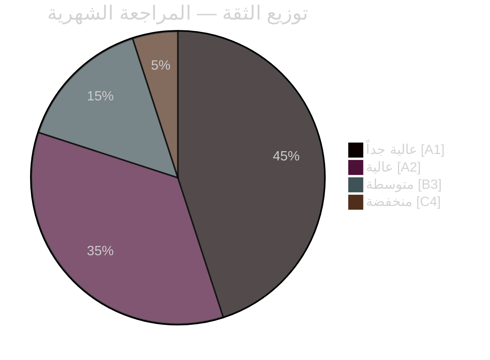

<!-- dir: rtl -->
# ملخص تنفيذي — المراجعة الشهرية أبريل 2026

**التصنيف**: عام | **المحلل**: James Pether Sörling | **التاريخ**: 2026-04-23
**الثقة**: عالية [A1] | **أيام حتى الانتخابات**: ~143

---

## 🎯 الخلاصة التنفيذية (BLUF)

قدّم الجري البرلماني السويدي في أبريل 2026 الحزمة التشريعية الأخيرة لحكومة كريسترسون قبل الانتخابات. التوقيع السياسي للشهر هو **تحوّل مالي-انتخابي**: تم تمرير HD01FiU48 (4.1 مليار كرونة سويدية إغاثة طارئة لضريبة الوقود) في 22 أبريل بأغلبية استثنائية M+SD+S+KD، مما يكشف عجز S عن معارضة دعم الطاقة للأسر قبل 143 يوماً من انتخابات سبتمبر 2026. إلى جانب الانتشارات العسكرية لحلف الناتو (UFöU3)، وإعادة هيكلة حوكمة الطاقة (HD03240/238/239)، وحزمة العدالة الجنائية، نفّذت الحكومة استراتيجية تموضع انتخابي ذات ثقة عالية — وإن كان الرعاية الصحية (77 تحفظاً مجمعاً في SfU18/SoU16/SoU17) والتوتر الائتلافي (شق SD-KD في SoU17 R15) يمثلان نقاط ضعف موثوقة.

---

## 🧭 3 قرارات يدعمها هذا الملخص

### القرار 1: تقييم الاستراتيجية الانتخابية (سبتمبر 2026)
تموضع الحكومة قبل الانتخابات متماسك ومنفّذ باحترافية — المسؤولية المالية + تخفيف العبء عن الأسر + الأمن + تسليم الهجرة. الخطر الرئيسي هو ساحة الرعاية الصحية، حيث تشير 77 تحفظاً مجمعاً للجان إلى هجوم معارضة منظّم جيداً.
**توصية المحلل**: رصد مداولات لجنة SfU والبيانات الصحية الإقليمية للحصول على ذخيرة حملة S. مراقبة شق SD-KD في الرعاية الصحية للكشف عن إشارات التصعيد.

### القرار 2: سياسة الطاقة وتوقيت الاستثمار
الثلاثية الطاقوية (HD03240/238/239) تخلق فرص استثمار جديدة ووضوحاً تنظيمياً لبنية الكهرباء التحتية. ستسرّع Miljöprövningsmyndigheten منح التراخيص. مشاركة البلديات في إيرادات طاقة الرياح (HD03239) تحل عائقاً رئيسياً في المعارضة المحلية.
**توصية المحلل**: ينبغي للمستثمرين في إنتاج الكهرباء السويدية والطاقة المتجددة الانتباه إلى استقرار الإطار التنظيمي بوصفه إشارة إيجابية.

### القرار 3: الأثر التجاري للدفاع والأمن
UFöU3 (1,200 جندي eFP فنلندا) + HD03214 (الأمن الإلكتروني) + HD03228 (معدات الحرب) تشير إلى استمرار ارتفاع الإنفاق الدفاعي. تتحدّث القاعدة الصناعية الدفاعية السويدية بتحديث من خلال لوائح أنظف لمعدات الحرب.
**توصية المحلل**: ينبغي لشركات الدفاع والأمن الإلكتروني الانتباه إلى إشارات تسريع المشتريات والتحديث التنظيمي.

---

## القراءة في 60 ثانية: النقاط الرئيسية

- 🔴 **22 أبريل**: تمرير HD01FiU48 (4.1 مليار كرونة إغاثة ضريبة الوقود) — يشير الأغلبية الاستثنائية M+SD+**S**+KD إلى هشاشة S الانتخابية على تكاليف الطاقة
- 🔴 **13 أبريل**: Vårproposition (HD03100) + Vårändringsbudget (HD0399) — الإطار المالي النهائي قبل الانتخابات
- 🟠 **الناتو**: UFöU3 تأذن بـ 1,200 جندي eFP فنلندا — التزام السويد بالناتو يتبلور
- 🟠 **الرعاية الصحية**: 77 تحفظاً مجمعاً (SfU18 + SoU16 + SoU17) — المتجه الهجومي الرئيسي للمعارضة
- 🟠 **الطاقة**: إصلاح قانون الكهرباء (HD03240) + سلطة تراخيص جديدة (HD03238) + طاقة الرياح (HD03239)
- 🟡 **التوتر الائتلافي**: شق SD-KD في SoU17 R15 — تصدع في أولوية الرعاية الصحية داخل قاعدة الدعم
- 🟡 **الأمن**: مركز الأمن الإلكتروني (HD03214) + إصلاح معدات الحرب (HD03228) — الإطار التشريعي ما بعد الناتو
- 🟢 **عابر للأحزاب**: تمرير التدابير الدفاعية وتدابير الناتو بتوافق عابر للأحزاب — قوة الحكومة

---

## ⚡ أفضل محفّز مستقبلي

**المراقبة**: تتبع استطلاعات الرأي بعد اعتماد FiU48 — إذا ترجم تخفيف تكاليف طاقة الأسر إلى مكاسب استطلاعية لـ M/KD/L، فإن استراتيجية S المزدوجة "معارضة رمزية + دعم عملي" قد فشلت. إذا حافظت S على حصتها في الاستطلاعات أو زادتها رغم تصويت 22 أبريل، فإن انضباط رسالتها فعّال.
**تاريخ التفعيل**: أول استطلاعات رأي بعد 22 أبريل (متوقعة في أواخر أبريل/أوائل مايو 2026).

---

## 📊 توزيع الثقة

| المجال | الثقة | Admiralty |
|--------|-------|-----------|
| الحقائق التشريعية (القوانين المعتمدة) | عالية جداً | A1 |
| الديناميكيات الائتلافية (شق SD-KD) | عالية | A2 |
| التداعيات الانتخابية | متوسطة | B3 |
| النتائج السياسية بعد الانتخابات | منخفضة | C4 |

---

## 🔗 مراجع التحليل الكاملة

- [ملخص التوليف](synthesis-summary.md)
- [تسجيل الأهمية](significance-scoring.md)
- [تحليل SWOT](swot-analysis.md)
- [تقييم المخاطر](risk-assessment.md)
- [التقييم الاستخباراتي](intelligence-assessment.md)
- [تحليل السيناريوهات](scenario-analysis.md)
- [المؤشرات المستقبلية](forward-indicators.md)

<!-- source-sha: 1e83ac6587956e9b1ca9cfd53aac08783e617cbd -->
