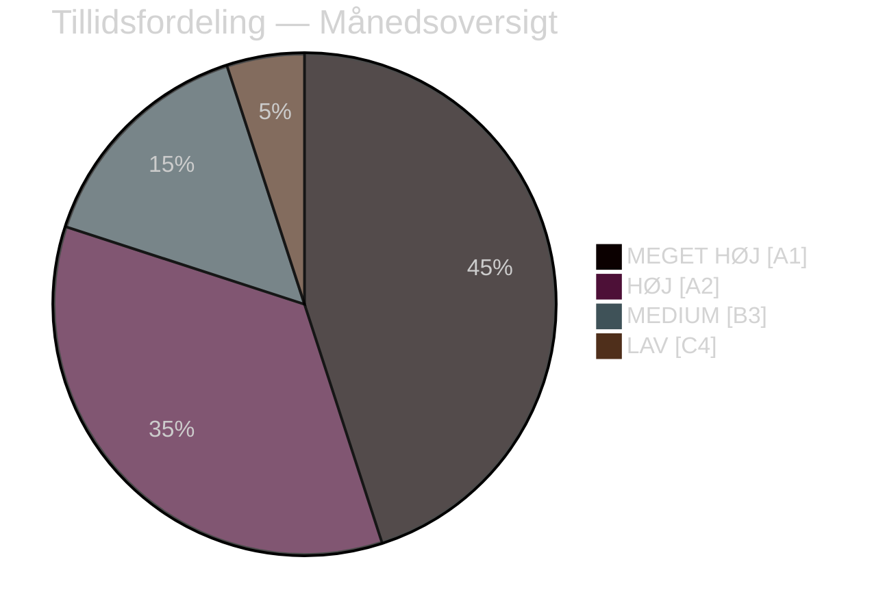

# Eksekutiv sammenfatning — Månedsoversigt april 2026

**Klassifikation**: OFFENTLIG | **Analytiker**: James Pether Sörling | **Dato**: 2026-04-23
**Tillid**: HØJ [A1] | **Dage til valget**: ~143

---

## 🎯 BLUF

Sveriges parlamentariske april 2026-sprint leverede Kristersson-regeringens endelige lovgivningspakke inden valget. Månedens politiske signatur er et **fiskal-valgpivot**: HD01FiU48 (4,1 mia. SEK nødlindring af brændstofafgift) vedtaget 22. april med et ekstraordinært M+SD+S+KD-superflertal, som afslører S's manglende evne til at modstå husholdningernes energihjælp 143 dage før valget i september 2026. Kombineret med NATO-deployeringer (UFöU3), omstrukturering af energistyring (HD03240/238/239) og en indsats for retfærdighed har regeringen gennemført en høj-konfidens valgpositioneringsstrategi — selvom sundhedsvæsenet (77 kombinerede forbehold i SfU18/SoU16/SoU17) og koalitionsstress (SD-KD-brud om SoU17 R15) udgør troværdige sårbarheder.

---

## 🧭 3 Beslutninger dette notat understøtter

### Beslutning 1: Vurdering af valgstrategi (september 2026)
Regeringens præ-valgspositionering er sammenhængende og professionelt gennemført — finansielt ansvar + husholdningslindring + sikkerhed + migrationsleverance. Den primære risiko er sundhedsarenan, hvor 77 kombinerede udvalgsforbehold signalerer en velorganiseret oppositionsoffensiv.
**Analytikeranbefaling**: Overvåg SfU-udvalgets overvejelser og regionale sundhedsdata for S's kampagneammunition. Overvåg SD-KD's sundhedsspaltning for eskaleringssignaler.

### Beslutning 2: Energipolitik og investeringstiming
Energitriplen (HD03240/238/239) skaber nye investeringsmuligheder og lovgivningsmæssig klarhed for elinfrastruktur. Miljöprövningsmyndigheten vil fremskynde tilladelsesgivning. Kommunal indtægtsdeling fra vindkraft (HD03239) løser en vigtig lokal oppositionsbarriere.
**Analytikeranbefaling**: Investorer i svensk elproduktion og vedvarende energi bør bemærke stabiliseringen af rammerne som et positivt signal.

### Beslutning 3: Forsvars- og sikkerhedsmæssig forretningspåvirkning
UFöU3 (1.200 tropper eFP Finland) + HD03214 (cybersikkerhed) + HD03228 (krigsmateriel) signalerer fortsat høje forsvarsudgifter. Sveriges forsvarsindustrielle base moderniseres via renere krigsmateriellregulativer.
**Analytikeranbefaling**: Forsvars- og cybersikkerhedsvirksomheder bør notere signaler om accelereret indkøb og lovgivningsmæssig modernisering.

---

## 60-sekunders læsning: Nøglepunkter

- 🔴 **22. april**: HD01FiU48 (4,1 mia. SEK brændstofafgiftslindring) vedtaget — M+SD+**S**+KD-superflertal signalerer S's valgssårbarhed på energiomkostninger
- 🔴 **13. april**: Vårproposition (HD03100) + Vårändringsbudget (HD0399) — endeligt præ-valgs-finansielt rammeværk
- 🟠 **NATO**: UFöU3 bemyndiger 1.200 tropper eFP Finland — Sveriges NATO-forpligtelse krystalliseres
- 🟠 **Sundhedsvæsen**: 77 kombinerede forbehold (SfU18 + SoU16 + SoU17) — oppositionens primære angrebsvektor
- 🟠 **Energi**: Elloverform (HD03240) + ny tilladelsesmyndighed (HD03238) + vindkraft (HD03239)
- 🟡 **Koalitionsstress**: SD-KD-brud om SoU17 R15 — brud i sundhedsprioritering inden for støttebasen
- 🟡 **Sikkerhed**: Cybersikkerhedscenter (HD03214) + krigsmateriellreform (HD03228) — post-NATO-lovgivningsramme
- 🟢 **Tværpolitisk**: Forsvars- og NATO-foranstaltninger vedtaget med tværpolitisk konsensus — regeringsstyrke

---

## ⚡ Bedste fremadrettede udløser

**Overvåg**: FiU48's meningsmålingssporing efter vedtagelse — hvis husholdningernes energiomkostningslindring omsættes til M/KD/L-meningsmålingsgevinster, er S's dobbelt-strategi "symbolsk opposition + praktisk støtte" slået fejl. Hvis S fastholder eller øger sin meningsmålingsandel på trods af 22. april-afstemningen, er deres budskabsdisciplin effektiv.
**Triggerdato**: Første meningsmålinger efter 22. april (forventet sent april/tidlig maj 2026).

---

## 📊 Tillidsfordeling

| Domæne | Tillid | Admiralty |
|--------|--------|-----------|
| Lovgivningsfakta (vedtagne love) | MEGET HØJ | A1 |
| Koalitionsdynamik (SD-KD-brud) | HØJ | A2 |
| Valgmæssige implikationer | MEDIUM | B3 |
| Politiske resultater efter valget | LAV | C4 |

---

## 🔗 Fuldstændige analysereferencer

- [Syntessammenfatning](synthesis-summary.md)
- [Signifikansvurdering](significance-scoring.md)
- [SWOT-analyse](swot-analysis.md)
- [Risikovurdering](risk-assessment.md)
- [Efterretningsvurdering](intelligence-assessment.md)
- [Scenarieanalyse](scenario-analysis.md)
- [Fremadrettede indikatorer](forward-indicators.md)

<!-- source-sha: 1e83ac6587956e9b1ca9cfd53aac08783e617cbd -->
