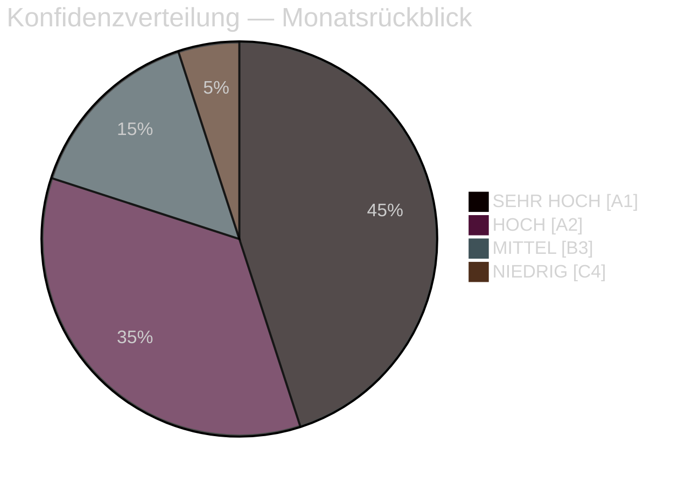

# Exekutivbriefing — Monatsrückblick April 2026

**Klassifizierung**: ÖFFENTLICH | **Analyst**: James Pether Sörling | **Datum**: 2026-04-23
**Konfidenz**: HOCH [A1] | **Tage bis zur Wahl**: ~143

---

## 🎯 BLUF

Schwedens parlamentarischer April-2026-Sprint lieferte das letzte Vorwahlgesetzgebungspaket der Regierung Kristersson. Die politische Signatur des Monats ist ein **fiskalisch-wahlpolitischer Schwenk**: HD01FiU48 (4,1 Mrd. SEK Kraftstoffsteuer-Notentlastung) wurde am 22. April mit einer außerordentlichen M+SD+S+KD-Supermehrheit verabschiedet und enthüllt S's Unfähigkeit, der Energiehilfe für Haushalte 143 Tage vor der Wahl im September 2026 entgegenzuwirken. Kombiniert mit NATO-Stationierungen (UFöU3), der Neustrukturierung der Energiesteuerung (HD03240/238/239) und einer Strafjustizoffensive hat die Regierung eine Wahlpositionierungsstrategie mit hoher Konfidenz umgesetzt — obwohl das Gesundheitswesen (77 kombinierte Vorbehalte in SfU18/SoU16/SoU17) und Koalitionsstress (SD-KD-Riss bei SoU17 R15) glaubwürdige Schwachstellen darstellen.

---

## 🧭 3 Entscheidungen, die dieses Briefing unterstützt

### Entscheidung 1: Wahlstrategiebewertung (September 2026)
Die Vorwahlpositionierung der Regierung ist kohärent und professionell umgesetzt — fiskalische Verantwortung + Haushaltsentlastung + Sicherheit + Migrationslieferung. Das Hauptrisiko ist die Gesundheitsfront, wo 77 kombinierte Ausschussvorbehalte eine gut organisierte Oppositionsoffensive signalisieren.
**Analysteempfehlung**: Verfolgen Sie SfU-Ausschussberatungen und regionale Gesundheitsdaten für S's Kampagnenmaterial. Beobachten Sie die SD-KD-Gesundheitsspaltung auf Eskalationssignale.

### Entscheidung 2: Energiepolitik und Investitionszeitpunkt
Das Energie-Triptychon (HD03240/238/239) schafft neue Investitionsmöglichkeiten und regulatorische Klarheit für die Strominfrastruktur. Miljöprövningsmyndigheten wird die Genehmigungserteilung beschleunigen. Die kommunale Einkommensteilung aus Windenergie (HD03239) beseitigt eine zentrale lokale Oppositionsbarriere.
**Analysteempfehlung**: Investoren in schwedische Stromerzeugung und erneuerbare Energien sollten die Stabilisierung des Regulierungsrahmens als positives Signal wahrnehmen.

### Entscheidung 3: Geschäftliche Auswirkungen im Verteidigungs- und Sicherheitsbereich
UFöU3 (1.200 Truppen eFP Finnland) + HD03214 (Cybersicherheit) + HD03228 (Kriegsmaterial) signalisieren weiterhin hohe Verteidigungsausgaben. Die schwedische Verteidigungsindustriebasis wird durch sauberere Kriegsmaterialvorschriften modernisiert.
**Analysteempfehlung**: Verteidigungs- und Cybersicherheitsunternehmen sollten Signale für beschleunigtes Beschaffungswesen und regulatorische Modernisierung beachten.

---

## 60-Sekunden-Lektüre: Kernpunkte

- 🔴 **22. April**: HD01FiU48 (4,1 Mrd. SEK Kraftstoffsteuerentlastung) verabschiedet — M+SD+**S**+KD-Supermehrheit signalisiert S's Wahlverwundbarkeit bei Energiekosten
- 🔴 **13. April**: Vårproposition (HD03100) + Vårändringsbudget (HD0399) — endgültiger Vorwahl-Haushaltsrahmen
- 🟠 **NATO**: UFöU3 genehmigt 1.200 Truppen eFP Finnland — Schwedens NATO-Engagement kristallisiert sich
- 🟠 **Gesundheitswesen**: 77 kombinierte Vorbehalte (SfU18 + SoU16 + SoU17) — primärer Angriffsvektor der Opposition
- 🟠 **Energie**: Stromgesetzreform (HD03240) + neue Genehmigungsbehörde (HD03238) + Windenergie (HD03239)
- 🟡 **Koalitionsstress**: SD-KD-Riss bei SoU17 R15 — Gesundheitspriorisierungsbruch innerhalb der Unterstützungsbasis
- 🟡 **Sicherheit**: Cybersicherheitszentrum (HD03214) + Kriegsmaterialreform (HD03228) — Post-NATO-Gesetzgebungsrahmen
- 🟢 **Parteiübergreifend**: Verteidigungs- und NATO-Maßnahmen mit überparteilichem Konsens verabschiedet — Regierungsstärke

---

## ⚡ Bester Vorwärtsauslöser

**Beobachten**: Nachverfolgen von FiU48 in der Meinungsforschung — wenn die Haushaltsenergiekostenenentlastung zu M/KD/L-Umfragesteigerungen führt, hat S's Doppelstrategie „symbolische Opposition + praktische Unterstützung" versagt. Falls S seinen Umfrageanteil trotz der Abstimmung vom 22. April hält oder steigert, ist seine Botschaftsdisziplin wirksam.
**Auslösedatum**: Erste Umfragen nach dem 22. April (erwartet Ende April/Anfang Mai 2026).

---

## 📊 Konfidenzverteilung

| Domäne | Konfidenz | Admiralty |
|--------|-----------|-----------|
| Gesetzgebungsfakten (verabschiedete Gesetze) | SEHR HOCH | A1 |
| Koalitionsdynamik (SD-KD-Riss) | HOCH | A2 |
| Wahlimplikationen | MITTEL | B3 |
| Politische Ergebnisse nach der Wahl | NIEDRIG | C4 |

---

## 🔗 Vollständige Analysereferenzen

- [Synthese-Zusammenfassung](synthesis-summary.md)
- [Signifikanzbewertung](significance-scoring.md)
- [SWOT-Analyse](swot-analysis.md)
- [Risikobewertung](risk-assessment.md)
- [Geheimdienstliche Bewertung](intelligence-assessment.md)
- [Szenarioanalyse](scenario-analysis.md)
- [Vorwärtsindikatoren](forward-indicators.md)

<!-- source-sha: 1e83ac6587956e9b1ca9cfd53aac08783e617cbd -->
