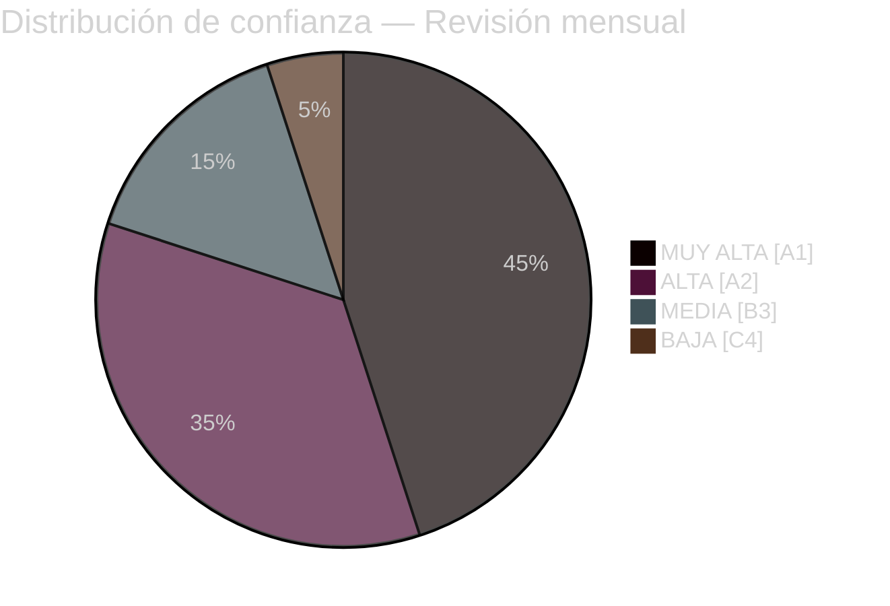

# Resumen ejecutivo — Revisión mensual abril 2026

**Clasificación**: PÚBLICO | **Analista**: James Pether Sörling | **Fecha**: 2026-04-23
**Confianza**: ALTA [A1] | **Días para las elecciones**: ~143

---

## 🎯 BLUF

El sprint parlamentario sueco de abril de 2026 entregó el último paquete legislativo preelectoral del gobierno Kristersson. La firma política del mes es un **giro fiscal-electoral**: HD01FiU48 (4,1 mil millones SEK de alivio de emergencia al impuesto sobre el combustible) aprobado el 22 de abril con una supermayoría extraordinaria M+SD+S+KD, revelando la incapacidad de S para oponerse al apoyo energético a los hogares a 143 días de las elecciones de septiembre de 2026. Combinado con despliegues de la OTAN (UFöU3), reestructuración de la gobernanza energética (HD03240/238/239) y una ofensiva de justicia penal, el gobierno ha ejecutado una estrategia de posicionamiento electoral con alta confianza, aunque la atención médica (77 reservas combinadas en SfU18/SoU16/SoU17) y el estrés de coalición (fractura SD-KD en SoU17 R15) presentan vulnerabilidades creíbles.

---

## 🧭 3 Decisiones que este resumen apoya

### Decisión 1: Evaluación de estrategia electoral (septiembre de 2026)
El posicionamiento preelectoral del gobierno es coherente y ejecutado profesionalmente — responsabilidad fiscal + alivio para los hogares + seguridad + entrega en migración. El principal riesgo es el campo de batalla de la salud, donde 77 reservas combinadas de comités señalan una ofensiva de oposición bien organizada.
**Recomendación del analista**: Monitorear las deliberaciones del comité SfU y los datos de salud regionales para munición de campaña de S. Vigilar la fractura SD-KD en salud en busca de señales de escalada.

### Decisión 2: Política energética y momento de inversión
El tríptico energético (HD03240/238/239) crea nuevas oportunidades de inversión y claridad regulatoria para la infraestructura eléctrica. Miljöprövningsmyndigheten acelerará la concesión de permisos. El reparto municipal de ingresos de energía eólica (HD03239) resuelve una barrera clave de oposición local.
**Recomendación del analista**: Los inversores en producción eléctrica sueca y energía renovable deberían observar la estabilización del marco regulatorio como una señal positiva.

### Decisión 3: Impacto empresarial en defensa y seguridad
UFöU3 (1.200 tropas eFP Finlandia) + HD03214 (ciberseguridad) + HD03228 (material de guerra) señalan gastos de defensa elevados sostenidos. La base industrial de defensa sueca se está modernizando a través de regulaciones más limpias sobre material de guerra.
**Recomendación del analista**: Las empresas de defensa y ciberseguridad deben notar señales de adquisición acelerada y modernización regulatoria.

---

## Lectura de 60 segundos: Puntos clave

- 🔴 **22 de abril**: HD01FiU48 (4,1 mil millones SEK de alivio al impuesto sobre el combustible) aprobado — supermayoría M+SD+**S**+KD señala la vulnerabilidad electoral de S en costos energéticos
- 🔴 **13 de abril**: Vårproposition (HD03100) + Vårändringsbudget (HD0399) — marco presupuestario preelectoral final
- 🟠 **OTAN**: UFöU3 autoriza 1.200 tropas eFP Finlandia — el compromiso de la OTAN de Suecia se cristaliza
- 🟠 **Atención médica**: 77 reservas combinadas (SfU18 + SoU16 + SoU17) — vector de ataque principal de la oposición
- 🟠 **Energía**: Reforma de la ley de electricidad (HD03240) + nueva autoridad de permisos (HD03238) + energía eólica (HD03239)
- 🟡 **Estrés de coalición**: Fractura SD-KD en SoU17 R15 — ruptura en la priorización de salud dentro de la base de apoyo
- 🟡 **Seguridad**: Centro de ciberseguridad (HD03214) + reforma de material de guerra (HD03228) — marco legislativo post-OTAN
- 🟢 **Transpartidista**: Medidas de defensa y OTAN aprobadas con consenso transpartidista — fortaleza del gobierno

---

## ⚡ Mejor desencadenante prospectivo

**Monitorear**: Seguimiento de encuestas de opinión post-adopción de FiU48 — si el alivio de costos energéticos del hogar se traduce en ganancias de encuestas para M/KD/L, la estrategia dual de S de "oposición simbólica + apoyo práctico" ha fallado. Si S mantiene o aumenta su cuota de encuestas a pesar del voto del 22 de abril, su disciplina de mensaje es efectiva.
**Fecha de activación**: Primeras encuestas de opinión después del 22 de abril (esperadas a finales de abril/principios de mayo de 2026).

---

## 📊 Distribución de confianza

| Dominio | Confianza | Admiralty |
|---------|-----------|-----------|
| Hechos legislativos (leyes aprobadas) | MUY ALTA | A1 |
| Dinámica de coalición (fractura SD-KD) | ALTA | A2 |
| Implicaciones electorales | MEDIA | B3 |
| Resultados políticos pos-elección | BAJA | C4 |

---

## 🔗 Referencias de análisis completas

- [Resumen de síntesis](synthesis-summary.md)
- [Puntuación de significancia](significance-scoring.md)
- [Análisis DAFO](swot-analysis.md)
- [Evaluación de riesgos](risk-assessment.md)
- [Evaluación de inteligencia](intelligence-assessment.md)
- [Análisis de escenarios](scenario-analysis.md)
- [Indicadores prospectivos](forward-indicators.md)

<!-- source-sha: 1e83ac6587956e9b1ca9cfd53aac08783e617cbd -->
