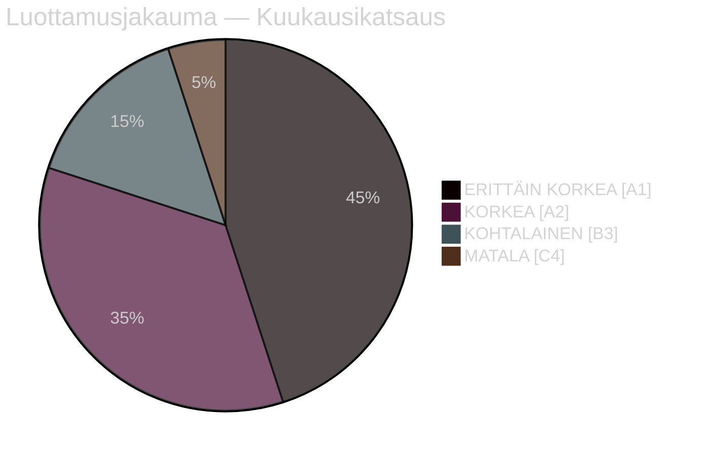

# Tiivistelmä — Kuukausikatsaus huhtikuu 2026

**Luokitus**: JULKINEN | **Analyytikko**: James Pether Sörling | **Päivämäärä**: 2026-04-23
**Luottamus**: KORKEA [A1] | **Päiviä vaaleihin**: ~143

---

## 🎯 BLUF

Ruotsin huhtikuun 2026 parlamentaarinen sprintti toimitti Kristersson-hallituksen viimeisen vaaleja edeltävän lainsäädäntöpaketin. Kuukauden poliittinen tunnusmerkki on **fiskaalinen vaalimuutos**: HD01FiU48 (4,1 miljardia SEK polttoaineverohätälievitys) hyväksyttiin 22. huhtikuuta poikkeuksellisella M+SD+S+KD-supraenemmistöllä, paljastaen S:n kyvyttömyyden vastustaa kotitalouksien energiavähennyksiä 143 päivää ennen syyskuun 2026 vaalia. Yhdistettynä NATO-joukkojen sijoittamiseen (UFöU3), energiahallinnon uudelleenjärjestelyyn (HD03240/238/239) ja rikostuomioistuimeen, hallitus on toteuttanut korkealuottamuksisen vaaliasemointistrategian — vaikka terveydenhuolto (77 yhdistettyä varausta SfU18/SoU16/SoU17) ja koalitiostressit (SD-KD-ristiriita SoU17 R15:sta) muodostavat uskottavia haavoittuvuuksia.

---

## 🧭 3 Päätöstä, joita tämä asiakirja tukee

### Päätös 1: Vaalistrategian arviointi (syyskuu 2026)
Hallituksen vaaleja edeltävä asemointi on johdonmukainen ja ammattimaisesti toteutettu — finansiaalinen vastuu + kotitalouksien helpotus + turvallisuus + maahanmuuttolupaukset. Pääriski on terveydenhuollon taistelukenttä, jossa 77 yhdistettyä valiokunnan varausta viestivät hyvin organisoidusta oppositiohyökkäyksestä.
**Analyytikon suositus**: Seuraa SfU-valiokunnan neuvotteluja ja alueellisia terveydenhuoltotietoja S:n kampanjamateriaalia varten. Tarkkaile SD-KD:n terveydenhuoltokuilua eskalointisignaalien varalta.

### Päätös 2: Energiapolitiikka ja investointiajoitus
Energiatripla (HD03240/238/239) luo uusia investointimahdollisuuksia ja sääntelyselkeyttä sähköinfrastruktuurille. Miljöprövningsmyndigheten nopeuttaa lupien myöntämistä. Kunnallinen tulonjako tuulivoimasta (HD03239) ratkaisee keskeisen paikallisen vastarintaesteen.
**Analyytikon suositus**: Ruotsin sähkötuotantoon ja uusiutuvaan energiaan sijoittavien tulisi huomioida sääntelykehyksen vakautuminen positiivisena signaalina.

### Päätös 3: Puolustus- ja turvallisuusliiketoimintavaikutus
UFöU3 (1 200 joukkoa eFP Suomi) + HD03214 (kyberturvallisuus) + HD03228 (sotamateriaali) viestivät jatkuvista korkeista puolustusmenoista. Ruotsin puolustusalan teollinen pohja uudistuu puhtaampien sotamateriaalimääräysten kautta.
**Analyytikon suositus**: Puolustus- ja kyberturvallisuusalan yritysten tulisi huomioida kiihtyneen hankinnan ja sääntelyuudistuksen signaalit.

---

## 60 sekunnin lukeminen: Avainkohtia

- 🔴 **22. huhtikuuta**: HD01FiU48 (4,1 mrd SEK polttoaineverolievitys) hyväksytty — M+SD+**S**+KD-supraenemmistö viestii S:n vaalihaavoittuvuudesta energiakustannuksissa
- 🔴 **13. huhtikuuta**: Vårproposition (HD03100) + Vårändringsbudget (HD0399) — lopullinen vaaleja edeltävä finansiaalinen kehys
- 🟠 **NATO**: UFöU3 valtuuttaa 1 200 joukkoa eFP Suomi — Ruotsin NATO-sitoutuminen kristallisoituu
- 🟠 **Terveydenhuolto**: 77 yhdistettyä varausta (SfU18 + SoU16 + SoU17) — opposition ensisijainen hyökkäysvektori
- 🟠 **Energia**: Sähkölakiuudistus (HD03240) + uusi lupuviranomainen (HD03238) + tuulivoima (HD03239)
- 🟡 **Koalitiostressit**: SD-KD-ristiriita SoU17 R15:sta — terveydenhuollon priorisoinnin hajaannus tukipohjassa
- 🟡 **Turvallisuus**: Kyberturvallisuuskeskus (HD03214) + sotamateriaaluudistus (HD03228) — post-NATO-lainsäädäntöviitekehys
- 🟢 **Puoluerajat ylittävä**: Puolustus- ja NATO-toimenpiteet hyväksytty puoluerajat ylittävällä konsensuksella — hallituksen vahvuus

---

## ⚡ Paras eteenpäin katsova laukaisin

**Seuraa**: FiU48:n hyväksynnän jälkeinen mielipideseuranta — jos kotitalouksien energiakustannuslievitys johtaa M/KD/L-gallupvoittoihin, S:n kaksoisstrategia "symbolinen vastustus + käytännön tuki" on epäonnistunut. Jos S ylläpitää tai kasvattaa gallupkannatustaan huolimatta 22. huhtikuun äänestä, heidän viestikurinsä on tehokas.
**Laukaisupäivä**: Ensimmäiset galluptutkimukset 22. huhtikuun jälkeen (odotettavissa myöhään huhtikuussa/toukokuun alussa 2026).

---

## 📊 Luottamusjakauma

| Toimiala | Luottamus | Admiralty |
|----------|-----------|-----------|
| Lainsäädäntötosiseikat (hyväksytyt lait) | ERITTÄIN KORKEA | A1 |
| Koalitiodynamiikka (SD-KD-ristiriita) | KORKEA | A2 |
| Vaalilliset vaikutukset | KOHTALAINEN | B3 |
| Poliittiset tulokset vaalien jälkeen | MATALA | C4 |

---

## 🔗 Täydelliset analyysiviittaukset

- [Synteetiivistelmä](synthesis-summary.md)
- [Merkittävyyspisteet](significance-scoring.md)
- [SWOT-analyysi](swot-analysis.md)
- [Riskiarviointi](risk-assessment.md)
- [Tiedusteluarviointi](intelligence-assessment.md)
- [Skenaarioanalyysi](scenario-analysis.md)
- [Tulevaisuuden indikaattorit](forward-indicators.md)

<!-- source-sha: 1e83ac6587956e9b1ca9cfd53aac08783e617cbd -->
