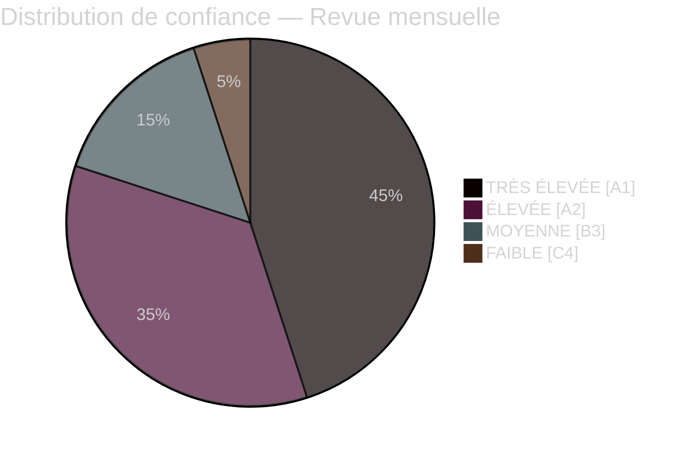

# Note de synthèse — Revue mensuelle avril 2026

**Classification** : PUBLIC | **Analyste** : James Pether Sörling | **Date** : 2026-04-23
**Confiance** : ÉLEVÉE [A1] | **Jours avant l'élection** : ~143

---

## 🎯 BLUF

Le sprint parlementaire suédois d'avril 2026 a livré le dernier paquet législatif pré-électoral du gouvernement Kristersson. La signature politique du mois est un **pivot fiscal-électoral** : HD01FiU48 (4,1 milliards SEK d'allègement d'urgence sur la taxe carburant) adopté le 22 avril avec une supermajorité extraordinaire M+SD+S+KD, révélant l'incapacité de S à s'opposer à l'aide énergétique aux ménages à 143 jours de l'élection de septembre 2026. Combiné aux déploiements OTAN (UFöU3), à la restructuration de la gouvernance énergétique (HD03240/238/239) et à un train de mesures sur la justice pénale, le gouvernement a exécuté une stratégie de positionnement électoral à haute confiance — bien que la santé (77 réserves combinées en SfU18/SoU16/SoU17) et la tension de coalition (fissure SD-KD sur SoU17 R15) constituent des vulnérabilités crédibles.

---

## 🧭 3 Décisions que cette note soutient

### Décision 1 : Évaluation de la stratégie électorale (septembre 2026)
Le positionnement pré-électoral du gouvernement est cohérent et exécuté de manière professionnelle — responsabilité fiscale + soulagement des ménages + sécurité + livraison migration. Le risque principal est le champ de bataille de la santé, où 77 réserves combinées de comités signalent une offensive d'opposition bien organisée.
**Recommandation de l'analyste** : Surveiller les délibérations du comité SfU et les données de santé régionales pour les munitions de campagne de S. Surveiller la fracture S-KD en matière de santé pour détecter des signaux d'escalade.

### Décision 2 : Politique énergétique et calendrier d'investissement
Le triptyque énergétique (HD03240/238/239) crée de nouvelles opportunités d'investissement et une clarté réglementaire pour l'infrastructure électrique. Miljöprövningsmyndigheten accélérera l'octroi de permis. Le partage des revenus municipaux de l'énergie éolienne (HD03239) résout un obstacle local clé à l'opposition.
**Recommandation de l'analyste** : Les investisseurs dans la production d'électricité suédoise et les énergies renouvelables devraient noter la stabilisation du cadre réglementaire comme un signal positif.

### Décision 3 : Impact commercial dans la défense et la sécurité
UFöU3 (1 200 troupes eFP Finlande) + HD03214 (cybersécurité) + HD03228 (matériel de guerre) signalent des dépenses de défense élevées soutenues. La base industrielle de défense suédoise est modernisée grâce à des réglementations plus claires sur le matériel de guerre.
**Recommandation de l'analyste** : Les entreprises de défense et de cybersécurité devraient noter les signaux d'accélération des achats et de modernisation réglementaire.

---

## Lecture en 60 secondes : Points clés

- 🔴 **22 avril** : HD01FiU48 (4,1 Mrd SEK allègement taxe carburant) adopté — supermajorité M+SD+**S**+KD signale la vulnérabilité électorale de S sur les coûts énergétiques
- 🔴 **13 avril** : Vårproposition (HD03100) + Vårändringsbudget (HD0399) — cadre budgétaire pré-électoral final
- 🟠 **OTAN** : UFöU3 autorise 1 200 troupes eFP Finlande — l'engagement OTAN de la Suède se cristallise
- 🟠 **Santé** : 77 réserves combinées (SfU18 + SoU16 + SoU17) — vecteur d'attaque principal de l'opposition
- 🟠 **Énergie** : Réforme de la loi sur l'électricité (HD03240) + nouvelle autorité de permis (HD03238) + énergie éolienne (HD03239)
- 🟡 **Tension de coalition** : Fissure SD-KD sur SoU17 R15 — fracture dans la priorisation de la santé au sein de la base de soutien
- 🟡 **Sécurité** : Centre de cybersécurité (HD03214) + réforme du matériel de guerre (HD03228) — cadre législatif post-OTAN
- 🟢 **Transpartisan** : Mesures de défense et OTAN adoptées avec consensus transpartisan — force gouvernementale

---

## ⚡ Meilleur déclencheur prospectif

**Surveiller** : Suivi des sondages d'opinion post-adoption de FiU48 — si l'allègement des coûts énergétiques des ménages se traduit par des gains dans les sondages M/KD/L, la double stratégie de S « opposition symbolique + soutien pratique » a échoué. Si S maintient ou augmente sa part dans les sondages malgré le vote du 22 avril, sa discipline de message est efficace.
**Date de déclenchement** : Premiers sondages d'opinion après le 22 avril (attendu fin avril/début mai 2026).

---

## 📊 Distribution de confiance

| Domaine | Confiance | Admiralty |
|---------|-----------|-----------|
| Faits législatifs (lois adoptées) | TRÈS ÉLEVÉE | A1 |
| Dynamique de coalition (fissure SD-KD) | ÉLEVÉE | A2 |
| Implications électorales | MOYENNE | B3 |
| Résultats politiques post-élection | FAIBLE | C4 |

---

## 🔗 Références d'analyse complètes

- [Synthèse sommaire](synthesis-summary.md)
- [Notation de signification](significance-scoring.md)
- [Analyse SWOT](swot-analysis.md)
- [Évaluation des risques](risk-assessment.md)
- [Évaluation du renseignement](intelligence-assessment.md)
- [Analyse de scénarios](scenario-analysis.md)
- [Indicateurs prospectifs](forward-indicators.md)

<!-- source-sha: 1e83ac6587956e9b1ca9cfd53aac08783e617cbd -->
