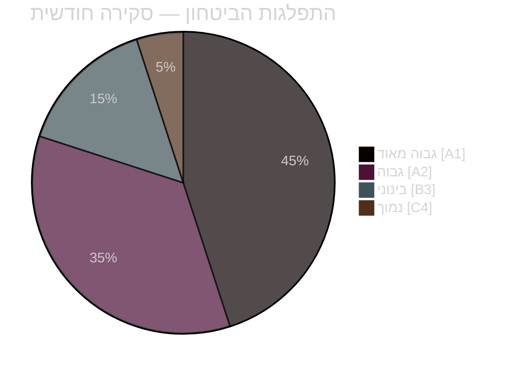

<!-- dir: rtl -->
# סיכום מנהלים — סקירה חודשית אפריל 2026

**סיווג**: ציבורי | **אנליסט**: James Pether Sörling | **תאריך**: 2026-04-23
**רמת ביטחון**: גבוהה [A1] | **ימים לבחירות**: ~143

---

## 🎯 תמצית (BLUF)

מרוץ הפרלמנט השוודי באפריל 2026 סיפק את חבילת החקיקה הסופית לפני הבחירות של ממשלת קריסטרסון. החתימה הפוליטית של החודש היא **ציר פיסקלי-בחירתי**: HD01FiU48 (4.1 מיליארד כתר שוודי הקלה חירום על מס הדלק) אושר ב-22 באפריל עם רוב-על יוצא דופן M+SD+S+KD, וחושף את חוסר יכולתה של S להתנגד לסיוע אנרגטי לבתי אב 143 יום לפני בחירות ספטמבר 2026. בשילוב פריסות נאט"ו (UFöU3), ארגון מחדש של ממשל האנרגיה (HD03240/238/239) ומהלך צדק פלילי, הממשלה ביצעה אסטרטגיית מיצוב בחירתי בביטחון גבוה — אם כי בריאות (77 הסתייגויות משולבות ב-SfU18/SoU16/SoU17) ומתח קואליציוני (שבר SD-KD ב-SoU17 R15) מהווים פגיעויות מהימנות.

---

## 🧭 3 החלטות שסיכום זה תומך בהן

### החלטה 1: הערכת אסטרטגיה בחירתית (ספטמבר 2026)
מיצוב הממשלה לפני הבחירות קוהרנטי ומבוצע באופן מקצועי — אחריות פיסקלית + הקלה לבתי אב + ביטחון + מסירת הגירה. הסיכון העיקרי הוא שדה קרב הבריאות, שבו 77 הסתייגויות ועדה משולבות מאותתות על מתקפת אופוזיציה מאורגנת היטב.
**המלצת האנליסט**: עקוב אחר דיוני ועדת SfU ונתוני בריאות אזוריים לקבלת תחמושת קמפיין S. עקוב אחר שבר SD-KD בבריאות לאיתות של הסלמה.

### החלטה 2: מדיניות אנרגיה ועיתוי השקעות
הטריפטיכון האנרגטי (HD03240/238/239) יוצר הזדמנויות השקעה חדשות ובהירות רגולטורית לתשתית חשמל. Miljöprövningsmyndigheten תאיץ את מתן האישורים. חלוקת הכנסות עירוניות מאנרגיית רוח (HD03239) פותרת מחסום התנגדות מקומי מרכזי.
**המלצת האנליסט**: משקיעים בייצור חשמל שוודי ואנרגיה מתחדשת צריכים לשים לב להתייצבות המסגרת הרגולטורית כאות חיובי.

### החלטה 3: השפעה עסקית על ביטחון והגנה
UFöU3 (1,200 חיילים eFP פינלנד) + HD03214 (אבטחת סייבר) + HD03228 (חומר מלחמה) מאותתים על הוצאות ביטחון גבוהות מתמשכות. הבסיס התעשייתי-ביטחוני של שוודיה מתחדש דרך תקנות נקיות יותר לחומר מלחמה.
**המלצת האנליסט**: חברות הגנה ואבטחת סייבר צריכות לשים לב לאותות של רכש מואץ ומודרניזציה רגולטורית.

---

## קריאה של 60 שניות: נקודות מפתח

- 🔴 **22 באפריל**: HD01FiU48 (4.1 מיליארד כתר הקלת מס דלק) אושר — רוב-על M+SD+**S**+KD מאותת על פגיעות בחירתית של S בעלויות אנרגיה
- 🔴 **13 באפריל**: Vårproposition (HD03100) + Vårändringsbudget (HD0399) — מסגרת תקציבית סופית לפני הבחירות
- 🟠 **נאט"ו**: UFöU3 מאשר 1,200 חיילים eFP פינלנד — מחויבות שוודיה לנאט"ו מתגבשת
- 🟠 **בריאות**: 77 הסתייגויות משולבות (SfU18 + SoU16 + SoU17) — וקטור ההתקפה העיקרי של האופוזיציה
- 🟠 **אנרגיה**: רפורמת חוק החשמל (HD03240) + רשות אישורים חדשה (HD03238) + אנרגיית רוח (HD03239)
- 🟡 **מתח קואליציוני**: שבר SD-KD ב-SoU17 R15 — שבר בתעדוף הבריאות בתוך בסיס התמיכה
- 🟡 **ביטחון**: מרכז אבטחת סייבר (HD03214) + רפורמת חומר מלחמה (HD03228) — מסגרת חקיקתית לאחר הנאט"ו
- 🟢 **חוצה-מפלגות**: אמצעי הגנה ונאט"ו אושרו בקונצנזוס חוצה-מפלגות — עוצמת הממשלה

---

## ⚡ המפעיל ה-forward הטוב ביותר

**מעקב**: מעקב אחר סקרי דעת קהל לאחר אימוץ FiU48 — אם הקלת עלויות אנרגיה לבתי אב תתורגם לרווחים בסקרים ל-M/KD/L, אסטרטגיית ה-dual של S "אופוזיציה סמלית + תמיכה מעשית" נכשלה. אם S שומרת על חלקה בסקרים או מגדילה אותו למרות הצבעת ה-22 באפריל, משמעת המסרים שלה אפקטיבית.
**תאריך הפעלה**: סקרי דעת קהל ראשונים לאחר ה-22 באפריל (צפוי סוף אפריל/תחילת מאי 2026).

---

## 📊 התפלגות הביטחון

| תחום | ביטחון | Admiralty |
|------|--------|-----------|
| עובדות חקיקה (חוקים שאושרו) | גבוה מאוד | A1 |
| דינמיקה קואליציונית (שבר SD-KD) | גבוה | A2 |
| השלכות בחירתיות | בינוני | B3 |
| תוצאות מדיניות לאחר הבחירות | נמוך | C4 |

---

## 🔗 הפניות לניתוח מלא

- [סיכום סינתזה](synthesis-summary.md)
- [ניקוד משמעות](significance-scoring.md)
- [ניתוח SWOT](swot-analysis.md)
- [הערכת סיכונים](risk-assessment.md)
- [הערכה מודיעינית](intelligence-assessment.md)
- [ניתוח תרחישים](scenario-analysis.md)
- [מדדים קדימה](forward-indicators.md)

<!-- source-sha: 1e83ac6587956e9b1ca9cfd53aac08783e617cbd -->
