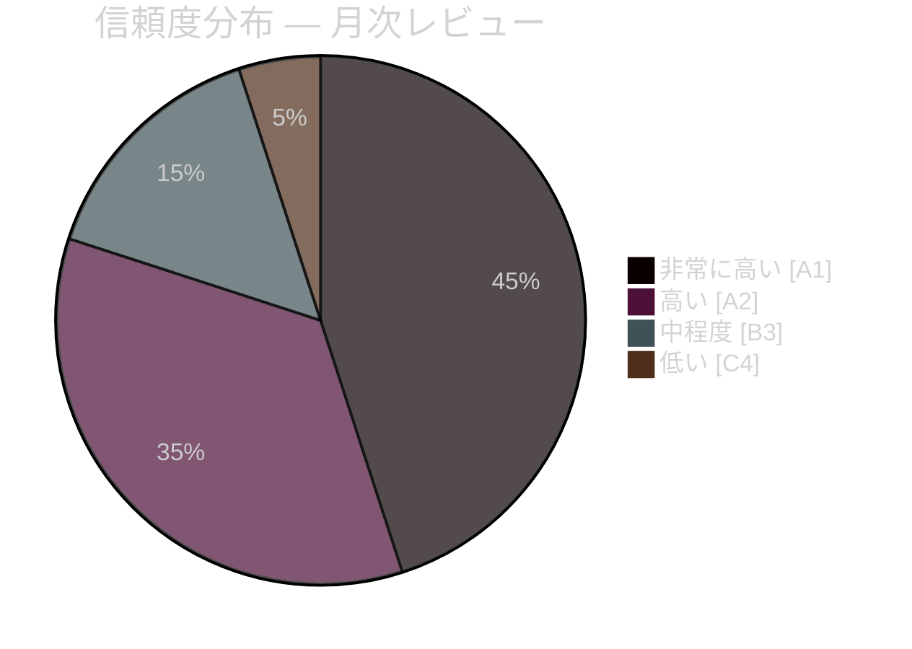

# エグゼクティブ・ブリーフ — 月次レビュー 2026年4月

**分類**: 公開 | **アナリスト**: James Pether Sörling | **日付**: 2026-04-23
**信頼度**: 高 [A1] | **選挙まで**: 約143日

---

## 🎯 BLUF（要約）

スウェーデンの2026年4月議会スプリントにより、クリステルション政権の選挙前最後の立法パッケージが提供されました。今月の政治的特徴は**財政・選挙ピボット**です。HD01FiU48（燃料税緊急緩和41億スウェーデン・クローナ）が4月22日にM+SD+S+KDの異例な超多数決で可決され、2026年9月選挙まで143日の時点でSが家庭向けエネルギー支援に反対できないことが露呈しました。NATO展開（UFöU3）、エネルギー統治の再編（HD03240/238/239）、刑事司法整備と組み合わさり、政府は高信頼性の選挙ポジショニング戦略を実行しました。ただし、医療（SfU18/SoU16/SoU17の合計77件の留保）と連立のストレス（SoU17 R15に関するSD-KDの亀裂）は信頼できる脆弱性です。

---

## 🧭 このブリーフが支援する3つの意思決定

### 意思決定1: 選挙戦略評価（2026年9月）
政府の選挙前ポジショニングは一貫しており、専門的に実行されています。財政責任＋家庭への救済＋安全保障＋移民政策の実施。主なリスクは医療の戦場であり、77件の合算委員会留保が組織的な野党攻勢を示しています。
**アナリストの推奨**: SfU委員会の審議とS党の選挙活動の材料となる地域医療データを監視すること。SD-KD医療分裂の激化シグナルを注視すること。

### 意思決定2: エネルギー政策と投資タイミング
エネルギー三部作（HD03240/238/239）は電力インフラへの新規投資機会と規制上の明確性を生み出します。Miljöprövningsmyndigheten は許可付与を加速させる予定です。風力発電の市町村収入分配（HD03239）は地元の重要な反対障壁を解消します。
**アナリストの推奨**: スウェーデンの電力生産および再生可能エネルギーへの投資家は、規制枠組みの安定化を前向きなシグナルとして注目すること。

### 意思決定3: 防衛・安全保障ビジネスへの影響
UFöU3（1,200名eFPフィンランド）＋HD03214（サイバーセキュリティ）＋HD03228（戦争物資）は引き続き高い防衛支出を示しています。スウェーデンの防衛産業基盤はより明確な戦争物資規制を通じて近代化されています。
**アナリストの推奨**: 防衛・サイバーセキュリティ企業は、調達加速と規制近代化のシグナルに注目すること。

---

## 60秒の読み: 主要ポイント

- 🔴 **4月22日**: HD01FiU48（41億SEK燃料税緩和）成立 — M+SD+**S**+KD超多数決がエネルギーコストにおけるSの選挙脆弱性を示す
- 🔴 **4月13日**: Vårproposition (HD03100) + Vårändringsbudget (HD0399) — 選挙前最終財政枠組み
- 🟠 **NATO**: UFöU3が1,200名eFPフィンランドを承認 — スウェーデンのNATOコミットメントが具体化
- 🟠 **医療**: 合算77件の留保（SfU18 + SoU16 + SoU17）— 野党の主要攻撃ベクター
- 🟠 **エネルギー**: 電力法改正（HD03240）＋新許可機関（HD03238）＋風力発電（HD03239）
- 🟡 **連立のストレス**: SoU17 R15に関するSD-KD亀裂 — 支持基盤内での医療優先化の亀裂
- 🟡 **安全保障**: サイバーセキュリティセンター（HD03214）＋戦争物資改革（HD03228）— NATO後の立法枠組み
- 🟢 **超党派**: 防衛およびNATOの措置が超党派コンセンサスで可決 — 政府の強さ

---

## ⚡ 最優先の先行トリガー

**監視**: FiU48採択後の世論調査追跡 — 家庭エネルギーコスト緩和がM/KD/L支持率向上に転換した場合、Sの「象徴的反対＋実際的支援」の二重戦略は失敗したことになります。4月22日の採決にもかかわらずSが支持率を維持または増加させれば、メッセージ統制は効果的です。
**発動日**: 4月22日以降の最初の世論調査（2026年4月下旬〜5月初旬予定）。

---

## 📊 信頼度分布

| 分野 | 信頼度 | Admiralty |
|------|--------|-----------|
| 立法上の事実（成立した法律） | 非常に高い | A1 |
| 連立の力学（SD-KD亀裂） | 高い | A2 |
| 選挙への影響 | 中程度 | B3 |
| 選挙後の政策成果 | 低い | C4 |

---

## 🔗 完全な分析参考文献

- [統合要約](synthesis-summary.md)
- [重要度スコアリング](significance-scoring.md)
- [SWOT分析](swot-analysis.md)
- [リスク評価](risk-assessment.md)
- [インテリジェンス評価](intelligence-assessment.md)
- [シナリオ分析](scenario-analysis.md)
- [先行指標](forward-indicators.md)

<!-- source-sha: 1e83ac6587956e9b1ca9cfd53aac08783e617cbd -->
