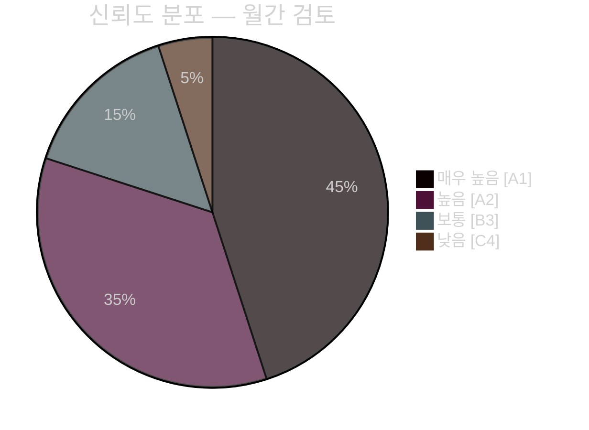

# 임원 브리핑 — 월간 검토 2026년 4월

**분류**: 공개 | **분석가**: James Pether Sörling | **날짜**: 2026-04-23
**신뢰도**: 높음 [A1] | **선거까지 남은 일수**: ~143일

---

## 🎯 BLUF (핵심 요약)

2026년 4월 스웨덴 의회 스프린트는 크리스테르손 정부의 마지막 선거 전 입법 패키지를 제공했습니다. 이달의 정치적 특징은 **재정-선거 피벗**입니다. HD01FiU48 (연료세 긴급 완화 41억 SEK)이 4월 22일 M+SD+S+KD 초다수결로 통과되어, 2026년 9월 선거 143일 전 S가 가정 에너지 지원에 반대할 수 없음을 드러냈습니다. NATO 파병(UFöU3), 에너지 거버넌스 재구성(HD03240/238/239), 형사사법 정비와 결합하여 정부는 높은 신뢰도의 선거 포지셔닝 전략을 실행했습니다. 다만 의료(SfU18/SoU16/SoU17 총 77건의 유보)와 연립 스트레스(SoU17 R15에 관한 SD-KD 균열)는 신뢰할 수 있는 취약점을 나타냅니다.

---

## 🧭 이 브리핑이 지원하는 3가지 결정

### 결정 1: 선거 전략 평가 (2026년 9월)
정부의 선거 전 포지셔닝은 일관되고 전문적으로 실행됩니다 — 재정 책임 + 가계 완화 + 안보 + 이민 이행. 주요 위험은 의료 전장으로, 77건의 위원회 합산 유보가 잘 조직된 야당 공세를 알립니다.
**분석가 권고**: SfU 위원회 심의와 S당 선거 재료를 위한 지역 의료 데이터를 모니터링할 것. SD-KD 의료 균열의 에스컬레이션 신호를 주시할 것.

### 결정 2: 에너지 정책 및 투자 타이밍
에너지 삼부작(HD03240/238/239)은 전기 인프라에 대한 새로운 투자 기회와 규제 명확성을 만들어냅니다. Miljöprövningsmyndigheten은 허가 부여를 가속화할 것입니다. 풍력 에너지에서의 지방자치단체 수입 공유(HD03239)는 주요 지역 반대 장벽을 해소합니다.
**분석가 권고**: 스웨덴 전력 생산 및 재생 가능 에너지 투자자들은 규제 프레임워크 안정화를 긍정적인 신호로 주목할 것.

### 결정 3: 방산·안보 비즈니스 영향
UFöU3 (1,200명 eFP 핀란드) + HD03214 (사이버보안) + HD03228 (전쟁 물자)는 지속적인 높은 방위비 지출을 알립니다. 스웨덴의 방위 산업 기반은 더 명확한 전쟁 물자 규정을 통해 현대화되고 있습니다.
**분석가 권고**: 방산·사이버보안 기업들은 조달 가속화 및 규제 현대화 신호에 주목할 것.

---

## 60초 읽기: 핵심 포인트

- 🔴 **4월 22일**: HD01FiU48 (41억 SEK 연료세 완화) 통과 — M+SD+**S**+KD 초다수결이 에너지 비용에서의 S 선거 취약성을 알림
- 🔴 **4월 13일**: Vårproposition (HD03100) + Vårändringsbudget (HD0399) — 최종 선거 전 재정 프레임워크
- 🟠 **NATO**: UFöU3이 1,200명 eFP 핀란드 승인 — 스웨덴의 NATO 공약 구체화
- 🟠 **의료**: 총 77건 유보 (SfU18 + SoU16 + SoU17) — 야당의 주요 공격 벡터
- 🟠 **에너지**: 전력법 개혁(HD03240) + 새 허가 당국(HD03238) + 풍력 에너지(HD03239)
- 🟡 **연립 스트레스**: SoU17 R15에 관한 SD-KD 균열 — 지지 기반 내 의료 우선순위 균열
- 🟡 **안보**: 사이버보안 센터(HD03214) + 전쟁 물자 개혁(HD03228) — 나토 이후 입법 프레임워크
- 🟢 **초당적**: 방위 및 NATO 조치들이 초당적 합의로 통과 — 정부 강점

---

## ⚡ 최우선 미래 트리거

**모니터링**: FiU48 채택 후 여론조사 추적 — 가계 에너지 비용 완화가 M/KD/L 지지율 상승으로 전환되면, S의 "상징적 반대 + 실질적 지원" 이중 전략은 실패한 것입니다. 4월 22일 투표에도 불구하고 S가 지지율을 유지하거나 높이면 메시지 규율이 효과적인 것입니다.
**트리거 날짜**: 4월 22일 이후 첫 여론조사 (2026년 4월 말/5월 초 예상).

---

## 📊 신뢰도 분포

| 영역 | 신뢰도 | Admiralty |
|------|--------|-----------|
| 입법 사실 (성립된 법률) | 매우 높음 | A1 |
| 연립 역학 (SD-KD 균열) | 높음 | A2 |
| 선거적 함의 | 보통 | B3 |
| 선거 후 정책 결과 | 낮음 | C4 |

---

## 🔗 전체 분석 참고문헌

- [종합 요약](synthesis-summary.md)
- [중요도 점수](significance-scoring.md)
- [SWOT 분석](swot-analysis.md)
- [위험 평가](risk-assessment.md)
- [정보 평가](intelligence-assessment.md)
- [시나리오 분석](scenario-analysis.md)
- [선행 지표](forward-indicators.md)

<!-- source-sha: 1e83ac6587956e9b1ca9cfd53aac08783e617cbd -->
