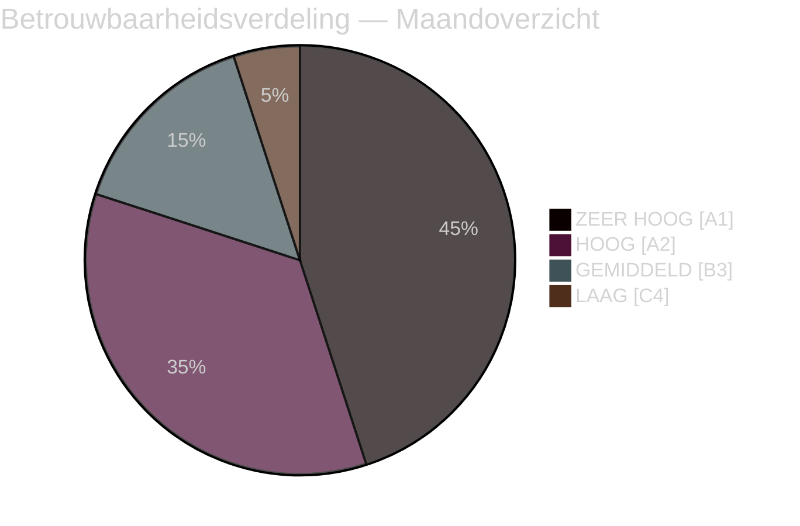

# Uitvoerend briefing — Maandoverzicht april 2026

**Classificatie**: OPENBAAR | **Analist**: James Pether Sörling | **Datum**: 2026-04-23
**Betrouwbaarheid**: HOOG [A1] | **Dagen tot de verkiezingen**: ~143

---

## 🎯 BLUF

De Zweedse parlementaire sprint van april 2026 leverde het laatste pre-verkiezingswetgevingspakket van de regering-Kristersson op. De politieke signatuur van de maand is een **fiscaal-electorale pivot**: HD01FiU48 (4,1 miljard SEK noodverlichting op brandstofbelasting) aangenomen op 22 april met een buitengewone M+SD+S+KD-supermeerderheid, waarmee S's onvermogen wordt onthuld om de energiehulp voor huishoudens te weerstaan 143 dagen voor de verkiezingen van september 2026. Gecombineerd met NAVO-inzetten (UFöU3), herstructurering van energiebeheer (HD03240/238/239) en een strafrechtelij offensief heeft de regering een hoge-betrouwbaarheids verkiezingspositioneringsstrategie uitgevoerd — hoewel gezondheidszorg (77 gecombineerde voorbehouden in SfU18/SoU16/SoU17) en coalitiedruk (SD-KD-breuk over SoU17 R15) geloofwaardige kwetsbaarheden vormen.

---

## 🧭 3 Beslissingen die deze briefing ondersteunen

### Beslissing 1: Beoordeling van de verkiezingsstrategie (september 2026)
De pre-verkiezingspositionering van de regering is coherent en professioneel uitgevoerd — fiscale verantwoordelijkheid + huishoudensverlichting + veiligheid + migratielevering. Het belangrijkste risico is het gezondheidsslagveld, waar 77 gecombineerde commissievoorbehouden wijzen op een goed georganiseerde oppositie-offensief.
**Aanbeveling van de analist**: Monitor SfU-commissieberaadslagingen en regionale gezondheidsgegevens voor S's campagnemateriaal. Bewijs SD-KD gezondheidssplitsing op escalatiesignalen.

### Beslissing 2: Energiebeleid en investeringstiming
Het energietriptiek (HD03240/238/239) creëert nieuwe investeringsmogelijkheden en regulatoire duidelijkheid voor elektriciteitsinfrastructuur. Miljöprövningsmyndigheten zal de vergunningverlening versnellen. Gemeentelijke inkomstendeling van windenergie (HD03239) lost een centrale lokale oppositiebarrière op.
**Aanbeveling van de analist**: Investeerders in Zweedse elektriciteitsproductie en hernieuwbare energie moeten de stabilisering van het regelgevingskader als positief signaal opmerken.

### Beslissing 3: Zakelijke impact op defensie en veiligheid
UFöU3 (1.200 troepen eFP Finland) + HD03214 (cyberbeveiliging) + HD03228 (oorlogsmaterieel) signaleren aanhoudend hoge defensie-uitgaven. De Zweedse defensie-industriële basis wordt gemoderniseerd door schonere regelgeving voor oorlogsmaterieel.
**Aanbeveling van de analist**: Defensie- en cyberbeveiligingsbedrijven moeten signalen van versnelde aankoop en regulatoire modernisering opmerken.

---

## 60-seconden lezing: Kernpunten

- 🔴 **22 april**: HD01FiU48 (4,1 mrd SEK brandstofbelastingverlichting) aangenomen — M+SD+**S**+KD-supermeerderheid signaleert S's verkiezingskwetsbaarheid op energiekosten
- 🔴 **13 april**: Vårproposition (HD03100) + Vårändringsbudget (HD0399) — definitief pre-verkiezingsbudgettair kader
- 🟠 **NAVO**: UFöU3 machtigt 1.200 troepen eFP Finland — Zweden's NAVO-engagement kristalliseert
- 🟠 **Gezondheidszorg**: 77 gecombineerde voorbehouden (SfU18 + SoU16 + SoU17) — primaire aanvalsvector van de oppositie
- 🟠 **Energie**: Hervorming elektriciteitswet (HD03240) + nieuwe vergunningsautoriteit (HD03238) + windenergie (HD03239)
- 🟡 **Coalitiedruk**: SD-KD-breuk over SoU17 R15 — gezondheidsprioriteringsfractuur binnen de steunbasis
- 🟡 **Veiligheid**: Cyberbeveiligingscentrum (HD03214) + hervorming oorlogsmaterieel (HD03228) — post-NAVO wetgevingskader
- 🟢 **Transpartijdig**: Defensie- en NAVO-maatregelen aangenomen met transpartijdige consensus — regeringskracht

---

## ⚡ Beste voorwaartse trigger

**Monitor**: Peiling na aanneming FiU48 — als energiekostenhulp voor huishoudens leidt tot M/KD/L-peiling-stijgingen, heeft S's dubbele strategie "symbolische oppositie + praktische steun" gefaald. Als S zijn peilingaandeel handhaaft of vergroot ondanks de stemming van 22 april, is zijn berichtdiscipline effectief.
**Triggerdatum**: Eerste opinieonderzoeken na 22 april (verwacht eind april/begin mei 2026).

---

## 📊 Betrouwbaarheidsverdeling

| Domein | Betrouwbaarheid | Admiralty |
|--------|-----------------|-----------|
| Wetgevingsfeiten (aangenomen wetten) | ZEER HOOG | A1 |
| Coalitiedynamiek (SD-KD-breuk) | HOOG | A2 |
| Electorale implicaties | GEMIDDELD | B3 |
| Politieke resultaten na de verkiezingen | LAAG | C4 |

---

## 🔗 Volledige analysereferenties

- [Syntheseoverzicht](synthesis-summary.md)
- [Significantiebeoordeling](significance-scoring.md)
- [SWOT-analyse](swot-analysis.md)
- [Risicobeoordeling](risk-assessment.md)
- [Inlichtingenbeoordeling](intelligence-assessment.md)
- [Scenarioanalyse](scenario-analysis.md)
- [Voorwaartse indicatoren](forward-indicators.md)

<!-- source-sha: 1e83ac6587956e9b1ca9cfd53aac08783e617cbd -->
