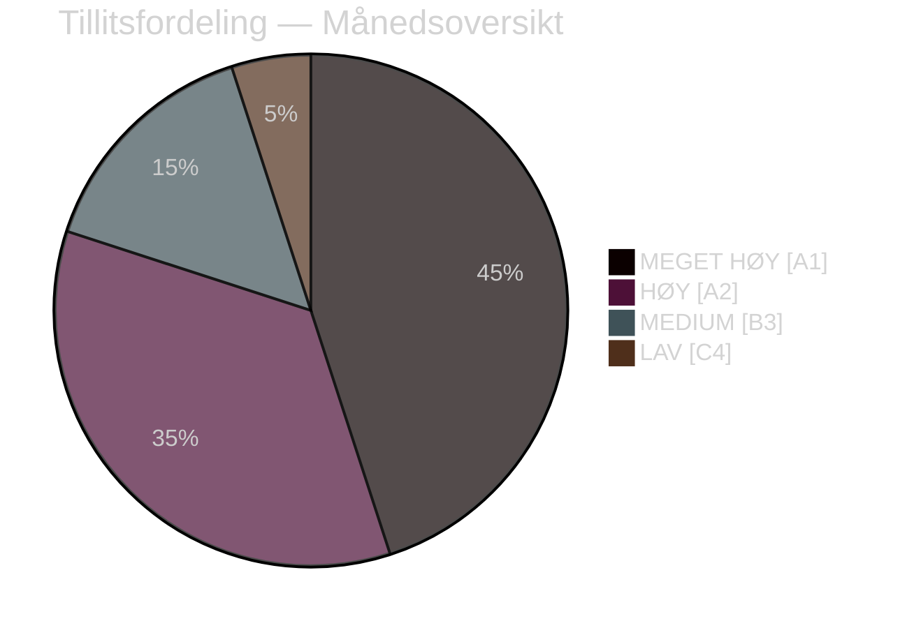

# Beslutningsnotat — Månedsoversikt april 2026

**Klassifisering**: OFFENTLIG | **Analytiker**: James Pether Sörling | **Dato**: 2026-04-23
**Tillit**: HØY [A1] | **Dager til valget**: ~143

---

## 🎯 BLUF

Sveriges parlamentariske april 2026-sprint leverte Kristersson-regjeringens endelige lovgivningspakke før valget. Månedens politiske signatur er et **fiskal-valgpivot**: HD01FiU48 (4,1 mrd. SEK nødlindring av drivstoffavgift) vedtatt 22. april med et ekstraordinært M+SD+S+KD-superflertall, som avslører S's manglende evne til å motsi husholdningers energistøtte 143 dager før valget i september 2026. Kombinert med NATO-deployeringer (UFöU3), omstrukturering av energistyring (HD03240/238/239) og en satsing på rettsvesen har regjeringen gjennomført en høykonfident valgposisjoneringsstrategi — selv om helsevesen (77 kombinerte forbehold i SfU18/SoU16/SoU17) og koalisjonstress (SD-KD-brudd om SoU17 R15) utgjør troverdige sårbarheter.

---

## 🧭 3 Beslutninger dette notatet støtter

### Beslutning 1: Valgstrategivurdering (september 2026)
Regjeringens pre-valgposisjonering er sammenhengende og profesjonelt gjennomført — finansielt ansvar + husholdningslindring + sikkerhet + migrasjonsleveranse. Den primære risikoen er helsearenan, der 77 kombinerte utvalgsforbehold signaliserer en velorganisert opposisjonsoffensiv.
**Analytikeres anbefaling**: Overvåk SfU-utvalgets overveielser og regionale helsedata for S's kampanjemunisjon. Overvåk SD-KD's helsebrudd for eskaleringssignaler.

### Beslutning 2: Energipolitikk og investeringstiming
Energitripelen (HD03240/238/239) skaper nye investeringsmuligheter og regulatorisk klarhet for elektrisitetsinfrastruktur. Miljöprövningsmyndigheten vil akselerere tillatelsesgivning. Kommunal inntektsdeling fra vindkraft (HD03239) løser en sentral lokal opposisjonsbarriere.
**Analytikeres anbefaling**: Investorer i svensk elektrisitetsproduksjon og fornybar energi bør merke stabiliseringen av rammeverket som et positivt signal.

### Beslutning 3: Forsvars- og sikkerhetsmessig forretningspåvirkning
UFöU3 (1 200 tropper eFP Finland) + HD03214 (cybersikkerhet) + HD03228 (krigsmateriell) signaliserer fortsatt høye forsvarsutgifter. Sveriges forsvarsindustrielle base moderniseres gjennom renere krigsmateriellregulering.
**Analytikeres anbefaling**: Forsvars- og cybersikkerhetsselskaper bør merke signaler om akselerert innkjøp og regulatorisk modernisering.

---

## 60-sekunders lesning: Nøkkelpunkter

- 🔴 **22. april**: HD01FiU48 (4,1 mrd. SEK drivstoffavgiftslindring) vedtatt — M+SD+**S**+KD-superflertall signaliserer S's valgssårbarhet på energikostnader
- 🔴 **13. april**: Vårproposition (HD03100) + Vårändringsbudget (HD0399) — endelig pre-valgs-finansielt rammeverk
- 🟠 **NATO**: UFöU3 bemyndiger 1 200 tropper eFP Finland — Sveriges NATO-forpliktelse krystalliseres
- 🟠 **Helsevesen**: 77 kombinerte forbehold (SfU18 + SoU16 + SoU17) — opposisjonens primære angrepsvektor
- 🟠 **Energi**: Elektrisitetslovreform (HD03240) + ny tillatelsesmyndighet (HD03238) + vindkraft (HD03239)
- 🟡 **Koalisjonstress**: SD-KD-brudd om SoU17 R15 — brudd i helseprioritering innen støttebasen
- 🟡 **Sikkerhet**: Cybersikkerhetssenter (HD03214) + krigsmateriellreform (HD03228) — post-NATO-lovgivningsramme
- 🟢 **Tverrpolitisk**: Forsvars- og NATO-tiltak vedtatt med tverrpolitisk konsensus — regjeringsstyrke

---

## ⚡ Beste fremadrettede utløser

**Overvåk**: FiU48's opinionsundersøkelsessporing etter vedtakelse — hvis husholdningers energikostnadslindring omsettes til M/KD/L-opinionsgevinster, har S's dobbeltstrategi "symbolsk opposisjon + praktisk støtte" slått feil. Hvis S opprettholder eller øker sin opinionsandel til tross for 22. april-stemmen, er budskabsdisiplinen effektiv.
**Triggerdato**: Første meningsmålinger etter 22. april (forventet sent april/tidlig mai 2026).

---

## �� Tillitsfordeling

| Domene | Tillit | Admiralty |
|--------|--------|-----------|
| Lovgivningsfakta (vedtatte lover) | MEGET HØY | A1 |
| Koalisjonsdinamikk (SD-KD-brudd) | HØY | A2 |
| Valgmessige implikasjoner | MEDIUM | B3 |
| Politiske resultater etter valget | LAV | C4 |

---

## 🔗 Fullstendige analysereferanser

- [Syntessammendrag](synthesis-summary.md)
- [Signifikansvurdering](significance-scoring.md)
- [SWOT-analyse](swot-analysis.md)
- [Risikovurdering](risk-assessment.md)
- [Etterretningsvurdering](intelligence-assessment.md)
- [Scenarioanalyse](scenario-analysis.md)
- [Fremadrettede indikatorer](forward-indicators.md)

<!-- source-sha: 1e83ac6587956e9b1ca9cfd53aac08783e617cbd -->
