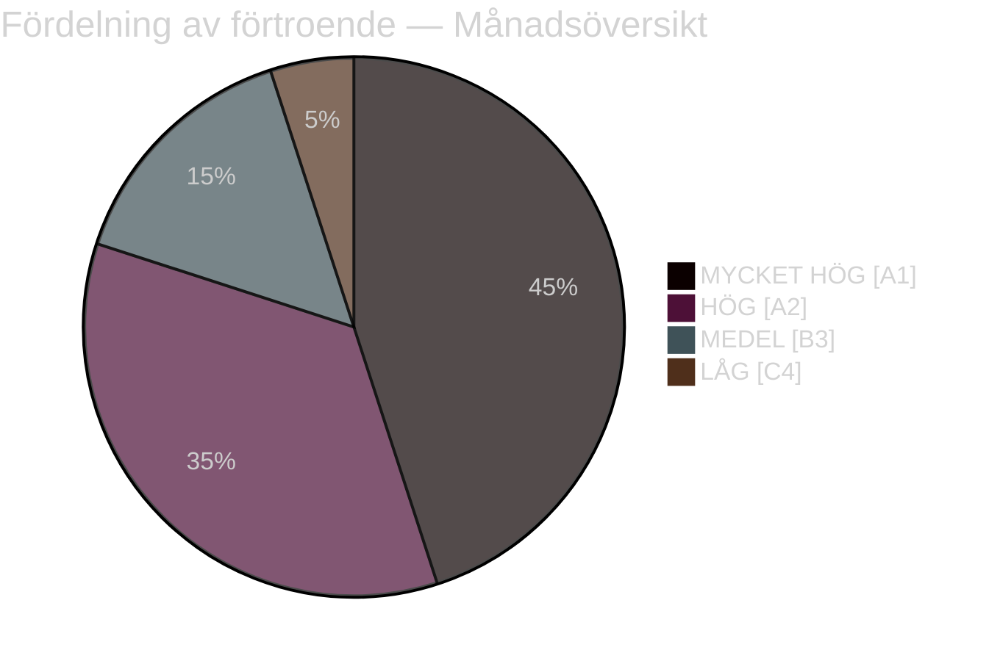

# Exekutiv sammanfattning — Månadsöversikt april 2026

**Klassificering**: OFFENTLIG | **Analytiker**: James Pether Sörling | **Datum**: 2026-04-23
**Förtroende**: HÖG [A1] | **Dagar till valet**: ~143

---

## 🎯 BLUF

Sveriges parlamentariska april 2026 levererade Kristersson-regeringens slutliga lagstiftningspaket inför valet. Månadens politiska signatur är en **fiskal-valpivotering**: HD01FiU48 (4,1 miljarder SEK nödlindring av bränslesskatt) antogs den 22 april med en extraordinär M+SD+S+KD-supermajoritet, vilket avslöjar S:s oförmåga att motsätta sig hushållens energihjälp 143 dagar före valet i september 2026. Kombinerat med NATO-deployeringar (UFöU3), omstrukturering av energistyrning (HD03240/238/239) och en satsning på rättsskipning har regeringen genomfört en högkonfident valpositioneringsstrategi — även om sjukvård (77 kombinerade reservationer i SfU18/SoU16/SoU17) och koalitionsstress (SD-KD-spricka om SoU17 R15) utgör trovärdiga sårbarheter.

---

## 🧭 3 Beslut som detta underlag stödjer

### Beslut 1: Bedömning av valstrategi (september 2026)
Regeringens förval-positionering är sammanhängande och professionellt genomförd — finansiellt ansvar + hushållslindring + säkerhet + migrationsleverans. Den huvudsakliga risken är sjukvårdsarenan, där 77 kombinerade utskottsreservationer signalerar en välorganiserad oppositionsoffensiv.
**Analytikerns rekommendation**: Övervaka SfU-utskottets överläggningar och regionala sjukvårdsdata för S:s kampanjammunition. Bevaka SD-KD:s sjukvårdsklyfta för eskaleringsignaler.

### Beslut 2: Energipolitik och investeringstiming
Energitripeln (HD03240/238/239) skapar nya investeringsmöjligheter och regleringsklarhet för elinfrastruktur. Miljöprövningsmyndigheten kommer att påskynda tillståndsgivning. Kommunal intäktsdelning från vindkraft (HD03239) löser ett centralt lokalt oppositionshinder.
**Analytikerns rekommendation**: Investerare i svensk elproduktion och förnybar energi bör notera stabiliseringen av regelverket som en positiv signal.

### Beslut 3: Försvars- och säkerhetspåverkan på verksamheter
UFöU3 (1 200 trupper eFP Finland) + HD03214 (cybersäkerhet) + HD03228 (krigsmateriel) signalerar fortsatt höga försvarsutgifter. Sveriges försvarsindustriella bas moderniseras genom renare regler för krigsmateriel.
**Analytikerns rekommendation**: Försvars- och cybersäkerhetsföretag bör notera signaler om accelererad upphandling och regelmodernisering.

---

## 60-sekunders läsning: Nyckelpunkter

- 🔴 **22 april**: HD01FiU48 (4,1 mdr SEK bränsleskattelindring) antagen — M+SD+**S**+KD-supermajoritet signalerar S:s valsårbarhet på energikostnader
- 🔴 **13 april**: Vårproposition (HD03100) + Vårändringsbudget (HD0399) — slutligt förvals-finansiellt ramverk
- 🟠 **NATO**: UFöU3 bemyndigar 1 200 trupper eFP Finland — Sveriges NATO-åtagande kristalliseras
- 🟠 **Sjukvård**: 77 kombinerade reservationer (SfU18 + SoU16 + SoU17) — oppositionens primära anfallsvektor
- 🟠 **Energi**: Ellagsreform (HD03240) + ny tillståndsmyndighet (HD03238) + vindkraft (HD03239)
- 🟡 **Koalitionsstress**: SD-KD-spricka om SoU17 R15 — fraktur i sjukvårdsprioritering inom stödbasen
- 🟡 **Säkerhet**: Cybersäkerhetscenter (HD03214) + krigsmaterielreform (HD03228) — post-NATO-lagstiftningsram
- 🟢 **Tvärsektoriellt**: Försvars- och NATO-åtgärder antas med partöverskridande konsensus — regeringsstyrka

---

## ⚡ Bästa framåtsignalen

**Övervaka**: FiU48:s opinionsuppföljning efter antagandet — om hushållets energikostnadslindring ger M/KD/L-opinionsvinster har S:s dubbla strategi "symbolisk opposition + praktiskt stöd" misslyckats. Om S bibehåller eller ökar sin opinionsandel trots rösten den 22 april är deras budskapskoherens effektiv.
**Triggerdatum**: Första opinionsundersökningar efter 22 april (förväntat sent april/tidigt maj 2026).

---

## 📊 Fördelning av förtroende

| Domän | Förtroende | Admiralty |
|-------|-----------|-----------|
| Lagstiftningsfakta (antagna lagar) | MYCKET HÖG | A1 |
| Koalitionsdynamik (SD-KD-spricka) | HÖG | A2 |
| Valmässiga implikationer | MEDEL | B3 |
| Politiska resultat efter valet | LÅG | C4 |

---

## 🔗 Fullständiga analysreferenser

- [Syntessammanfattning](synthesis-summary.md)
- [Signifikansbedömning](significance-scoring.md)
- [SWOT-analys](swot-analysis.md)
- [Riskbedömning](risk-assessment.md)
- [Underrättelsebedömning](intelligence-assessment.md)
- [Scenarioanalys](scenario-analysis.md)
- [Framåtindikatorer](forward-indicators.md)

<!-- source-sha: 1e83ac6587956e9b1ca9cfd53aac08783e617cbd -->
