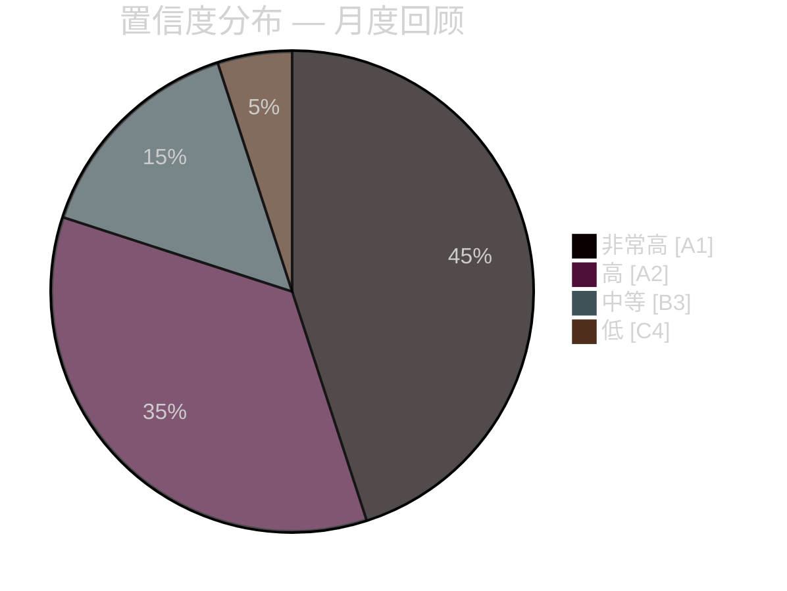

# 执行简报 — 2026年4月月度回顾

**分类**：公开 | **分析师**：James Pether Sörling | **日期**：2026-04-23
**置信度**：高 [A1] | **距选举天数**：约143天

---

## 🎯 核心摘要（BLUF）

瑞典2026年4月议会冲刺完成了克里斯特松政府选举前的最后立法包。本月的政治标志是**财政-选举轴心转移**：HD01FiU48（41亿瑞典克朗燃油税紧急减免）于4月22日以M+SD+S+KD异常超级多数获得通过，在2026年9月大选前143天揭示了S无法反对家庭能源援助的困境。结合北约部署（UFöU3）、能源治理重组（HD03240/238/239）和刑事司法整顿，政府执行了高置信度的选举定位战略——尽管医疗（SfU18/SoU16/SoU17共77项联合保留意见）和联合政府压力（SoU17 R15上的SD-KD裂痕）构成可信漏洞。

---

## 🧭 本简报支持的3项决策

### 决策1：选举战略评估（2026年9月）
政府的选前定位连贯一致、执行专业——财政责任＋家庭救济＋安全保障＋移民承诺。主要风险是医疗战场，77项联合委员会保留意见表明有组织的反对党攻势正在形成。
**分析师建议**：监测SfU委员会审议情况和地区医疗数据，为S党竞选提供弹药。密切关注SD-KD医疗分歧的升级信号。

### 决策2：能源政策与投资时机
能源三联组（HD03240/238/239）为电力基础设施创造新的投资机会和监管清晰度。Miljöprövningsmyndigheten 将加快许可授予。风电市政收益共享（HD03239）解决了重要的地方反对障碍。
**分析师建议**：投资于瑞典电力生产和可再生能源的投资者应将监管框架稳定化视为积极信号。

### 决策3：国防与安全业务影响
UFöU3（1,200名eFP芬兰）＋HD03214（网络安全）＋HD03228（战争物资）表明国防支出将持续保持高位。通过更清晰的战争物资法规，瑞典国防工业基础正在现代化。
**分析师建议**：国防和网络安全企业应关注采购加速和监管现代化的信号。

---

## 60秒速读：关键要点

- 🔴 **4月22日**：HD01FiU48（41亿SEK燃油税减免）通过 — M+SD+**S**+KD超级多数揭示S在能源成本问题上的选举脆弱性
- 🔴 **4月13日**：Vårproposition (HD03100) + Vårändringsbudget (HD0399) — 最终选前财政框架
- 🟠 **北约**：UFöU3授权1,200名eFP芬兰 — 瑞典对北约的承诺具体化
- 🟠 **医疗**：77项联合保留意见（SfU18 + SoU16 + SoU17）— 反对党主要攻击向量
- 🟠 **能源**：电力法改革（HD03240）＋新许可机构（HD03238）＋风电（HD03239）
- 🟡 **联合压力**：SoU17 R15的SD-KD裂痕 — 支持基础内医疗优先化断裂
- 🟡 **安全**：网络安全中心（HD03214）＋战争物资改革（HD03228）— 北约后立法框架
- 🟢 **跨党派**：国防和北约措施以跨党派共识通过 — 政府实力

---

## ⚡ 最佳前瞻性触发因素

**监测**：FiU48通过后民调追踪——若家庭能源成本减免转化为M/KD/L民调上升，S的"象征性反对＋实际支持"双轨策略宣告失败。若S尽管经历4月22日投票仍维持或提高民调份额，其信息纪律有效。
**触发日期**：4月22日后首批民调（预计2026年4月下旬/5月初）。

---

## 📊 置信度分布

| 领域 | 置信度 | Admiralty |
|------|--------|-----------|
| 立法事实（已通过的法律） | 非常高 | A1 |
| 联盟动态（SD-KD裂痕） | 高 | A2 |
| 选举影响 | 中等 | B3 |
| 选后政策结果 | 低 | C4 |

---

## 🔗 完整分析参考文献

- [综合摘要](synthesis-summary.md)
- [重要性评分](significance-scoring.md)
- [SWOT分析](swot-analysis.md)
- [风险评估](risk-assessment.md)
- [情报评估](intelligence-assessment.md)
- [情景分析](scenario-analysis.md)
- [前瞻指标](forward-indicators.md)

<!-- source-sha: 1e83ac6587956e9b1ca9cfd53aac08783e617cbd -->
