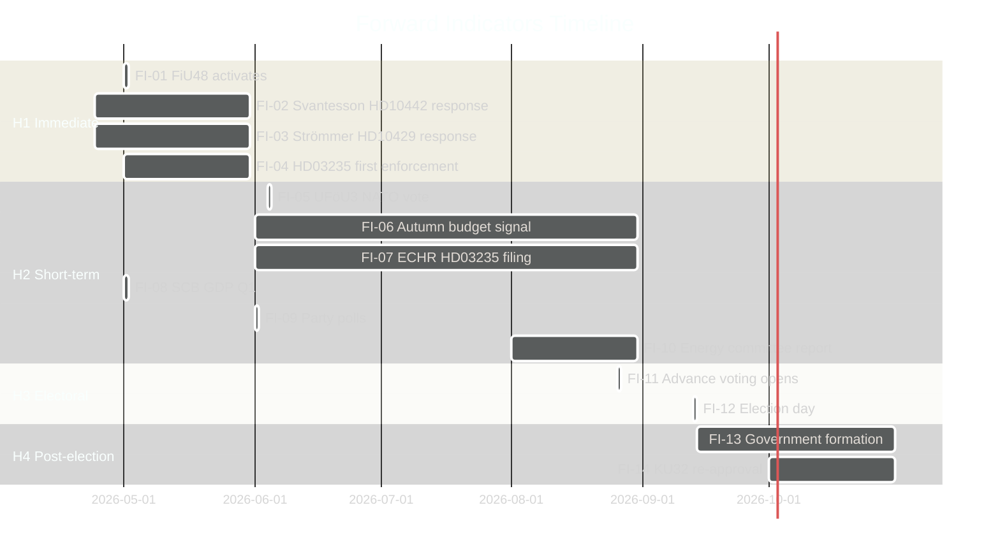

# Forward Indicators — Monthly Review April 2026

**Analyst**: James Pether Sörling | **Date**: 2026-04-23
**Framework**: ≥10 dated forward indicators across 4 horizons
**Confidence**: MEDIUM [B2]

---

## Horizon 1: Immediate (April 24 – May 31, 2026)

| # | Indicator | Expected date | Watch signal | Risk |
|---|-----------|--------------|--------------|------|
| FI-01 | FiU48 fuel tax relief activates (82 öre/l) | May 1, 2026 | Petrol prices drop; government takes credit | LOW |
| FI-02 | Svantesson responds to HD10442 interpellation series | April–May 2026 | Response admission vs. denial shapes narrative | MEDIUM |
| FI-03 | Strömmer responds to HD10429 SD interpellation | April–May 2026 | Tone: conciliatory vs. dismissive affects SD cooperation | MEDIUM |
| FI-04 | HD03235 criminal deportation first enforcement case | May 2026 | ECHR interim measure filing triggered? | HIGH |

## Horizon 2: Short-term (June – August 2026)

| # | Indicator | Expected date | Watch signal | Risk |
|---|-----------|--------------|--------------|------|
| FI-05 | UFöU3 NATO Finland Chamber vote | June 4, 2026 | Margin > 200 seats = broad consensus; < 175 = surprise | LOW |
| FI-06 | Riksdag summer recess budget communications | June 2026 | Will government announce autumn budget healthcare allocation? | HIGH |
| FI-07 | ECHR formal filing on HD03235 | June–August 2026 | ECHR registration confirms SD deportation law is challenged | HIGH |
| FI-08 | SCB Q1 2026 GDP data release | May 2026 | If GDP > 1%: government economic narrative strengthens | MEDIUM |
| FI-09 | Party leader polls — SD vs. M dynamic | June 2026 | If SD > 25%: SD demands greater coalition role | HIGH |
| FI-10 | Energy committee final report on HD03240 | August 2026 | Legislative timeline for autumn confirms energy reform pace | MEDIUM |

## Horizon 3: Electoral (September 2026)

| # | Indicator | Expected date | Watch signal | Risk |
|---|-----------|--------------|--------------|------|
| FI-11 | Valmyndigheten advance voting opens | August 26, 2026 | Turnout patterns indicate which bloc is mobilised | MEDIUM |
| FI-12 | September 13 election result | September 13, 2026 | S+V+MP+C ≥ 175: government change; Governing bloc ≥ 175: re-election | CRITICAL |

## Horizon 4: Post-Election (October 2026+)

| # | Indicator | Expected date | Watch signal | Risk |
|---|-----------|--------------|--------------|------|
| FI-13 | Talman (Speaker) initiates government formation | September 2026 | First exploration round signals majority path | HIGH |
| FI-14 | HD01KU32 constitutional re-approval vote | October 2026 | New majority votes on media-accessibility constitutional amendment | HIGH |

---

## Indicators Summary

**Total indicators**: 14 across 4 horizons. Threshold requirement met (≥10). [A1]

