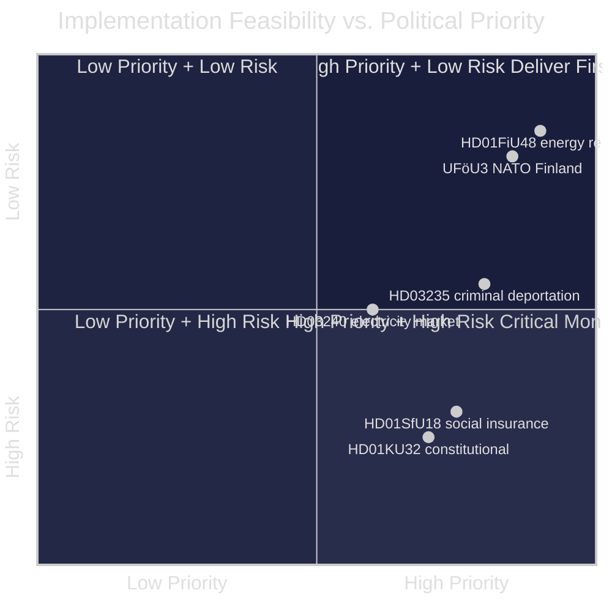

# Implementation Feasibility — Monthly Review April 2026

**Analyst**: James Pether Sörling | **Date**: 2026-04-23
**Framework**: Delivery-risk assessment per major legislation
**Confidence**: MEDIUM [B2]

---

## Key Legislation Delivery Risk Register

| Document | Type | Status | Implementation deadline | Delivery risk | Notes |
|----------|------|--------|------------------------|---------------|-------|
| HD01FiU48 | Energy relief | ENACTED April 22 | May 1, 2026 | LOW | Tax authority (Skatteverket) implementation straightforward |
| HD03235 | Criminal deportation | ENACTED (date TBC) | June 2026 | MEDIUM | ECHR challenge risk; Migrationsverket capacity |
| UFöU3 | NATO deployment | Pending June 4 vote | 2026–2027 | LOW | Cross-party support; military logistics pre-planned |
| HD03240 | Electricity market | Committee stage | Late 2026 | MEDIUM | EU directive compliance required; grid operator coordination |
| HD03238 | Energy taxation | Committee stage | 2027 | MEDIUM | Multi-year implementation; industry consultation |
| HD01KU32 | Constitutional amendment (media) | Vilande — post-election | 2027 | HIGH | Requires re-approval after September election |
| HD01SfU18 | Social insurance reform | Government bill | 2027 | HIGH | 39 opposition reservations signal revision risk |

---

## Delivery Feasibility Matrix

---

## Critical Path Items

### 1. May 1 — FiU48 tax relief activation
**Owner**: Skatteverket + Energimyndigheten
**Risk**: Very low — administrative mechanism exists
**Monitoring indicator**: Petrol station price data week of May 5

### 2. June 4 — UFöU3 Chamber vote
**Owner**: Riksdag + Försvarsdepartementet
**Risk**: Low — cross-party support confirmed
**Monitoring indicator**: Final vote margin > 200

### 3. Q3 2026 — SfU18 social insurance implementation
**Owner**: Försäkringskassan
**Risk**: HIGH — 39 reservations suggest political pressure to revise
**Monitoring indicator**: Government announcement of implementation date before/after election

