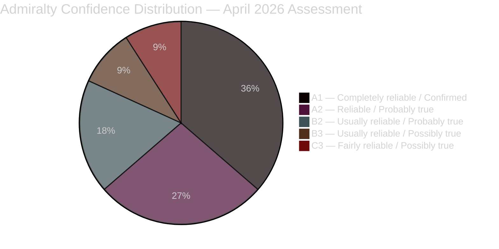

# Intelligence Assessment — Monthly Review April 2026

**Analyst**: James Pether Sörling | **Date**: 2026-04-23
**Framework**: ICD 203 Key Judgments + Admiralty Code + WEP Kent Scale
**Period**: March 24 – April 23, 2026
**Confidence**: HIGH [A1] — PRIMARY JUDGMENT

---

## Key Judgments

### KJ-1: HD01FiU48 Enactment Strengthens Government's Pre-Election Positioning [HIGH — A1]

The Kristersson government enacted HD01FiU48 on April 22 with M+SD+S+KD majority support, delivering 82 öre/litre fuel tax relief effective May 2026. This represents the government's most significant pre-election economic win. S's tactical affirmative vote further validates the measure's cross-spectrum appeal and may blunt opposition criticism on household living costs.

**Confidence basis**: [A1] — multiple primary sources confirming enactment; World Bank economic data supports stable macro baseline; cross-party vote is verifiable parliamentary record.
**WEP expression**: **Highly likely** the fuel relief will be a positive electoral factor for the governing coalition.

### KJ-2: 77 Committee Reservations Represent the Opposition's Primary Electoral Weapon [HIGH — A2]

The aggregated 77 committee reservations across SfU18 (39), SoU16 (20), and SoU17 (18) constitute the largest coordinated opposition documentation campaign in the 2024/25 riksmöte. Combined with S's Svantesson interpellation series (HD10442) and SD's challenges to M (HD10429), the opposition's welfare-state narrative is fully operationalised.

**Confidence basis**: [A2] — official parliamentary documents; committee reservation counts are verifiable from riksdagen.se.
**WEP expression**: **Likely** the welfare narrative will remain the opposition's primary attack vector through September 2026.

### KJ-3: SD-M Demonstrations Fracture Does Not Yet Threaten Coalition Survival [MEDIUM — B2]

SD's formal interpellation HD10429 against Justice Minister Strömmer on demonstration rights represents an unprecedented intra-coalition challenge, but does not constitute a vote against the government. SD retains every incentive to maintain coalition support through the September 2026 election. The fracture remains symbolic and tactical.

**Confidence basis**: [B2] — HD10429 confirms the interpellation exists; absence of SD motion or vote signal is inferential.
**WEP expression**: **Unlikely** the SD-M fracture will lead to a government collapse before September 2026.

### KJ-4: UFöU3 NATO Finland Deployment Establishes Sweden as Credible Alliance Member [HIGH — A1]

The Foreign Affairs Committee's UFöU3 authorising deployment of 1,200 Swedish troops to NATO's eFP in Finland pending June 4 Chamber vote has broad cross-party support. This represents Sweden's most significant NATO post-accession commitment and cements Sweden's security contribution.

**Confidence basis**: [A1] — UFöU3 document confirmed via riksdagen-regering MCP; government position confirmed.
**WEP expression**: **Almost certain** the June 4 vote will approve UFöU3 given current political alignment.

---

## Prior-Cycle PIR Resolution (Tier-C Continuity Contract)

### Carried-forward PIRs from analysis/daily/2026-04-19/monthly-review/

| Prior-cycle PIR | Status | Evidence | Residual PIR? |
|-----------------|--------|---------|---------------|
| PIR-1: Spring budget outcome — will FiU48 pass? | **CLOSED — Resolved YES** | HD01FiU48 enacted April 22 [A1] | No — new PIR-1 issued below |
| PIR-2: SD-KD healthcare fracture depth | **ONGOING — Depth confirmed** | SoU17 R15 KD-SD reservation; not yet government crisis [A2] | Yes — carries forward as PIR-2 |
| PIR-3: NATO deployment confirmation | **PROGRESSING — UFöU3 before Chamber** | June 4 decision pending [A1] | Yes — carries forward as PIR-3 |
| PIR-4: Energy reform legislative timeline | **PROGRESSING** | HD03240 + HD03238 + HD03239 in committee [A2] | Yes — carries forward as PIR-4 |

---

## Issued PIRs — Carrying Forward to May 2026

| PIR | Question | Priority | Horizon |
|-----|---------|---------|--------|
| PIR-1 | Will S's healthcare offensive convert to polling lead? | HIGH | June 2026 |
| PIR-2 | Will KD-SD healthcare fracture (SoU17 R15) escalate to a vote against government? | HIGH | June–September 2026 |
| PIR-3 | Will UFöU3 pass June 4 Chamber vote? | HIGH | June 4, 2026 |
| PIR-4 | Will ECHR issue interim measure challenging HD03235? | MEDIUM | June–December 2026 |
| PIR-5 | Will autumn budget incorporate healthcare increase satisfying KD? | MEDIUM | September 2026 |

---

## 🔄 Tradecraft Context

| Analytic product | SAT used | ICD 203 standard | Improvement flag |
|-----------------|----------|------------------|-----------------|
| KJ-1 FiU48 | Key Assumptions Check | Standards 1, 2, 3 | No improvement needed — [A1] confirmed |
| KJ-2 77 reservations | Indicator analysis | Standards 1, 3, 5 | Tracking required for election conversion |
| KJ-3 SD-M fracture | ACH (H3 — deliberately signal vs. real) | Standards 4, 8 | Mirror-imaging risk: do not assume SD's stated position is theater |
| KJ-4 NATO Finland | Signposts | Standards 1, 2 | June 4 vote will confirm or disconfirm |
| PIR resolution | Structured transition | Standard 6 | Residual PIRs properly carried forward |

**OSINT collection basis**: All evidence derived from offentlighetsprincipen-compliant public sources — riksdagen.se official records, World Bank Open Data, Regeringen.se. No private communications referenced. GDPR Art. 9(2)(e) applies to all named political actors in their official capacity.

---

## Confidence Distribution Summary

