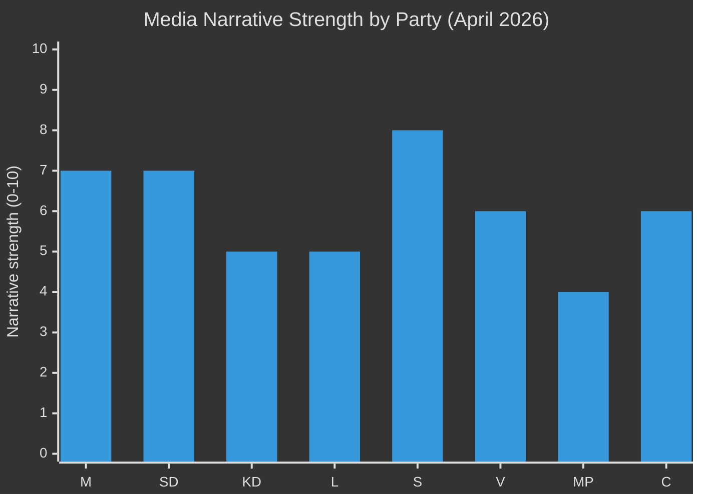

# Media Framing Analysis — Monthly Review April 2026

**Analyst**: James Pether Sörling | **Date**: 2026-04-23
**Framework**: Per-party framing analysis + narrative control assessment
**Confidence**: MEDIUM [B2]

---

## Governing Bloc Framing

### M (Moderaterna) — Fiscal Competence Frame
**Core narrative**: "We manage Sweden's economy responsibly — HD03100 spring bill + HD01FiU48 household relief proves fiscal leadership."
**Key messages**:
1. "Household energy costs relieved — 82 öre/litre from May 1" (HD01FiU48)
2. "Sweden's NATO commitment secured — 1,200 troops to Finland" (UFöU3)
3. "Crime down — criminal deportation law enacted" (HD03235)

**Framing risk**: S's interpellation series (HD10442) targets Finance Minister Svantesson directly — court ruling potentially contradicting Svantesson's statements. M must counter with factual rebuttal.

### SD (Sverigedemokraterna) — Order and Identity Frame
**Core narrative**: "SD delivers on immigration and enforcement — HD03235 is SD's biggest win in 2025/26."
**Contradictory signal**: HD10429 interpellation against M's Strömmer on demonstrations — SD must reconcile "order" frame with civil-liberties dispute.

### KD — Social-Christian Values Frame
**Core narrative**: "Family, healthcare, Christian values — SoU17 R15 signals we will not accept healthcare cuts."
**Framing vulnerability**: KD's SoU17 R15 reservation publicly distances KD from SD on healthcare — useful for KD differentiation but signals coalition fragility to voters.

---

## Opposition Framing

### S — Responsible Opposition Frame
**Core narrative**: "We vote yes when it helps Swedes (FiU48), no when it hurts (SfU18/SoU16/SoU17). We are the responsible alternative."
**Strategic advantage**: Cross-party FiU48 vote appears "statesmanlike." Simultaneous interpellation offensive (HD10442) maintains critical distance.
**Key messages**:
1. "Government undermines healthcare — 77 reservations are the evidence"
2. "Finance Minister Svantesson misled the Riksdag" (HD10442 claim)
3. "We supported fuel relief because Swedes needed it — not the government"

### V — Progressive Flank Frame
**Core narrative**: "S is too centrist — V is the party of real welfare state defence."
**Risk**: If S moves to centre, V may lose voters who prefer a clear left alternative.

### MP — Climate First Frame
**Core narrative**: "HD024082 fuel counter-motion shows only MP puts climate first."
**Risk**: FiU48 + S's yes vote signals climate concerns secondary to household costs — MP narrative is weakened.

### C — Market Liberal Pragmatist Frame
**Core narrative**: "We support energy reform (HD03240 abstained on FiU48) and housing (HC023443) — we are the sensible centre."
**Strategic opportunity**: C abstained on FiU48 — preserves both coalition and opposition options. C is the true pivot party.

---

## Narrative Control Assessment

**Top finding**: S has the strongest current narrative (8/10) — responsible opposition + accountability offensive. M and SD tied at 7/10. MP weakest at 4/10 following FiU48 cross-party energy passage.

