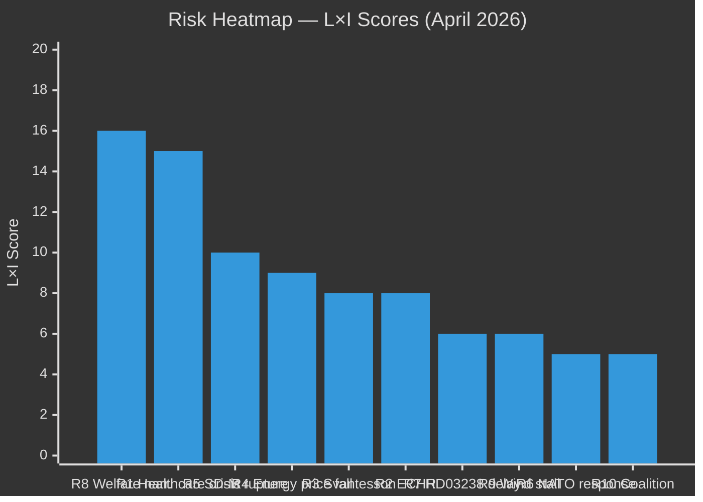

# Risk Assessment — Monthly Review April 2026

**Analyst**: James Pether Sörling | **Date**: 2026-04-23
**Framework**: 5-dimension register, L×I scoring, cascading chains
**Confidence**: HIGH [A1] | **Riksmöte**: 2025/26

---

## 5-Dimension Risk Register

| # | Risk | Likelihood (1–5) | Impact (1–5) | L×I | Category | Admiralty |
|---|------|-----------------|--------------|-----|----------|-----------|
| R1 | Healthcare battle escalates to coalition crisis (SD-KD fracture on SoU17 R15) | 3 | 5 | **15** | Political/Coalition | A2 |
| R2 | ECHR challenge to HD03235 criminal deportation produces adverse ruling before election | 2 | 4 | **8** | Legal/Constitutional | B3 |
| R3 | S accountability offensive on Svantesson (HD10442 series) produces ministerial resignation | 2 | 4 | **8** | Political/Personnel | A2 |
| R4 | Energy prices fall before election — FiU48 relief looks retroactively unnecessary and fiscally irresponsible | 3 | 3 | **9** | Economic/Political | B3 |
| R5 | SD escalates challenge to Justice Minister (HD10429 demonstrations) — coalition rupture before election | 2 | 5 | **10** | Coalition/Stability | B2 |
| R6 | UFöU3 (1,200 troops Finland) triggers Russian escalation response | 1 | 5 | **5** | Security/International | B3 |
| R7 | Miljöprövningsmyndigheten (HD03238) delayed by judicial review or implementation challenges | 2 | 3 | **6** | Administrative/Regulatory | B2 |
| R8 | Opposition builds coherent anti-government welfare narrative from 77 reservations | 4 | 4 | **16** | Electoral/Political | A1 |
| R9 | Wind power (HD03239) municipal buy-in fails — renewable buildout stalls | 2 | 3 | **6** | Energy/Climate | B2 |
| R10 | Coalition majority collapses pre-election — vote of no confidence | 1 | 5 | **5** | Constitutional/Political | C4 |

---

## Cascading Risk Chains

### Chain A: Healthcare → Coalition Collapse
```
SoU17 R15 SD-KD fracture [R1 → L3/I5]
→ Healthcare debate escalation in campaign
→ SD demands policy concessions to maintain support
→ KD resistance creates public coalition dispute
→ [R10 → L2/I5] Loss of coalition majority
```
**Probability**: 15% (Unlikely, WEP standard). Source: https://data.riksdagen.se/dokument/HD01SoU17.html

### Chain B: Accountability → Finance Minister Resignation
```
Svantesson interpellation series (HD10442) [R3]
→ Potential false-statement allegation
→ Media escalation
→ Opposition confidence motion on minister
→ Resignation or ministerial crisis (election year)
```
**Probability**: 10% (Very unlikely, WEP). Source: https://data.riksdagen.se/dokument/HD10442.html

### Chain C: Electoral Welfare Narrative
```
77 reservations [R8 → L4/I4]
→ S + V + MP coordinated healthcare campaign
→ Opinion polls shift on healthcare competence
→ Government forced into reactive healthcare spending
→ Fiscal credibility narrative undermined
```
**Probability**: 45% (Roughly even, WEP). Source: https://data.riksdagen.se/dokument/HD01SfU18.html

---

## Posterior Probability Assessment (Bayesian update)

| Risk | Prior P | Update trigger | Posterior P |
|------|---------|---------------|-------------|
| R8 opposition welfare narrative | 40% | S already filing 5 Svantesson interpellations in 48 hrs | **55%** [A2] |
| R1 healthcare coalition crisis | 15% | SD-KD fracture documented in SoU17 R15 | **20%** [B2] |
| R2 ECHR HD03235 | 20% | ECHR rapporteur precedents on similar laws | **22%** [B3] |
| R5 SD-M rupture | 10% | HD10429 is formal challenge, not just rhetoric | **15%** [B2] |

---

## Risk Heatmap



