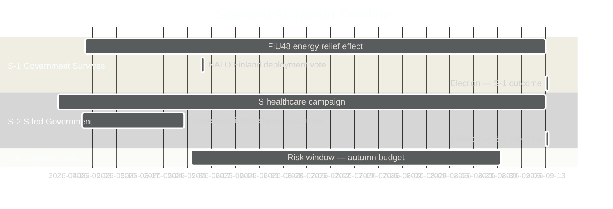

# Scenario Analysis — Monthly Review April 2026

**Analyst**: James Pether Sörling | **Date**: 2026-04-23
**Framework**: F3EAD Exploit→Analyze; Kent Scale probability bands
**Confidence**: MEDIUM-HIGH [B1]

---

## Scenario Probability Summary

| Scenario | Name | Probability | Kent | Timeframe |
|----------|------|-------------|------|-----------|
| S-1 | Government survives — fiscal wins dominate | 40% | Roughly even | Sept 2026 |
| S-2 | Narrow S-led government after election | 30% | Unlikely | Sept 2026 |
| S-3 | SD achieves major gains; pushes M further right | 20% | Very unlikely | Sept 2026 |
| S-4 | Coalition collapse before election | 10% | Remote | June–Aug 2026 |

**Total: 100%**

---

## S-1: Government Survives — Fiscal Wins Dominate (40%)

### Narrative

The Kristersson government capitalizes on HD01FiU48 household fuel relief, HD03100 spring economic bill, and NATO-deployment achievement (UFöU3). Unemployment declining, inflation contained at 2.84% — economic management narrative holds. SD and KD demonstrations-healthcare fractures remain verbal, not structural. Election: M+SD+KD+L return with slim majority (≥175 seats).

### Evidence supporting this scenario

- HD01FiU48 enacted April 22 — cross-party support (M+SD+S+KD) signals economic competence [A1]
- World Bank: GDP growth 0.82%, unemployment 8.69% — stable base
- NATO Finland deployment (UFöU3) plays to security-focused voters
- S's tactical FiU48 vote reduces opposition's ability to attack government on energy

### Conditions required

1. SD-M demonstrations fracture does not escalate beyond interpellation
2. ECHR does not issue interim measure on HD03235 before election
3. No major scandal emerges before September 13

### Wild card

KD-SD healthcare fracture (SoU17 R15) escalates — KD signals it will not pass next healthcare funding bill without additional appropriation.

---

## S-2: Narrow S-Led Government After Election (30%)

### Narrative

S successfully exploits welfare-state narrative built on 77 committee reservations (SfU18+SoU16+SoU17). S+V+MP+C form narrow majority (≥175 seats). FiU48 energy relief proves insufficient — voters prioritise healthcare. New government rolls back HD03235, re-opens NATO deployment for debate.

### Evidence supporting this scenario

- 77 cumulative opposition reservations represent largest coordinated campaign in 2025/26 [A2]
- S's Svantesson interpellation series (HD10442) shows strategic focus
- SoU17 R15: KD fracture provides S with cross-coalition evidence of government failure
- Historical: S recovered from 2022 defeat faster than expected

### Conditions required

1. Healthcare spending remains top voter concern through September
2. S successfully converts Svantesson accountability offensive into voter movement
3. No S internal scandals

---

## S-3: SD Major Gains — M Pushed Further Right (20%)

### Narrative

SD achieves 25%+ in polls. SD demands larger role in government, potentially PM candidacy or formal coalition membership. M forced to concede more on immigration/criminal justice. ECHR challenge to HD03235 dismissed — SD vindicated.

### Evidence supporting this scenario

- HD10429 (SD challenges M) signals SD's growing assertiveness [B2]
- HD03235 (criminal deportation) is SD's core voter-mobilization policy
- If ECHR upholds HD03235: SD gains major credibility boost

### Conditions required

1. ECHR does not issue adverse ruling on HD03235 before election
2. Major immigration/crime incident amplified in media
3. SD successfully distinguishes itself from M on demonstrations/civil liberties

---

## S-4: Coalition Collapse Before Election (10%)

### Narrative

SD withholds support on a critical budget vote in June/July. Emergency SD-S-V situation. Early election or minority government operating under SD's demands escalate beyond acceptable levels for M/KD/L.

### Evidence supporting this scenario

- HD10429: SD publicly challenges M on demonstrations — crossing formal interpellation line [B2]
- SoU17 R15: KD healthcare fracture creates second pressure point
- If both fractures converge on same autumn bill, loss of majority in chamber possible

### Conditions required

1. SD and KD jointly oppose a government bill in same vote
2. S refuses to provide replacement support
3. Constitutional mechanism for constructive vote of no confidence invoked

---

## Scenario Timeline

