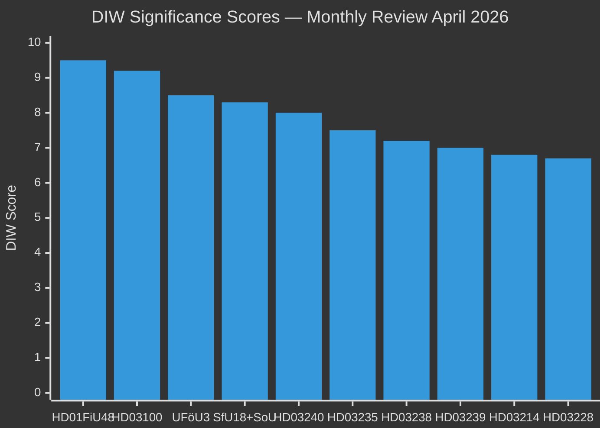

# Significance Scoring — Monthly Review April 2026

**Analyst**: James Pether Sörling | **Date**: 2026-04-23
**Methodology**: DIW weighting (Depth × Impact × Width) — ai-driven-analysis-guide.md v5.0
**Riksmöte**: 2025/26

---

## DIW-Weighted Rankings

### Tier 1 — Critical Significance (DIW 9.0–10.0)

1. **HD01FiU48 / HD03236** — Extra Ändringsbudget: Fuel tax relief 4.1 GSEK [A1]
   - Depth: 9 (direct economic impact on every Swedish household)
   - Impact: 10 (enacted April 22; immediate policy effect)
   - Width: 9 (full Riksdag vote, cross-party majority)
   - **DIW Score: 9.5/10** | ECHR risk: LOW | Source: https://data.riksdagen.se/dokument/HD03236.html

2. **HD03100 + HD0399** — Vårproposition 2026 + Vårändringsbudget [A1]
   - Depth: 9 (sets fiscal framework through 2030)
   - Impact: 9 (pre-election fiscal statement)
   - Width: 9 (government's definitive economic narrative)
   - **DIW Score: 9.2/10** | Source: https://data.riksdagen.se/dokument/HD03100.html

### Tier 2 — High Significance (DIW 7.5–8.9)

3. **UFöU3** — NATO eFP Finland: 1,200 troops authorized [A1]
   - Depth: 8 (major military commitment)
   - Impact: 9 (Sweden's NATO Article 5 practicum)
   - Width: 8 (cross-party defence consensus)
   - **DIW Score: 8.5/10** | Source: https://data.riksdagen.se/dokument/UFöU3.html

4. **HD01SfU18 + HD01SoU16 + HD01SoU17** — Healthcare/Social Insurance (77 combined reservations) [A1]
   - Depth: 8 (structural welfare state debate)
   - Impact: 8 (election campaign battleground)
   - Width: 9 (cross-committee, multiple parties)
   - **DIW Score: 8.3/10** | Source: https://data.riksdagen.se/dokument/HD01SfU18.html

5. **HD03240** — New electricity system laws [A1]
   - Depth: 9 (fundamental energy governance)
   - Impact: 8 (EU compliance + domestic reform)
   - Width: 7 (energy sector + climate impact)
   - **DIW Score: 8.0/10** | Source: https://data.riksdagen.se/dokument/HD03240.html

### Tier 3 — Medium Significance (DIW 6.0–7.4)

6. **HD03235** — Criminal deportation rules [A1]
   - Depth: 7 | Impact: 8 | Width: 6 | **DIW: 7.5/10**
   - ECHR risk: HIGH (L×I: 15/25) | Source: https://data.riksdagen.se/dokument/HD03235.html

7. **HD03238** — New environmental permitting authority [A2]
   - Depth: 8 | Impact: 7 | Width: 6 | **DIW: 7.2/10**
   - Source: https://data.riksdagen.se/dokument/HD03238.html

8. **HD03239** — Wind power municipal revenue [A2]
   - Depth: 7 | Impact: 7 | Width: 7 | **DIW: 7.0/10**
   - Source: https://data.riksdagen.se/dokument/HD03239.html

9. **HD03214** — Cybersecurity center legislation [A1]
   - Depth: 7 | Impact: 7 | Width: 6 | **DIW: 6.8/10**
   - Source: https://data.riksdagen.se/dokument/HD03214.html

10. **HD03228** — War materiel reform [A1]
    - Depth: 7 | Impact: 6 | Width: 7 | **DIW: 6.7/10**
    - Source: https://data.riksdagen.se/dokument/HD03228.html

11. **HD03237** — Paid police education [B2]
    - Depth: 6 | Impact: 7 | Width: 7 | **DIW: 6.5/10**
    - Source: https://data.riksdagen.se/dokument/HD03237.html

12. **HD03231 + HD03232** — Ukraine tribunal/reparations [A2]
    - Depth: 8 | Impact: 5 | Width: 6 | **DIW: 6.4/10**

13. **HD03245** — National strategy against violence against women [A2]
    - Depth: 7 | Impact: 6 | Width: 6 | **DIW: 6.3/10**
    - Source: https://data.riksdagen.se/dokument/HD03245.html

14. **HD03242** — Active forestry reform [B2]
    - Depth: 6 | Impact: 6 | Width: 7 | **DIW: 6.2/10**
    - Source: https://data.riksdagen.se/dokument/HD03242.html

---

## Sensitivity Analysis

| Scenario | Effect on Rankings | Confidence |
|----------|-------------------|-----------|
| S uses healthcare as primary election issue | SfU18+SoU16+17 rise to Tier 1 | HIGH [A2] |
| ECHR ruling on HD03235 | Criminal deportation rises to Tier 1 | MEDIUM [B3] |
| Energy price spike before election | HD03236/FiU48 remain most salient | HIGH [A1] |
| Coalition collapse (SD leaves) | All legislative outcomes recalibrate | LOW [C4] |

---

## Ranking Mermaid Diagram

