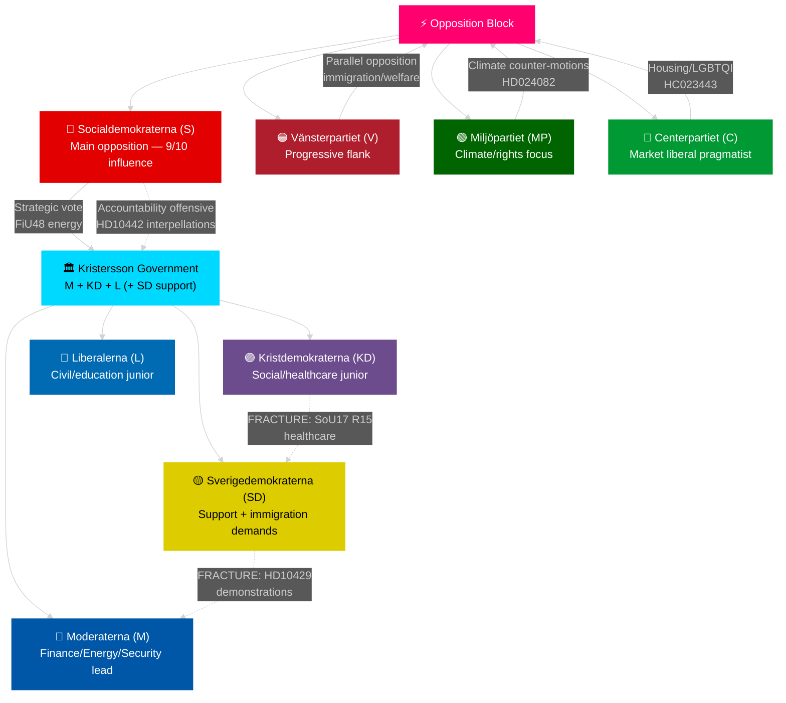

# Stakeholder Perspectives — Monthly Review April 2026

**Analyst**: James Pether Sörling | **Date**: 2026-04-23
**Framework**: 6-lens stakeholder matrix + influence network
**Confidence**: HIGH [A1]

---

## 6-Lens Stakeholder Matrix

| Stakeholder | Position | Interest | Influence | Stance | Named actors | Source |
|-------------|----------|---------|-----------|--------|--------------|--------|
| M (Moderaterna) | Government lead | Fiscal credibility + security | 10/10 | Delivering pre-election package | PM Svantesson, Finance Min. E. Svantesson | HD03100 riksdagen.se |
| SD (Sverigedemokraterna) | Governing support | Immigration enforcement + SD voter satisfaction | 9/10 | Compliant on most issues; fracture on demonstrations (HD10429) | Jimmie Åkesson, Farivar | HD10429 riksdagen.se |
| KD (Kristdemokraterna) | Coalition junior | Social conservatism + healthcare | 7/10 | Delivering on healthcare competence (HD03216) but fracturing on SoU17 R15 | Ebba Busch, Elisabet Lann | HD01SoU17 riksdagen.se |
| L (Liberalerna) | Coalition junior | Civil liberties + education | 6/10 | Supporting energy package; PM Lotta Edholm co-signed HD03236 | Lotta Edholm, Paulina Brandberg | HD03245 riksdagen.se |
| S (Socialdemokraterna) | Main opposition | Return to power; healthcare | 9/10 | Coordinated accountability offensive; strategically voted for FiU48 on energy costs | Håkan Juholt (absent), named: Gunilla Carlsson, Serkan Köse, Marie Olsson | HD10442, HD01FiU48 riksdagen.se |
| V (Vänsterpartiet) | Opposition | Progressive welfare state | 6/10 | Consistent opposition on immigration, healthcare, civil rights | Gudrun Nordborg, Nadja Awad | HC023444, HC023445 riksdagen.se |
| MP (Miljöpartiet) | Opposition | Climate + civil rights | 5/10 | Filed climate counter-motions (HD024082) on fuel tax; outflanked by S's FiU48 vote | Märta Stenevi, Jan Riise, Mats Berglund | HD024082 riksdagen.se |
| C (Centerpartiet) | Opposition | Market liberal + rural | 5/10 | Active on housing (HC023443) and LGBTQI (HD10431); pragmatic on energy | Alireza Akhondi, Catarina Deremar | HC023437 riksdagen.se |
| FöU committee | Parliamentary oversight | Defence and security | 7/10 | Advancing NATO/defence legislation with broad consensus | Committee chair | UFöU3 riksdagen.se |
| Swedish public | Electorate | Household energy costs | N/A | Broadly supportive of fuel tax relief based on HD01FiU48 passage | N/A | World Bank unemployment data |

---

## Influence Network

---

## Winner/Loser Analysis — April 2026

| Actor | Win/Loss | Evidence |
|-------|----------|---------|
| M (Svantesson) | **WIN** — spring fiscal package adopted | HD03100 + FiU48 enacted [A1] |
| SD | **MIXED** — immigration delivered; demonstrations conflict [A2] | HD03235 vs HD10429 |
| KD | **NEUTRAL** — healthcare delivered (HD03216) but coalition fracture visible | SoU17 R15 [A2] |
| S | **TACTICAL WIN** — FiU48 vote shows pragmatism; accountability offensive maintains pressure | HD10442 series [A2] |
| MP | **LOSS** — outflanked on energy; climate narrative diluted by S's FiU48 vote | HD024082 vs FiU48 [A1] |
| Swedish households | **WIN** — 82 öre/l petrol relief May–September 2026 | HD01FiU48 [A1] |
| Ukraine accountability | **WIN** — HD03231 + HD03232 establish Sweden as serious rule-of-law actor | riksdagen.se [A2] |

