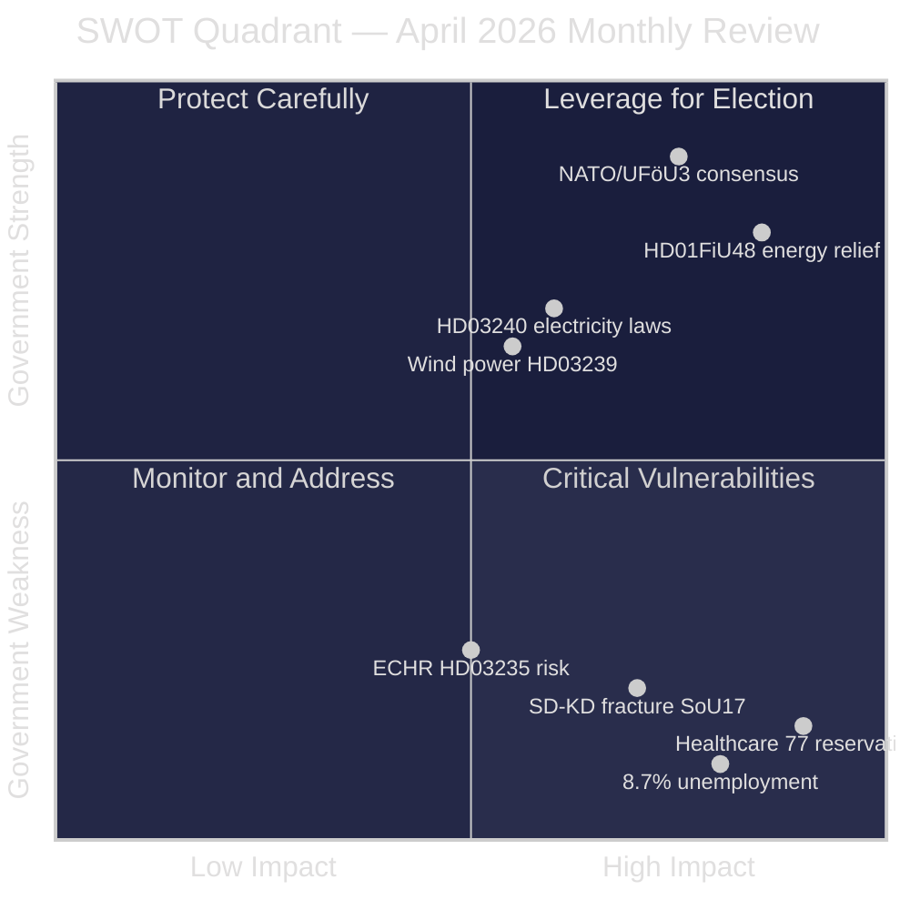

# SWOT Analysis — Monthly Review April 2026

**Analyst**: James Pether Sörling | **Date**: 2026-04-23
**Framework**: SWOT + TOWS matrix | **Confidence**: HIGH [A1]

---

## SWOT Framework

### Strengths

- **Comprehensive pre-election delivery**: Government tabled its final legislative package including spring budget (HD03100, https://data.riksdagen.se/dokument/HD03100.html), fuel relief (HD01FiU48, https://data.riksdagen.se/dokument/HD01FiU48.html), and energy reform (HD03240) [A1]
- **Cross-party defence consensus**: UFöU3 (NATO Finland, 1,200 troops) passed with cross-party support — security is a government strength [A1]
- **Household energy relief optics**: HD01FiU48 enacted April 22 with S+M+SD+KD majority — opposition unable to block consumer protection measure [A1]
- **Fiscal credibility**: Surplus rule maintained in Vårproposition 2026 (HD03100); Svantesson framing "responsible but caring" fiscal management [A2]
- **Energy governance modernization**: Miljöprövningsmyndigheten (HD03238) addresses Sweden's notoriously slow permitting — business community broadly supportive [A2]

### Weaknesses

- **Healthcare vulnerability**: SfU18 (39 reservations), SoU16 (20 reservations), SoU17 (18 reservations) = 77 total reservations across 3 committees — deepest opposition battleground of the session [A1, https://data.riksdagen.se/dokument/HD01SfU18.html]
- **SD-KD coalition stress**: Joint SD-KD reservation on SoU17 R15 reveals healthcare prioritization disagreement within governing support base [A1, https://data.riksdagen.se/dokument/HD01SoU17.html]
- **ECHR exposure**: HD03235 (criminal deportation) carries L×I risk score 15/25 — a successful ECHR challenge before September would be politically damaging [B2]
- **Fiscal deterioration signal**: 4.1 GSEK HD01FiU48 emergency spending increases deficit — critics note structural inconsistency with surplus rule narrative [A2]
- **Unemployment elevated**: 8.69% unemployment (2025 World Bank data) — highest in a decade among Nordic peers; S's main economic attack vector [A1]

### Opportunities

- **Electoral energy narrative**: If fuel price relief reduces household energy bills visibly before September 2026, it directly validates the government's pre-election promise [B2]
- **Wind power local buy-in**: HD03239 (municipal revenue from wind power) resolves the key local acceptance barrier for renewable buildout — potential for M+C+L joint electoral appeal on climate-economy integration [A2]
- **Ukraine positioning**: HD03231 (aggression tribunal) + HD03232 (reparations commission) establish Sweden as a constructive rule-of-law actor in the Ukraine conflict — reputational upside [A2]
- **Paid police education (HD03237)**: Broadens police recruitment pipeline — visible anti-crime commitment ahead of election [B2]
- **Digital infrastructure**: TU21 (state e-ID) + TU17 (anti-fraud telecoms) create observable digital governance improvements valued by younger voters [B2]

### Threats

- **Healthcare campaign**: S, V, and MP have built a coherent welfare-state narrative across 77 combined reservations — organized opposition attack on government's most vulnerable flank [A1]
- **Energy price reversal**: If Middle East tensions ease and energy prices fall before election, HD01FiU48's electoral value diminishes and fiscal deterioration looks opportunistic [B3]
- **SD intra-coalition defection risk**: SD's challenge to Justice Minister Strömmer (M) via HD10429 (demonstration rights) signals potential SD-M tension that could destabilize the coalition in an election-year crisis [B2]
- **ECHR challenge acceleration**: NGO legal challenges to HD03235 could produce adverse rulings during the election campaign window [C3]
- **Svantesson accountability**: S's coordination of 5 interpellations against Finance Minister Svantesson (HD10442 and series) — including potential false-statement allegation — creates targeted ministerial accountability risk [A2]

---

## TOWS Matrix

| | Strengths | Weaknesses |
|---|-----------|-----------|
| **Opportunities** | **SO — Exploit**: Use energy relief + wind power narrative to claim climate-economy integration leadership | **WO — Improve**: Pre-empt healthcare attacks by fast-tracking SoU committee recommendations; repair SD-KD healthcare rift before campaign |
| **Threats** | **ST — Protect**: Lock in NATO/defence consensus to prevent opposition from finding national security wedge | **WT — Avoid**: Minimize ECHR exposure by pre-complying HD03235 provisions; prevent SD from escalating demonstration-rights conflict |

---

## Cross-SWOT Pattern

The month's dominant pattern is **electoral positioning under fiscal constraint**: the government uses targeted household relief (energy costs) to compensate for structural weaknesses (healthcare, unemployment) while banking on security/NATO as a non-contested strength. The SD-KD healthcare fracture is the single most dangerous SWOT element — if it widens, it could force a headline coalition crisis during the campaign.

