# Synthesis Summary — Monthly Review: March 24 – April 23, 2026

**Analysis Date**: 2026-04-23
**Analyst**: James Pether Sörling
**Methodology**: DIW weighting per synthesis-methodology.md; Tier-C 1.5× period multiplier
**Riksmöte**: 2025/26
**Analysis Depth**: comprehensive (Tier-C monthly-review)
**Documents Analyzed**: 24 primary + 13 sibling synthesis references
**Overall Confidence**: HIGH [A1]
**Days to Election 2026**: ~143 (September 13, 2026)

---

## 🎯 Lead Story Decision

**PRIMARY: The Spring 2026 Electoral Pivot — Government's Pre-Election Legislative Blitz and Fiscal Gamble**

The 30-day period March 24 – April 23, 2026 constitutes the most consequential parliamentary month of the 2025/26 riksmöte. The Kristersson government (M–SD–KD–L) delivered its final comprehensive legislative package before the September 2026 election: a spring fiscal triple-pack (HD03100 + HD0399 + HD03236), an energy transformation triptych (HD03240 + HD03238 + HD03239), a security and defence cluster (HD03214 + HD03228 + UFöU3), and a criminal justice overhaul. The political climax arrived April 22 when HD01FiU48 (the fuel tax emergency budget) passed with an extraordinary M+SD+S+KD supermajority — revealing the limits of S's climate positioning when household energy costs dominate the political agenda 143 days before election day.

**SECONDARY: Healthcare as the Defining Domestic Battleground**

The Social Insurance Committee's SfU18 report (39 reservations, the session's most contested betänkande) combined with SoU16 (20) and SoU17 (18) signals that healthcare and social insurance will be the primary welfare-state battleground of the election campaign. A cross-cutting SD-KD dissent on SoU17 R15 (healthcare prioritization) represents the period's most significant coalition stress signal.

**TERTIARY: NATO Finland Deployment — Sweden's Post-Membership Defence Trajectory**

UFöU3 authorizing 1,200 troops for NATO enhanced Forward Presence (eFP) in Finland through December 2026 is the period's most consequential foreign/security decision. Combined with HD03214 (cybersecurity), HD03228 (war materiel), and HD03214 (cybersecurity center), Sweden's post-NATO accession legislative framework is now substantially in place.

---

## 📊 DIW-Weighted Intelligence Dashboard

```mermaid
%%{init: {'theme': 'dark', 'themeVariables': {'primaryColor': '#1a1e3d', 'primaryTextColor': '#e0e0e0', 'primaryBorderColor': '#00d9ff', 'lineColor': '#ff006e', 'secondaryColor': '#0a0e27', 'tertiaryColor': '#1a1e3d'}}}%%
flowchart TD
    A["🔴 TIER 1 — DIW 9.5<br/>HD01FiU48: 4.1 GSEK Budget ENACTED<br/>M+SD+S+KD supermajority | April 22<br/>Confidence: HIGH [A1]"]
    B["🔴 TIER 1 — DIW 9.2<br/>HD03100: Vårproposition 2026<br/>Final pre-election fiscal framework<br/>Confidence: HIGH [A1]"]
    C["🟠 TIER 2 — DIW 8.5<br/>UFöU3: 1,200 NATO troops Finland<br/>Cross-party defence consensus<br/>Confidence: HIGH [A1]"]
    D["🟠 TIER 2 — DIW 8.3<br/>HD01SfU18: 39 reservations<br/>Social insurance battleground<br/>Confidence: HIGH [A1]"]
    E["🟠 TIER 2 — DIW 8.0<br/>HD03240: New electricity system laws<br/>Energy transition framework<br/>Confidence: HIGH [A1]"]
    F["🟡 TIER 3 — DIW 7.5<br/>HD03235: Criminal deportation rules<br/>Tidö flagship, ECHR risk<br/>Confidence: HIGH [A1]"]
    G["🟡 TIER 3 — DIW 7.2<br/>HD03238: New env. permit authority<br/>Governance restructuring<br/>Confidence: HIGH [A1]"]
    H["�� TIER 3 — DIW 7.0<br/>HD03237: Paid police education<br/>Security pre-election signal<br/>Confidence: MEDIUM [B2]"]
    
    A --> B
    B --> C
    C --> D
    D --> E
    E --> F
    F --> G
    G --> H
    
    style A fill:#ff006e,stroke:#ff006e,color:#FFFFFF
    style B fill:#ff006e,stroke:#ff006e,color:#FFFFFF
    style C fill:#F57C00,stroke:#F57C00,color:#FFFFFF
    style D fill:#F57C00,stroke:#F57C00,color:#FFFFFF
    style E fill:#F57C00,stroke:#F57C00,color:#FFFFFF
    style F fill:#ffbe0b,stroke:#ffbe0b,color:#000000
    style G fill:#ffbe0b,stroke:#ffbe0b,color:#000000
    style H fill:#ffbe0b,stroke:#ffbe0b,color:#000000
```

---

## Integrated Intelligence Picture

### Theme 1: The Electoral Fiscal Gamble [HIGH confidence — A1]

The government's spring budget package is its last major fiscal statement before voters. Three interconnected propositions — the Vårproposition (HD03100/Prop. 2025/26:100), Vårändringsbudget (HD0399/Prop. 2025/26:99), and the Extra Ändringsbudget cutting fuel taxes (HD03236/Prop. 2025/26:236) — represent a carefully calibrated pre-election offer. The April 22 adoption of HD01FiU48 by an extraordinary M+SD+S+KD majority demonstrates that S was unwilling to be seen as blocking household energy relief, even at the cost of strategic consistency on climate. Finance Minister Svantesson (M) has positioned the Tidö government as fiscally responsible defenders of household purchasing power.

### Theme 2: Energy Transition — Triptych Reform [HIGH confidence — A1]

Three propositions tabled April 14 — HD03240 (new electricity system laws), HD03238 (new environmental permitting authority Miljöprövningsmyndigheten), and HD03239 (wind power municipal revenue reform) — represent the most comprehensive restructuring of Sweden's energy governance framework in a decade. The creation of Miljöprövningsmyndigheten is particularly significant: it explicitly accelerates permitting for electricity production infrastructure.

### Theme 3: Security and Defence Legislative Framework [HIGH confidence — A1]

Sweden's NATO membership has generated a substantial legislative agenda. UFöU3 (1,200 troops eFP Finland), HD03214 (cybersecurity center), and HD03228 (war materiel modernization) represent the core legislative architecture of post-NATO Sweden. The cross-party consensus on defence is structurally important — it isolates SD's occasional dissent on social policy and positions security as a government strength heading into the election.

### Theme 4: Healthcare and Social Insurance Battleground [HIGH confidence — A1]

With 77 total reservations across SfU18 + SoU16 + SoU17, healthcare and social insurance are the opposition's primary vulnerability-targeting domain. The SD-KD fracture on SoU17 R15 is the most analytically significant coalition signal of the month — representing a substantive policy disagreement between the government's two most conservative support pillars. This will be amplified during the election campaign.

### Theme 5: Immigration Enforcement Acceleration [HIGH confidence — A1]

Three immigration measures (HD03235 criminal deportation, new reception act, settlement act) represent the Tidö coalition's most ideologically SD-driven deliverables. HD03235 carries the highest ECHR risk (L×I score 15/25) but is also the most electorally potent for SD.

---

## 🔄 Tradecraft Context

| Evidence item | Source | Admiralty | WEP expression |
|--------------|--------|-----------|----------------|
| HD01FiU48 enacted April 22 | riksdagen.se official record | [A1] | Almost certain |
| 77 committee reservations aggregate | SfU18+SoU16+SoU17 official records | [A1] | Confirmed fact |
| UFöU3 1,200 troops pending June 4 vote | riksdagen.se UFöU3 | [A1] | Almost certain to pass |
| SD-KD healthcare fracture (SoU17 R15) | SoU17 reservation record | [A2] | Likely to persist through election |
| HD10429 SD interpellation against M | riksdagen.se HD10429 | [A1] | Confirmed — response pending |
| HD10442 5-interpellation series vs. Svantesson | riksdagen.se HD10442 | [A1] | Confirmed — coordinated campaign |
| World Bank GDP 0.82%, unemployment 8.69% | World Bank Open Data | [A1] | Confirmed |
| ECHR challenge to HD03235 | Inferred from precedent — not yet filed | [C3] | Possibly — 6–18 months |

**Methodology**: F3EAD (Find-Fix-Finish-Exploit-Analyze-Disseminate) applied across all 5 themes. SAT techniques: SWOT, Scenario Analysis, ACH, Red Team, Coalition Mathematics, Historical Parallels.

**Uncertainty flags**: Electoral projections ([B2]) rely on current seat data without live polling. ECHR timeline ([C3]) is speculative. Post-election formation ([C4]) has low confidence.

---

## AI-Recommended Article Metadata

- **Recommended Title (EN)**: "Sweden's April 2026 Parliamentary Sprint: How the Kristersson Government Positioned Itself for September's Election"
- **Recommended Title (SV)**: "Sveriges riksdag april 2026: Hur Kristerssonregeringen positionerade sig inför septembervalet"
- **Meta Description (EN)**: "Monthly intelligence review: 30 days of Swedish political action — fuel tax relief, NATO deployments, energy reform, and the healthcare battleground that will define the 2026 election."
- **Meta Description (SV)**: "Månadsöversikt: 30 dagars riksdagspolitik — bränsleskattelättnader, NATO-insatser, energireform och sjukvårdsstriden inför valet 2026."
