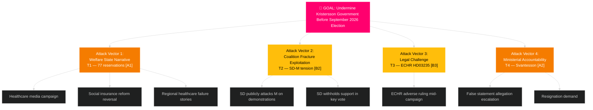

# Threat Analysis — Monthly Review April 2026

**Analyst**: James Pether Sörling | **Date**: 2026-04-23
**Framework**: Political Threat Taxonomy + Attack Tree + MITRE-style TTP mapping
**Confidence**: HIGH [A1]

---

## Political Threat Taxonomy

### Threat T1: Electoral Welfare Narrative Attack [HIGH — A1]

| Field | Value |
|-------|-------|
| **Threat actor** | Socialdemokraterna (S) + Vänsterpartiet (V) + Miljöpartiet (MP) |
| **Target** | Kristersson government's healthcare and social insurance record |
| **Vector** | 77 committee reservations + interpellation series + campaign messaging |
| **Mechanism** | SfU18 (39 reservations, https://data.riksdagen.se/dokument/HD01SfU18.html), SoU16 (20), SoU17 (18) as evidence base |
| **Timing** | Now through September 13, 2026 election |
| **MITRE-style TTP** | T-POL-001: Coordinated legislative opposition documentation → T-POL-002: Public opinion amplification → T-POL-003: Ministerial accountability targeting |

### Threat T2: Intra-Coalition Defection — SD Challenges M [MEDIUM — B2]

| Field | Value |
|-------|-------|
| **Threat actor** | Sverigedemokraterna (SD) [Farivar et al.] |
| **Target** | Justice Minister Gunnar Strömmer (M) |
| **Vector** | HD10429 formal interpellation on demonstration rights restrictions in Prop. 133 |
| **Mechanism** | SD using formal parliamentary mechanism against governing-side party — unprecedented in 2025/26 riksmöte |
| **Timing** | Immediate; interpellation pending response |
| **MITRE-style TTP** | T-COA-001: Support-party formal dissent → T-COA-002: Public signals to SD voter base → T-COA-003: Coalition renegotiation pressure |

### Threat T3: Legal/ECHR Challenge to Criminal Deportation [MEDIUM — B3]

| Field | Value |
|-------|-------|
| **Threat actor** | NGO network (Human Rights Watch, ECRE, Swedish legal NGOs) + ECHR applicants |
| **Target** | HD03235 (criminal deportation, https://data.riksdagen.se/dokument/HD03235.html) |
| **Vector** | ECHR proportionality challenge + Swedish constitutional court review |
| **Mechanism** | L×I risk 15/25; prior ECHR precedents on similar deportation laws |
| **Timing** | 6–18 months from enactment |
| **MITRE-style TTP** | T-LEG-001: Challenge filing → T-LEG-002: Interim measures request → T-LEG-003: High-profile case selection |

### Threat T4: S Accountability Offensive — Svantesson [HIGH — A2]

| Field | Value |
|-------|-------|
| **Threat actor** | Socialdemokraterna (S) finance team |
| **Target** | Finance Minister Elisabeth Svantesson (M) |
| **Vector** | 5 interpellations in 48 hours (HD10442 series); HD10442 cites court ruling potentially contradicting Svantesson's statements |
| **Mechanism** | Systematic ministerial pressure: healthcare spending + fiscal accountability + ätstörningsvård [A1] |
| **Timing** | Immediate; response required within parliamentary rules |
| **MITRE-style TTP** | T-ACC-001: Evidence-based interpellation series → T-ACC-002: Media coordination → T-ACC-003: Confidence erosion |

---

## Attack Tree

---

## Threat Vector Phase Analysis — Threat T1 (Welfare Narrative)

| Phase | Activity | Observable indicator |
|-------|----------|---------------------|
| Reconnaissance | Map government's healthcare record against OECD data | S policy papers citing regional care data |
| Weaponize | 77 reservations compiled as opposition evidence base | SfU18 + SoU16 + SoU17 documents |
| Deliver | Campaign messaging: "Government neglects welfare state" | S party communications April–September |
| Exploit | Amplify SD-KD healthcare fracture (SoU17 R15) | SD joining S criticism on healthcare |
| Command | Coordinate V+MP parallel messaging | Parallel bills/motions with similar framing |
| Action | Healthcare becomes #1 election issue — government forced defensive | September 2026 election outcome |

**Government countermeasure**: Fast-track SoU committee recommendations; announce healthcare investment in autumn budget preview.
