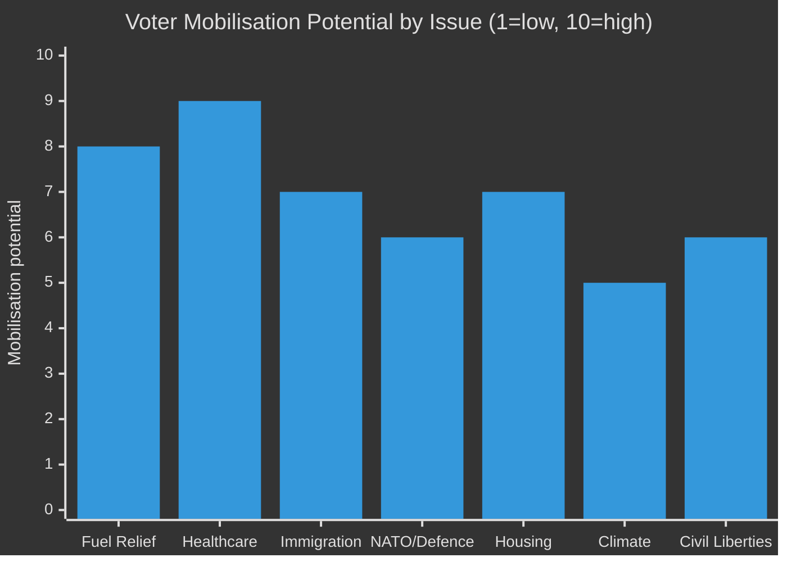

# Voter Segmentation — Monthly Review April 2026

**Analyst**: James Pether Sörling | **Date**: 2026-04-23
**Confidence**: MEDIUM [B2]

---

## Demographic Impact Analysis

| Segment | Policy impact | Key document | Net effect | Electoral implication |
|---------|--------------|--------------|-----------|----------------------|
| Working families (car-dependent, suburban/rural) | +82 öre/l fuel relief | HD01FiU48 | **Positive** | Governing bloc +2–3% |
| Healthcare workers / NHS patients | Welfare reform uncertainty | SfU18 + SoU17 | **Negative** | Opposition +1–2% |
| Young adults (18–29) | Housing, demonstration rights | HC023443 + HD10429 | **Mixed** | Volatile — possible SD or C gain |
| Pensioners | Social insurance reform | SfU18 SoU16 | **Uncertain** | High sensitivity to SfU18 changes |
| Rural voters | Fuel relief + agricultural energy | HD01FiU48 + HD03240 | **Positive** | SD + M + C benefit |
| Urban professionals | Civil liberties, climate | HD10429 + HD024082 | **Negative toward governing** | MP + S + L benefit |
| Immigrants (naturalised citizens) | Criminal deportation extension | HD03235 | **Very negative** | S + V benefit |
| Defence/security voters | NATO commitment | UFöU3 | **Positive** | Governing bloc + C benefit |

---

## Regional Analysis

| Region | Key concerns | Governing bloc advantage | Opposition advantage |
|--------|-------------|--------------------------|---------------------|
| Norrland | Energy costs, rural transport | HD01FiU48 + HD03240 electricity | Healthcare access — SoU17 |
| Stockholm | Housing, civil liberties, climate | N/A | MP + S + C |
| Skåne | Immigration enforcement | HD03235 | N/A |
| Västra Götaland | Manufacturing, energy costs | HD01FiU48 + energy package | Healthcare (regional council governance) |
| Gotland / military regions | Defence, NATO | UFöU3 | N/A |

---

## Mobilisation Index

**Top insight**: Healthcare is the highest-mobilisation issue (9/10) and favours the opposition — this is the government's primary vulnerability heading into September 2026.

