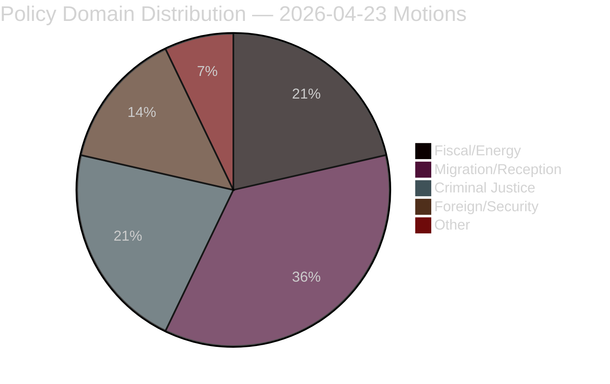

# Classification Results — Opposition Motions 2026-04-23

**Author**: James Pether Sörling | **Date**: 2026-04-23 | **Confidence**: HIGH [B1]

---

## 7-Dimension Classification

| Dimension | HD024082 (S) | HD024092 (V) | HD024090 (V) | HD024096 (MP) | HD024089 (C) |
|-----------|-------------|-------------|-------------|---------------|-------------|
| **Policy domain** | Fiscal/Energy | Fiscal/Energy/Climate | Criminal justice/Migration | Foreign policy/Security | Migration/Social |
| **Legislative stage** | Committee (FiU) | Committee (FiU) | Committee (SfU) | Committee (UU) | Committee (SfU) |
| **Ideological axis** | Centre-left | Left | Left | Green-left | Centre |
| **EU/International dimension** | Moderate (energy directive) | Moderate (climate treaty) | High (ECHR, deportation) | High (EU arms export regime) | Moderate (EU reception directives) |
| **Electoral salience** | High (household energy) | Medium-high (redistribution) | Medium (rule of law) | Medium-low (niche) | Medium (municipal autonomy) |
| **Data sensitivity** | Low (public budget data) | Low (RUT public analysis) | Low (public legal opinion) | Low-medium (export controls) | Low (public legislation) |
| **Priority tier** | P1 — Critical | P1 — Critical | P1 — Critical | P2 — High | P2 — High |

---

## Document Access Classification

All documents are publicly available under Offentlighetsprincipen (Swedish freedom of information law). No special handling required. GDPR Art. 9 special categories (political opinion) apply but are publicly made per Art. 9(2)(e).

---

## Retention Guidelines

- Analysis files: Retain for 24 months (electoral cycle documentation)
- Raw MCP data: 12 months
- Per-document analyses: Permanent public record

---

## Mermaid: Policy Domain Distribution

*Based on 14 analysed motions. Sources: riksdagen.se official document metadata [A1]*

