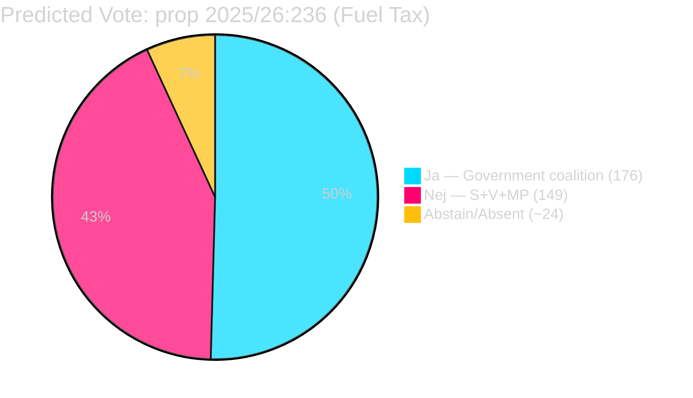

# Coalition Mathematics — Opposition Motions 2026-04-23

**Author**: James Pether Sörling | **Date**: 2026-04-23 | **Confidence**: HIGH [A1–B2]

---

## 2022 Election Seat Allocation (official, riksdagen.se)

| Party | Seats | Bloc |
|-------|-------|------|
| Socialdemokraterna (S) | 107 | Opposition |
| Sverigedemokraterna (SD) | 73 | Government |
| Moderaterna (M) | 68 | Government |
| Vänsterpartiet (V) | 24 | Opposition |
| Centerpartiet (C) | 24 | Pivot |
| Kristdemokraterna (KD) | 19 | Government |
| Miljöpartiet (MP) | 18 | Opposition |
| Liberalerna (L) | 16 | Government |
| **Total** | **349** | |

**Government coalition (M+SD+KD+L)**: 176 seats — bare majority  
**Opposition bloc (S+V+MP)**: 149 seats  
**Pivotal C**: 24 seats

*Source: riksdagen.se official election results [A1]*

---

## This Week's Motions: Predicted Vote Outcomes

| Proposition | Ja (expect) | Nej (expect) | Avstår | Outcome |
|------------|-------------|--------------|--------|---------|
| prop. 2025/26:236 (fuel tax) | M+SD+KD+L = 176 | S+V+MP = 149 | C ~0–24 | PASSES (government majority) |
| prop. 2025/26:235 (deportation) | M+SD+KD+L = 176 | V+MP = 42 | S+C = 131 | PASSES (government majority) |
| prop. 2025/26:Mottagandelag | M+SD+KD+L+C = 200 | V+MP = 42 | S = 107 | PASSES strongly |
| HD024096 arms export ban | V+MP+S = 149 (partial) | M+SD = 141 | KD+L+C | FAILS |

*Assessment: All government propositions pass with current coalition. Opposition motions all fail. C's partial abstention on migration does not change outcomes.*

---

## Governing Majority Sensitivity Analysis

| Scenario | Government seats | Margin | Stable? |
|---------|-----------------|--------|---------|
| Current (all four parties full support) | 176 | +3 | Yes |
| L drops out or abstains | 160 | -13 | Minority, needs C |
| SD rebels on one vote | 103 | -70 | Needs full C+L |
| Full Tidö coalition + C | 200 | +51 | Highly stable |

**Threshold**: 175 seats needed for absolute majority. With 176, the government has a margin of 1. A single resignation or long-term illness in M/SD/KD/L bloc can produce a 174-175 tie requiring Speaker casting vote.

---

## Mermaid: Vote Prediction for prop. 2025/26:236

