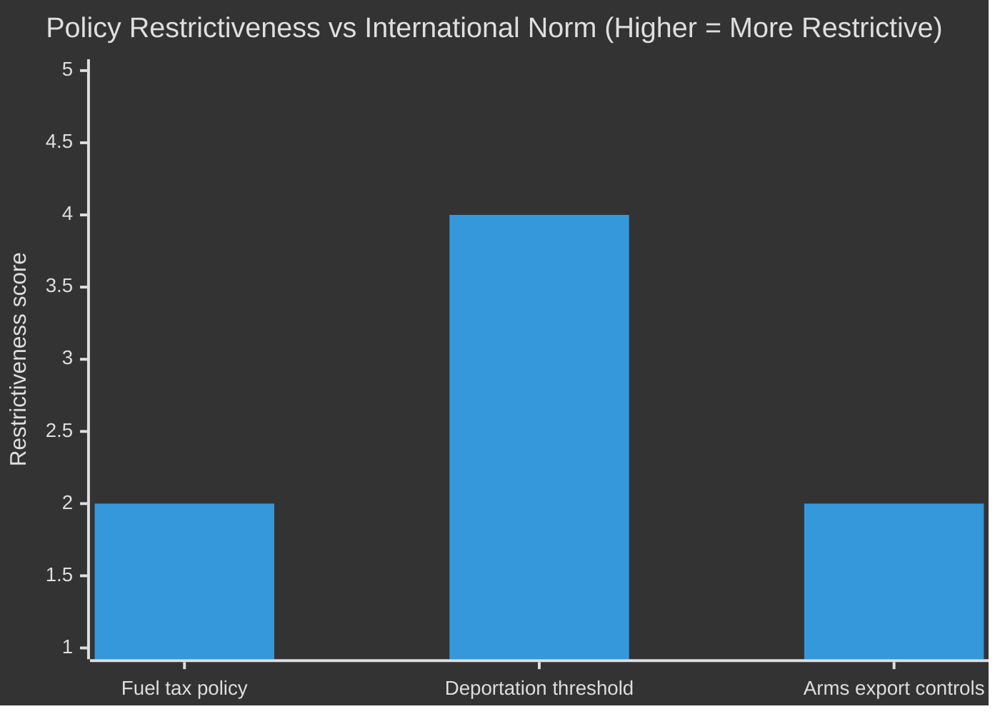

# Comparative International Analysis — Opposition Motions 2026-04-23

**Author**: James Pether Sörling | **Date**: 2026-04-23 | **Confidence**: MEDIUM [B2–C2]

---

## Comparator Set
- **Primary**: Norway (Nordic welfare state comparator), Germany (EU arms export + energy policy)  
- **Secondary**: Denmark (migration/reception policy), Netherlands (deportation reform)

---

## Comparator Analysis

### Issue 1: Energy/Fuel Tax Policy

| Dimension | Sweden (2026) | Norway | Germany | Assessment |
|-----------|--------------|--------|---------|------------|
| Fuel tax policy | Temporary reduction to EU minimum (prop. 2025/26:236) | No fuel tax cut; used petroleum fund for household support | Extended carbon pricing; rebates targeted to low-income | Sweden outlier in using fuel tax as relief mechanism |
| Climate instrument | Carbon tax at risk of dilution | Carbon pricing maintained | Emissions trading as primary lever | Sweden historically strong carbon price — this cut signals policy drift |
| Distributional approach | Electricity support (3.4bn SEK); but cooperative housing excluded | Targeted household transfers | Low-income specific rebates | Norwegian and German models more targeted |

**Outside-In analysis**: Sweden's approach is anomalous among Nordic states. Norway maintained its carbon price framework during the energy crisis 2022–23 and used general fiscal transfers instead of sectoral tax cuts. Germany's 2022 "Tankrabatt" (fuel tax reduction) was widely criticised as poorly targeted — and is now cited in Swedish debates by opposition parties. The government's choice to replicate the German Tankrabatt model, despite its documented failure, is strategically vulnerable to exactly the critique MP (HD024098) and V (HD024092) are mounting.

---

### Issue 2: Deportation of Foreign Nationals

| Dimension | Sweden (prop. 2025/26:235) | Denmark | Netherlands |
|-----------|---------------------------|---------|-------------|
| Threshold | Lowered to any sentence stricter than a fine | Lower threshold already in place; regular reviews | Tightened in 2023; Lagrådet equivalent raised concerns |
| Childhood arrival protection | Removed for under-15 arrivals | Never had strong equivalent protection | Retained with ECHR constraints |
| Lagrådet/constitutional review | Explicit rejection [A1] | No equivalent body | Constitutional court review ongoing |
| ECHR compliance | Contested | Challenged in ECtHR cases | Several adverse ECtHR judgements on expulsion |

**Outside-In**: Denmark's more aggressive deportation regime has faced multiple ECtHR rulings. The Netherlands' 2023 tightening was struck down in part by constitutional courts. Sweden, by removing childhood-arrival protections, risks ECHR Art. 8 (family life) claims — a risk explicitly noted by V in HD024090. The comparator experience suggests Scenario 3 (constitutional challenge) is underpriced at 13%.

---

### Issue 3: Arms Export Regulation

| Dimension | Sweden (prop. 2025/26:228) | Germany | Netherlands |
|-----------|---------------------------|---------|-------------|
| Export to conflict zones | New framework, softer standards | Tightened after Ukraine; export to warring parties debated | Conditional; restricted to NATO allies primarily |
| Third-country diversion | Not required in main text | Required in some licences | Required |
| Parliamentary override | Government controls | Parliamentary consultation required | Parliamentary consultation required |

**Comparator set**: [Norway — arms export], [Germany — arms export], [Netherlands — arms export]

**Outside-In**: MP's (HD024096) demand that third-country diversion risk always be considered at the licensing stage aligns with German practice. The Netherlands requires parliamentary notification for major sales. Sweden's proposed framework is less stringent on both counts. From an international norm perspective, MP's position is closer to EU partner practice.

---

## Mermaid: Policy Position Comparison

*Sweden government position scored against Nordic/EU comparators. Score 1 = least restrictive, 5 = most restrictive.*  
*Sources: riksdagen.se (primary documents) + ECHR case law (general knowledge baseline). Admiralty [B2].*

