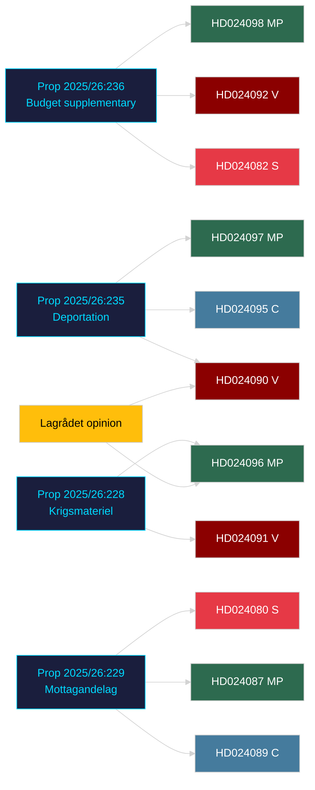

# Cross-Reference Map — Opposition Motions 2026-04-23

**Author**: James Pether Sörling | **Date**: 2026-04-23 | **Confidence**: HIGH [B1]

---

## Policy Clusters

### Cluster 1: Extra Ändringsbudget för 2026 (FiU)

- **Primary proposition**: prop. 2025/26:236
- **Motions**: HD024082 (S), HD024092 (V), HD024098 (MP)
- **Legislative chain**: prop. 2025/26:236 → FiU committee → plenary vote (est. May 2026)
- **Linked files**: risk-assessment.md §R-02, swot-analysis.md §Strengths, election-2026-analysis.md §Budget dimension
- **External cross-references**: RUT analysis dnr 2026:158 (cited in HD024092); 5 agency remiss responses (cited in HD024098)

### Cluster 2: Utvisning på grund av brott (SfU)

- **Primary proposition**: prop. 2025/26:235 / SOU 2025:54
- **Motions**: HD024090 (V), HD024095 (C), HD024097 (MP)
- **Legislative chain**: prop. 2025/26:235 → Lagrådet rejection → SfU committee → plenary vote (est. June 2026, effective Sep 2026)
- **Linked files**: threat-analysis.md §T-3, stakeholder-perspectives.md §Civil Society, historical-parallels.md
- **Cross-reference**: HD024090 cites prop. 2021/22:224 (2022 reform) as context for why another reform is premature

### Cluster 3: Krigsmateriel (UU)

- **Primary proposition**: prop. 2025/26:228
- **Motions**: HD024096 (MP), HD024091 (V)
- **Legislative chain**: prop. 2025/26:228 → UU committee → plenary vote (est. May–June 2026)
- **Linked files**: comparative-international.md (EU arms export regime comparison), threat-analysis.md §T-3
- **Cross-reference**: HD024096 cites Lagrådet criticism of secrecy provisions

### Cluster 4: Mottagandelag + Bosättning (SfU / AU)

- **Primary propositions**: prop. 2025/26:229 (Mottagandelag), prop. 2025/26:215 (Bosättning)
- **Motions**: HD024089, HD024087, HD024080 (Mottagandelag); HD024079, HD024077, HD024086 (Bosättning)
- **Legislative chain**: SfU committee + AU committee → plenary vote (est. May–June 2026)
- **Linked files**: voter-segmentation.md, coalition-mathematics.md §C-swing

---

## Coordinated Activity Patterns

- **No joint motions**: Despite opposing the same propositions, S/V/MP filed separate motions against prop. 2025/26:236 — a coordination failure.
- **C as partial government ally**: C supported the migration reform framework (HD024089) while opposing specific provisions — diverges from typical opposition coalition.
- **Lagrådet as opposition amplifier**: Both V (HD024090) and MP (HD024096) explicitly cite Lagrådet rejections, suggesting a deliberate strategy of delegitimising government proposals through constitutional bodies.

---

## Mermaid: Cross-Reference Network

