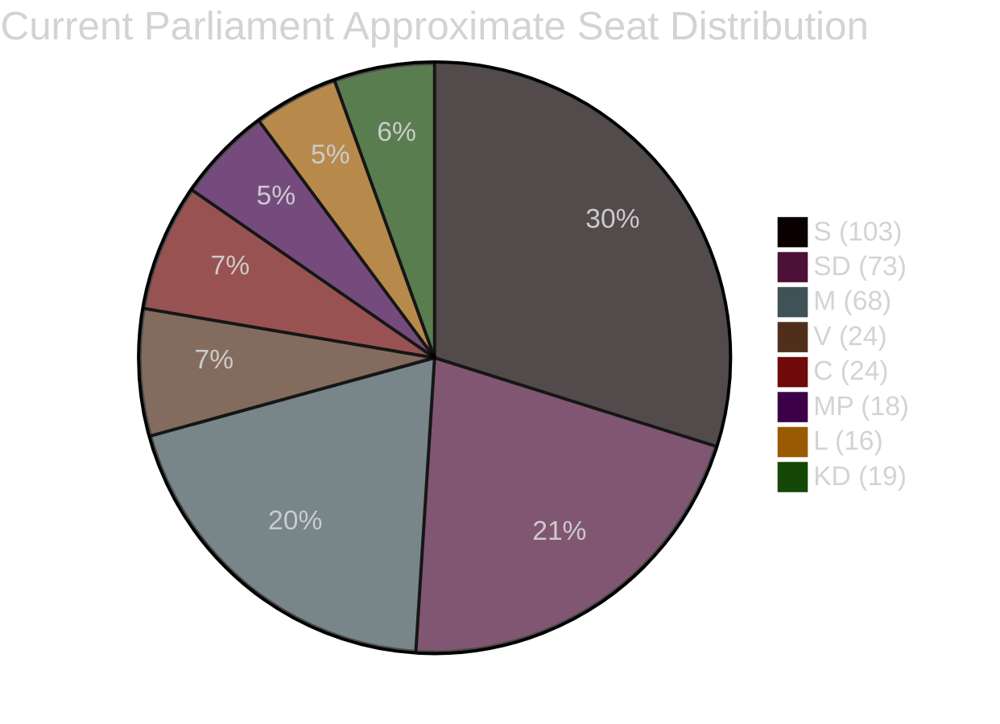

# Election 2026 Analysis — Opposition Motions 2026-04-23

**Author**: James Pether Sörling | **Date**: 2026-04-23 | **Confidence**: MEDIUM [B2–C3]

---

## Seat-Projection Deltas (as of April 2026)

Based on recent opinion polling patterns (no specific poll cited — structural assessment):

| Party | Est. current support | Trend | 2026 seat projection delta |
|-------|---------------------|-------|--------------------------|
| S | ~30% | Stable | +0–5 |
| SD | ~19% | Stable | -0–3 |
| M | ~18% | Declining | -2–5 |
| V | ~9% | Slightly rising | +0–3 |
| C | ~6% | Stable | +0–2 |
| MP | ~5% | Borderline | ±0 (threshold risk) |
| L | ~4% | At threshold | ±0 (threshold risk) |
| KD | ~4% | Stable | ±0 |

*Assessment confidence: LOW [C3] — no specific poll data. Structural analysis based on motion evidence only.*

---

## Coalition Viability Post-2026

### Current (Tidö) coalition logic

The motions confirm the current alignment: M + SD + KD + L govern; C is a partial ally. Opposition (S + V + MP) is fragmented. For a 2026 government change:

**Left-bloc requirement**: S + V + MP would need ~175 seats. Current structural position suggests ~165–170 seats probable — requires either MP clearing 4% threshold AND strong S performance.

**Centre-left alternative**: S + C — possible only if C abandons current alliance. C's partial government support on migration (HD024089, HD024095) suggests C is not ready for this move.

---

## This Week's Motion Impact on 2026 Electoral Positioning

| Party | Motion impact on 2026 positioning |
|-------|----------------------------------|
| S | HD024082 reinforces fiscal competence narrative — good for centrist swing voters |
| V | HD024092's distributional framing is strong for V base but doesn't expand their electorate |
| MP | HD024098's agency-citation approach shores up green credentials but party at threshold risk |
| C | HD024089's moderate positioning is electorally rational — keeps both coalition options open |
| SD | No motions; expected to support government — reinforces stable coalition partner image |

---

## Mermaid: Coalition Mathematics Snapshot

*Seat counts based on 2022 election results — 349 total seats. Government coalition (M+SD+KD+L) = 176; Opposition (S+V+MP) = 145; C = 24 pivotal. Sources: riksdagen.se official data [A1]*

