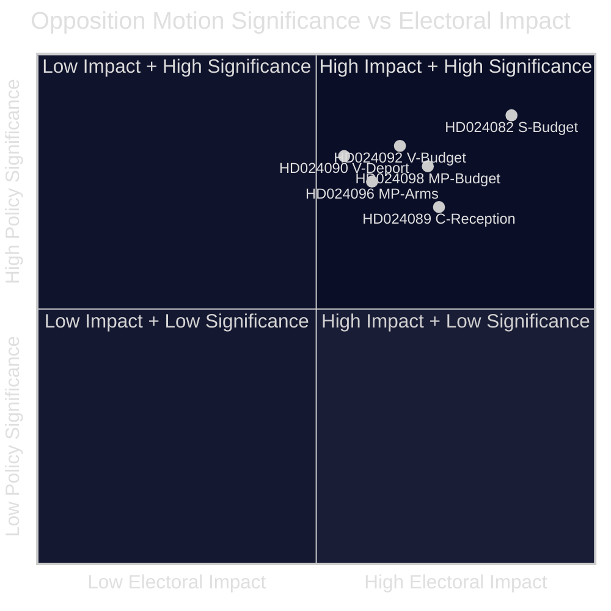

# Executive Brief — Opposition Motions 2026-04-23

**Classification**: PUBLIC DOMAIN — Parliamentary Records  
**Author**: James Pether Sörling  
**Date**: 2026-04-23  
**Confidence**: HIGH [B2]

---

## 🎯 BLUF

Sweden's parliamentary opposition has filed 14 motions in the week of 13–17 April 2026 challenging the government's extra supplementary budget (prop. 2025/26:236), deportation law reform (prop. 2025/26:235), new arms export framework (prop. 2025/26:228), and new asylum reception law (prop. 2025/26:229). The sharpest cleavage is over the government's temporary fuel tax cut to EU minimum levels: S, V, and MP all oppose it but for divergent reasons, signalling that the centre-left opposition cannot coalesce behind a single counter-proposal ahead of the autumn 2026 election.

---

## 🧭 Decisions This Brief Supports

1. **Media & editorial framing**: Determine whether the energy/budget dispute should lead as a "fiscal credibility" or "climate policy" story — evidence below supports both framings simultaneously.
2. **Election intelligence**: Assess whether opposition fragmentation on fiscal and migration issues reduces the probability of a left-of-centre government change in autumn 2026.
3. **Policy monitoring**: Track which committee (FiU for budget, SfU for migration) will process motions first and when votes are scheduled.

---

## ⚡ 60-Second Read

- **Budget clash**: S wants better-targeted electricity support and flexible use of grid-congestion revenues (HD024082 by Mikael Damberg). V demands the entire fuel tax cut be rejected — cites RUT analysis showing government reforms benefiting top half of income distribution 5× more than the bottom half (HD024092, Nooshi Dadgostar). MP likewise opposes fuel cut; cites Konjunkturinstitutet, Naturvårdsverket, 2030-sekretariatet, and Trafikverket as opposing the proposal (HD024098, Janine Alm Ericson).
- **Deportation law (prop. 2025/26:235)**: V demands full rejection of stricter deportation rules (HD024090, Tony Haddou); C accepts with conditions requiring systematic repeat offences (HD024095, Niels Paarup-Petersen); MP partial rejection (HD024097, Annika Hirvonen).
- **Arms exports (prop. 2025/26:228)**: MP demands a ban on arms exports to dictatorships and warring nations, and opposes new secrecy provisions (HD024096, Jacob Risberg). V opposes the entire proposition.
- **Asylum reception (prop. 2025/26:229)**: C accepts broad framework but opposes area restrictions and wants municipalities to retain emergency welfare powers (HD024089); S opposes privatisation of asylum housing (HD024080); MP rejects entirely (HD024087).
- **Opposition fragmentation**: S, V, and MP oppose the budget supplementary but cannot unite on a common alternative. On migration, the centre-left bloc is even more fractured, with C partly supporting the government.

---

## 🔭 Top Forward Trigger

**FiU committee vote on Extra ändringsbudget (prop. 2025/26:236)** — expected within 3–4 weeks. If SD votes with the government as expected, the fuel tax cut will pass. Watch for any SD amendment demands as a pivotal indicator of coalition stability.

---

## 📊 Significance Ranking (DIW weighted)

*Confidence: HIGH overall [B2]; individual document scores reflect manifest data + full text where available.*

