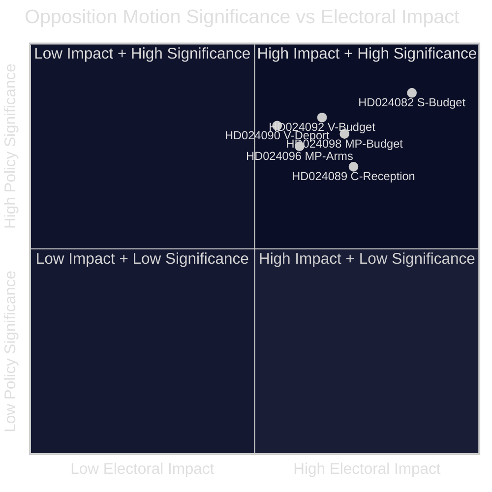

<!-- dir: rtl -->
<!-- lang: ar -->
# ملخص تنفيذي — اقتراحات المعارضة 2026-04-23

**التصنيف**: المجال العام — السجلات البرلمانية  
**المؤلف**: James Pether Sörling  
**التاريخ**: 2026-04-23  
**الثقة**: عالية [B2]

---

## 🎯 الخلاصة التنفيذية

قدّمت المعارضة البرلمانية السويدية 14 اقتراحاً في أسبوع 13–17 أبريل 2026 تطعن في الميزانية التكميلية الإضافية للحكومة (prop. 2025/26:236)، وإصلاح قانون الترحيل (prop. 2025/26:235)، والإطار الجديد لتصدير الأسلحة (prop. 2025/26:228)، وقانون استقبال طالبي اللجوء الجديد (prop. 2025/26:229). أعمق خلاف يتعلق بخفض الضريبة المؤقت على الوقود إلى الحدود الدنيا للاتحاد الأوروبي: S وV وMP جميعها معارضة لكن لأسباب متباينة، مما يشير إلى أن المعارضة الوسطى-اليسارية لا تستطيع الاتحاد خلف مقترح مضاد واحد قبل انتخابات خريف 2026.

---

## 🧭 القرارات التي تدعمها هذه الوثيقة

1. **الإطار الإعلامي والتحريري**: تحديد ما إذا كان الجدل حول الطاقة/الميزانية ينبغي أن يُقدَّم كقضية "مصداقية مالية" أم "سياسة مناخية" — الأدلة أدناه تدعم كلا الإطارين في آنٍ واحد.
2. **الاستخبارات الانتخابية**: تقييم ما إذا كانت تشرذم المعارضة حول القضايا المالية والهجرة يقلل من احتمالية تغيير حكومة وسطى-يسارية في خريف 2026.
3. **متابعة السياسات**: تتبع أي لجنة (FiU للميزانية، SfU للهجرة) ستعالج الاقتراحات أولاً ومتى مقررة التصويتات.

---

## ⚡ قراءة 60 ثانية

- **صراع الميزانية**: تريد S دعماً كهربائياً أكثر استهدافاً واستخداماً مرناً لعائدات ازدحام الشبكة (HD024082 بقلم Mikael Damberg). تطالب V برفض كامل لتخفيض ضريبة الوقود — تستشهد بتحليل RUT الذي يُظهر أن الإصلاحات الحكومية تفيد النصف الأعلى من توزيع الدخل بـ5 أضعاف مقارنةً بالنصف الأدنى (HD024092، Nooshi Dadgostar). تعارض MP أيضاً تخفيض الوقود؛ وتستشهد بـKonjunkturinstitutet وNaturvårdsverket و2030-sekretariatet وTrafikverket كمعارضين للاقتراح (HD024098، Janine Alm Ericson).
- **قانون الترحيل (prop. 2025/26:235)**: تطالب V بالرفض الكامل لقواعد ترحيل أكثر صرامة (HD024090، Tony Haddou)؛ تقبل C بشروط تتطلب مخالفات متكررة منهجية (HD024095، Niels Paarup-Petersen)؛ MP رفض جزئي (HD024097، Annika Hirvonen).
- **صادرات الأسلحة (prop. 2025/26:228)**: تطالب MP بحظر صادرات الأسلحة إلى الديكتاتوريات والدول المتحاربة، وتعارض أحكام السرية الجديدة (HD024096، Jacob Risberg). تعارض V الاقتراح بأكمله.
- **استقبال طالبي اللجوء (prop. 2025/26:229)**: تقبل C الإطار العام لكنها تعارض قيود المناطق وتريد أن تحتفظ البلديات بصلاحيات المساعدة في حالات الطوارئ (HD024089)؛ تعارض S خصخصة مساكن اللجوء (HD024080)؛ ترفض MP بالكامل (HD024087).
- **تشرذم المعارضة**: تعارض S وV وMP الميزانية التكميلية لكنها لا تستطيع الاتحاد خلف بديل مشترك. في موضوع الهجرة، الكتلة الوسطى-اليسارية أكثر تشرذماً، مع دعم C الجزئي للحكومة.

---

## 🔭 أهم محفز استشرافي

**تصويت لجنة FiU على Extra ändringsbudget (prop. 2025/26:236)** — متوقع خلال 3–4 أسابيع. إذا صوّت SD مع الحكومة كما هو متوقع، سيمر خفض ضريبة الوقود. مراقبة أي مطالب تعديل من SD كمؤشر محوري على استقرار الائتلاف.

---

## 📊 تصنيف الأهمية (مرجّح بـDIW)

*الثقة: عالية بشكل عام [B2]؛ درجات الوثيقة الفردية تعكس بيانات البيان + النص الكامل حيث متاح.*

<!-- source-sha: 1e83ac6587956e9b1ca9cfd53aac08783e617cbd -->
