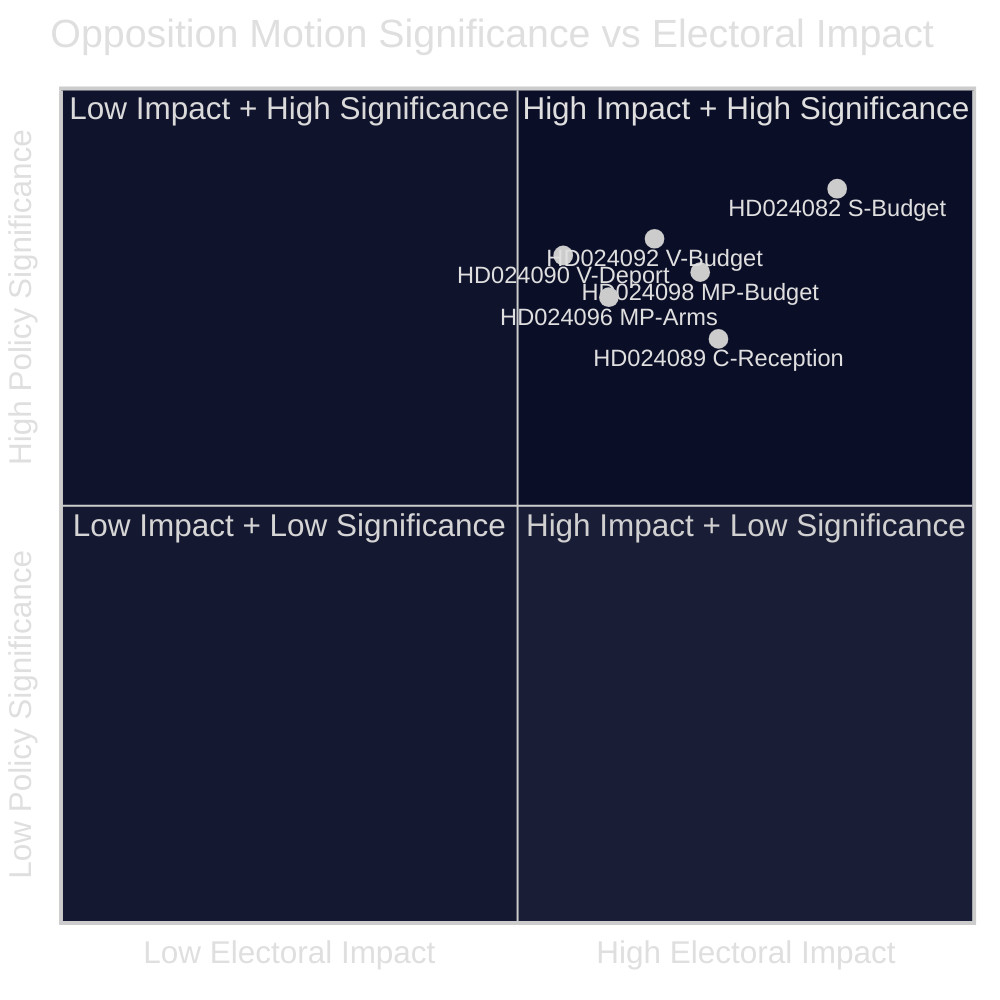

<!-- lang: da -->
# Eksekutiv sammenfatning — Oppositionsforslag 2026-04-23

**Klassifikation**: OFFENTLIGT DOMÆNE — Parlamentariske optegnelser  
**Forfatter**: James Pether Sörling  
**Dato**: 2026-04-23  
**Tillid**: HØJ [B2]

---

## 🎯 BLUF

Den svenske parlamentariske opposition indgav 14 forslag i ugen 13.–17. april 2026, der udfordrer regeringens ekstrasupplementærbudget (prop. 2025/26:236), reform af udvisningsloven (prop. 2025/26:235), den nye ramme for våbeneksport (prop. 2025/26:228) og den nye asylmodtagningslov (prop. 2025/26:229). Den skarpeste kløft drejer sig om regeringens midlertidige brændstofafgiftsnedsættelse til EU-minimumsniveauer: S, V og MP er alle imod, men af divergerende årsager, hvilket signalerer, at centrum-venstre-oppositionen ikke kan samle sig bag et fælles modforslag forud for efterårsvalget 2026.

---

## 🧭 Beslutninger dette notat understøtter

1. **Medie- og redaktionel indramning**: Afgør, om energi-/budgetstriden skal lede som en "finansiel troværdighed"- eller "klimapolitik"-nyhed — evidensen nedenfor understøtter begge indramninger simultant.
2. **Valgintelligens**: Vurder, om oppositionens fragmentering om finansielle og migrationsspørgsmål reducerer sandsynligheden for et centrum-venstreorienteret regeringsskifte i efteråret 2026.
3. **Politikovervågning**: Spor hvilken komité (FiU for budget, SfU for migration) der behandler forslagene først, og hvornår afstemninger er planlagt.

---

## ⚡ 60-sekunders læsning

- **Budgetkollision**: S ønsker bedre målrettet elstøtte og fleksibel brug af nettilstopningsindtægter (HD024082 af Mikael Damberg). V kræver, at hele brændstofafgiftsnedsættelsen forkastes — citerer RUT-analyse, der viser, at regeringens reformer gavner den øverste halvdel af indkomstfordelingen 5× mere end den nederste halvdel (HD024092, Nooshi Dadgostar). MP er ligeledes imod brændstofnedsættelsen; citerer Konjunkturinstitutet, Naturvårdsverket, 2030-sekretariatet og Trafikverket som modstandere af forslaget (HD024098, Janine Alm Ericson).
- **Udvisningslov (prop. 2025/26:235)**: V kræver fuld afvisning af strengere udvisningsregler (HD024090, Tony Haddou); C accepterer med betingelser, der kræver systematiske gentagelsesovertredelser (HD024095, Niels Paarup-Petersen); MP delvis afvisning (HD024097, Annika Hirvonen).
- **Våbeneksport (prop. 2025/26:228)**: MP kræver forbud mod våbeneksport til diktaturer og krigsførende nationer og modstår nye tavshedsbestemmelser (HD024096, Jacob Risberg). V modsætter sig hele propositionen.
- **Asylmodtagning (prop. 2025/26:229)**: C accepterer den brede ramme, men modsætter sig områderestriktioner og ønsker, at kommunerne bevarer nødhjælpsbeføjelser (HD024089); S modstår privatisering af asylboliger (HD024080); MP afviser fuldstændigt (HD024087).
- **Oppositionsfragmentering**: S, V og MP modsætter sig budgetsupplementet, men kan ikke forene sig om et fælles alternativ. Om migration er centrum-venstre-blokken endnu mere fragmenteret, idet C delvist støtter regeringen.

---

## 🔭 Top fremadrettet trigger

**FiU-komitéafstemning om Extra ändringsbudget (prop. 2025/26:236)** — forventet inden for 3–4 uger. Hvis SD stemmer med regeringen som forventet, vil brændstofafgiftsnedsættelsen passere. Hold øje med eventuelle SD-ændringsforslag som en afgørende indikator for koalitionsstabilitet.

---

## 📊 Signifikansrangering (DIW-vægtet)

*Tillid: HØJ overordnet [B2]; individuelle dokumentscorer afspejler manifestdata + fuld tekst, hvor tilgængelig.*

<!-- source-sha: 1e83ac6587956e9b1ca9cfd53aac08783e617cbd -->
