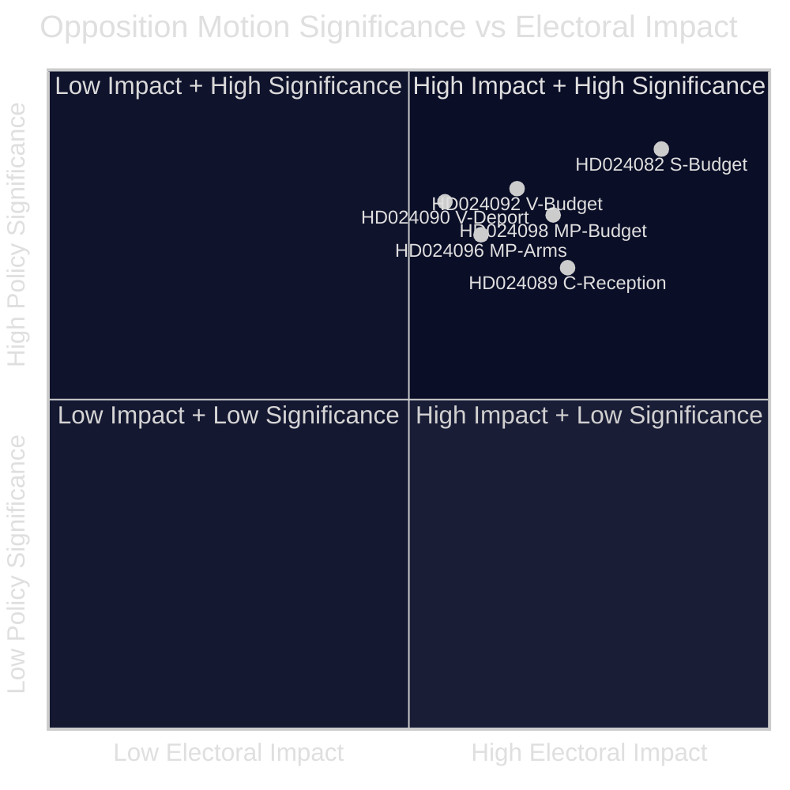

<!-- lang: de -->
# Exekutivbriefing — Oppositionsanträge 2026-04-23

**Klassifizierung**: ÖFFENTLICHER BEREICH — Parlamentarische Aufzeichnungen  
**Autor**: James Pether Sörling  
**Datum**: 2026-04-23  
**Konfidenz**: HOCH [B2]

---

## 🎯 BLUF

Die schwedische parlamentarische Opposition reichte in der Woche vom 13.–17. April 2026 14 Anträge ein, die den zusätzlichen Ergänzungshaushalt der Regierung (prop. 2025/26:236), die Reform des Abschiebungsgesetzes (prop. 2025/26:235), den neuen Rüstungsexportrahmen (prop. 2025/26:228) und das neue Asylaufnahmegesetz (prop. 2025/26:229) anfechten. Die schärfste Kluft besteht bei der vorübergehenden Kraftstoffsteuersenkung auf EU-Mindestniveaus: S, V und MP sind alle dagegen, aber aus unterschiedlichen Gründen, was signalisiert, dass die Mitte-Links-Opposition sich nicht hinter einem gemeinsamen Gegenvorschlag vereinen kann, bevor die Herbstwahl 2026 stattfindet.

---

## 🧭 Entscheidungen, die dieses Briefing unterstützt

1. **Medien- und redaktionelle Rahmung**: Entscheiden, ob der Energie-/Budgetstreit als eine „fiskalische Glaubwürdigkeit"- oder „Klimapolitik"-Geschichte im Vordergrund stehen soll — die nachfolgenden Beweise stützen beide Rahmungen gleichzeitig.
2. **Wahlintelligenz**: Beurteilen, ob die Fragmentierung der Opposition bei fiskalischen und migrationspolitischen Fragen die Wahrscheinlichkeit eines linken Regierungswechsels im Herbst 2026 verringert.
3. **Politikoverwachung**: Verfolgen, welches Ausschuss (FiU für Haushalt, SfU für Migration) die Anträge zuerst bearbeitet und wann Abstimmungen geplant sind.

---

## ⚡ 60-Sekunden-Lektüre

- **Haushaltskonflikt**: S will besser zielgerichtete Stromunterstützung und flexible Nutzung von Netzengpasseinnahmen (HD024082 von Mikael Damberg). V fordert, den gesamten Kraftstoffsteuerabzug abzulehnen — zitiert RUT-Analyse, die zeigt, dass Regierungsreformen die obere Hälfte der Einkommensverteilung 5× mehr begünstigen als die untere Hälfte (HD024092, Nooshi Dadgostar). MP lehnt den Kraftstoffabzug ebenfalls ab; zitiert Konjunkturinstitutet, Naturvårdsverket, 2030-sekretariatet und Trafikverket als Gegner des Vorschlags (HD024098, Janine Alm Ericson).
- **Abschiebungsgesetz (prop. 2025/26:235)**: V fordert vollständige Ablehnung strengerer Abschiebungsregeln (HD024090, Tony Haddou); C akzeptiert unter Bedingungen, die systematische Wiederholungsverstösse erfordern (HD024095, Niels Paarup-Petersen); MP teilweise Ablehnung (HD024097, Annika Hirvonen).
- **Rüstungsexporte (prop. 2025/26:228)**: MP fordert ein Verbot von Rüstungsexporten in Diktaturen und kriegführende Nationen und lehnt neue Geheimhaltungsvorschriften ab (HD024096, Jacob Risberg). V widersetzt sich dem gesamten Vorschlag.
- **Asylaufnahme (prop. 2025/26:229)**: C akzeptiert den breiten Rahmen, lehnt aber Gebietseinschränkungen ab und möchte, dass Kommunen Notfallhilfebefugnisse behalten (HD024089); S lehnt die Privatisierung von Asylunterkünften ab (HD024080); MP lehnt vollständig ab (HD024087).
- **Oppositionsfragmentierung**: S, V und MP lehnen das Haushaltssupplement ab, können sich aber nicht auf eine gemeinsame Alternative einigen. In Migrationsfragen ist der Mitte-Links-Block noch fragmentierter, wobei C die Regierung teilweise unterstützt.

---

## 🔭 Wichtigster Vorwärts-Auslöser

**FiU-Ausschussabstimmung über Extra ändringsbudget (prop. 2025/26:236)** — erwartet innerhalb von 3–4 Wochen. Wenn SD wie erwartet mit der Regierung stimmt, wird die Kraftstoffsteuersenkung beschlossen. Auf eventuelle SD-Änderungsanforderungen als entscheidenden Indikator für die Koalitionsstabilität achten.

---

## 📊 Signifikanzranking (DIW-gewichtet)

*Konfidenz: HOCH gesamt [B2]; individuelle Dokumentpunktzahlen spiegeln Manifestdaten + Volltext wider, wo verfügbar.*

<!-- source-sha: 1e83ac6587956e9b1ca9cfd53aac08783e617cbd -->
