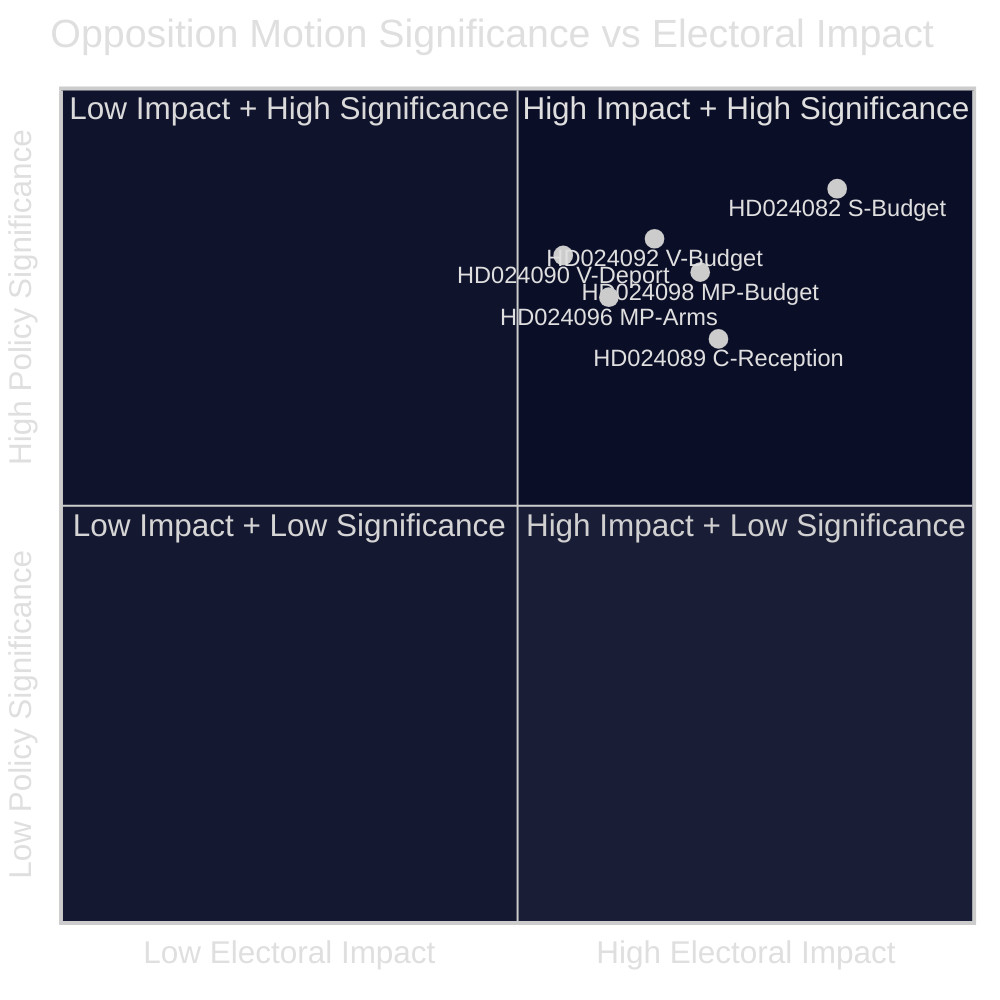

<!-- lang: es -->
# Resumen ejecutivo — Mociones de la oposición 2026-04-23

**Clasificación**: DOMINIO PÚBLICO — Registros parlamentarios  
**Autor**: James Pether Sörling  
**Fecha**: 2026-04-23  
**Confianza**: ALTA [B2]

---

## 🎯 BLUF

La oposición parlamentaria sueca presentó 14 mociones en la semana del 13 al 17 de abril de 2026 impugnando el presupuesto suplementario extraordinario del gobierno (prop. 2025/26:236), la reforma de la ley de deportación (prop. 2025/26:235), el nuevo marco de exportación de armas (prop. 2025/26:228) y la nueva ley de acogida de solicitantes de asilo (prop. 2025/26:229). La división más acentuada se refiere a la reducción temporal del impuesto sobre el combustible a los niveles mínimos de la UE: S, V y MP la oponen todos pero por razones divergentes, lo que señala que la oposición centro-izquierda no puede coaligarse detrás de una sola contrapropuesta antes de las elecciones de otoño de 2026.

---

## 🧭 Decisiones que apoya esta nota

1. **Encuadre mediático y editorial**: Determinar si la disputa energía/presupuesto debe liderar como una historia de «credibilidad fiscal» o de «política climática» — las evidencias a continuación apoyan ambos encuadres simultáneamente.
2. **Inteligencia electoral**: Evaluar si la fragmentación de la oposición en cuestiones fiscales y de migración reduce la probabilidad de un cambio de gobierno de centro-izquierda en otoño de 2026.
3. **Seguimiento de políticas**: Rastrear qué comisión (FiU para el presupuesto, SfU para la migración) procesará las mociones primero y cuándo están programadas las votaciones.

---

## ⚡ Lectura de 60 segundos

- **Choque presupuestario**: S quiere apoyo eléctrico mejor focalizado y uso flexible de los ingresos por congestión de red (HD024082 de Mikael Damberg). V exige que todo el recorte del impuesto al combustible sea rechazado — cita el análisis RUT que muestra que las reformas del gobierno benefician a la mitad superior de la distribución de ingresos 5 veces más que a la mitad inferior (HD024092, Nooshi Dadgostar). MP también se opone al recorte del combustible; cita a Konjunkturinstitutet, Naturvårdsverket, 2030-sekretariatet y Trafikverket como opositores de la propuesta (HD024098, Janine Alm Ericson).
- **Ley de deportación (prop. 2025/26:235)**: V exige el rechazo total de reglas de deportación más estrictas (HD024090, Tony Haddou); C acepta con condiciones que requieren infracciones repetidas sistemáticas (HD024095, Niels Paarup-Petersen); MP rechazo parcial (HD024097, Annika Hirvonen).
- **Exportaciones de armas (prop. 2025/26:228)**: MP exige una prohibición de las exportaciones de armas a dictaduras y naciones en guerra, y se opone a nuevas disposiciones de secreto (HD024096, Jacob Risberg). V se opone a toda la proposición.
- **Acogida de solicitantes de asilo (prop. 2025/26:229)**: C acepta el marco amplio pero se opone a las restricciones de zona y quiere que los municipios conserven los poderes de asistencia de emergencia (HD024089); S se opone a la privatización de la vivienda de asilo (HD024080); MP rechaza completamente (HD024087).
- **Fragmentación de la oposición**: S, V y MP se oponen al suplemento presupuestario pero no pueden unirse en una alternativa común. En migración, el bloque de centro-izquierda está aún más fragmentado, con C apoyando parcialmente al gobierno.

---

## 🔭 Principal desencadenante prospectivo

**Votación de la comisión FiU sobre Extra ändringsbudget (prop. 2025/26:236)** — esperada dentro de 3–4 semanas. Si SD vota con el gobierno como se espera, el recorte del impuesto al combustible pasará. Vigilar cualquier demanda de enmienda de SD como un indicador decisivo de estabilidad de la coalición.

---

## 📊 Clasificación de significancia (ponderada por DIW)

*Confianza: ALTA general [B2]; las puntuaciones individuales de los documentos reflejan datos del manifiesto + texto completo donde esté disponible.*

<!-- source-sha: 1e83ac6587956e9b1ca9cfd53aac08783e617cbd -->
