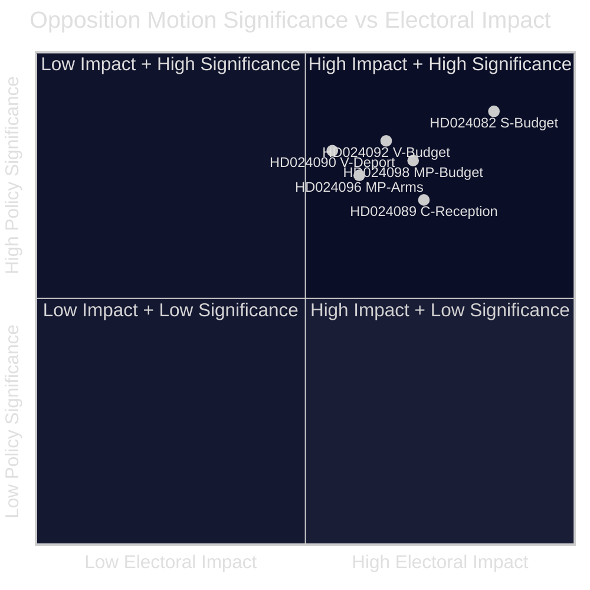

<!-- lang: fi -->
# Tiivistelmä — Oppositioaloitteet 2026-04-23

**Luokitus**: JULKINEN ALUE — Parlamentaariset asiakirjat  
**Tekijä**: James Pether Sörling  
**Päivämäärä**: 2026-04-23  
**Luottamus**: KORKEA [B2]

---

## 🎯 BLUF

Ruotsin parlamentaarinen oppositio jätti 14 aloitetta viikolla 13.–17. huhtikuuta 2026 haastamaan hallituksen ylimääräisen lisätalousarvion (prop. 2025/26:236), karkotuslakirefrormin (prop. 2025/26:235), uuden asevientikehyksen (prop. 2025/26:228) ja uuden turvapaikanhakijoiden vastaanottolain (prop. 2025/26:229). Terävimmät erimielisyydet liittyvät hallituksen väliaikaiseen polttoaineveron leikkaukseen EU:n vähimmäistasolle: S, V ja MP vastustavat kaikki, mutta eri syistä, mikä viestii siitä, ettei vasemmiston ja keskustan oppositio pysty yhdistymään yhden vastaehdotuksen taakse ennen syksyn 2026 vaaleja.

---

## 🧭 Päätökset, joita tämä tilannekatsaus tukee

1. **Media- ja toimituksellinen kehystys**: Määritä, pitäisikö energia-/budjettikiistan johtaa "finanssiuskottavuus"- vai "ilmastopolitiikka"-uutisena — alla olevat todisteet tukevat molempia kehystyksiä samanaikaisesti.
2. **Vaalitiedustelu**: Arvioi, vähentääkö opposition hajanaisuus finanssi- ja maahanmuuttokysymyksissä vasemmisto-keskusta-hallituksenvaihdon todennäköisyyttä syksyllä 2026.
3. **Politiikkaseuranta**: Seuraa, mikä valiokunta (FiU budjettiin, SfU maahanmuuttoon) käsittelee aloitteet ensin ja milloin äänestykset on suunniteltu.

---

## ⚡ 60 sekunnin lukeminen

- **Budjettitörmäys**: S haluaa paremmin kohdennettua sähkötukea ja joustava käyttö verkon ruuhkautuloista (HD024082, Mikael Damberg). V vaatii koko polttoaineveroleikkauksen hylkäämistä — viittaa RUT-analyysiin, joka osoittaa hallituksen uudistusten hyödyttävän tulojakauman ylintä puoliskoa 5× enemmän kuin alinta (HD024092, Nooshi Dadgostar). MP vastustaa myös polttoaineleikkausta; viittaa Konjunkturinstitutet, Naturvårdsverket, 2030-sekretariatet ja Trafikverket vastustamaan ehdotusta (HD024098, Janine Alm Ericson).
- **Karkotuslaki (prop. 2025/26:235)**: V vaatii tiukempien karkotussääntöjen täydellistä hylkäämistä (HD024090, Tony Haddou); C hyväksyy ehdoin, jotka edellyttävät systemaattisia toistuvia rikkomuksia (HD024095, Niels Paarup-Petersen); MP osittainen hylkääminen (HD024097, Annika Hirvonen).
- **Asevienti (prop. 2025/26:228)**: MP vaatii aseviennin kieltämistä diktatuureihin ja sotaa käyviin kansoihin, ja vastustaa uusia salassapitosäännöksiä (HD024096, Jacob Risberg). V vastustaa koko esitystä.
- **Turvapaikanhakijoiden vastaanotto (prop. 2025/26:229)**: C hyväksyy laajan kehyksen, mutta vastustaa aluerajoituksia ja haluaa kuntien säilyttävän hätäaputoimivaltuudet (HD024089); S vastustaa turvapaikkaasuntojen yksityistämistä (HD024080); MP hylkää kokonaan (HD024087).
- **Opposition hajanaisuus**: S, V ja MP vastustavat talousarviolisäystä, mutta eivät voi yhdistyä yhteisen vaihtoehdon taakse. Maahanmuuton osalta vasemmiston ja keskustan ryhmittymä on vielä hajanaisempi, kun C osittain tukee hallitusta.

---

## 🔭 Tärkein eteenpäin katsova laukaisin

**FiU-valiokunnan äänestys Extra ändringsbudget -esityksestä (prop. 2025/26:236)** — odotetaan 3–4 viikon sisällä. Jos SD äänestää hallituksen kanssa odotetusti, polttoaineveroleikkaus hyväksytään. Seuraa SD:n mahdollisia muutosehdotuksia koalition vakauden ratkaisevana indikaattorina.

---

## 📊 Merkittävyysluokitus (DIW-painotettu)

*Luottamus: KORKEA kokonaisuutena [B2]; yksittäiset asiakirjapisteet heijastavat manifesti-dataa + koko tekstiä saatavilla ollessa.*

<!-- source-sha: 1e83ac6587956e9b1ca9cfd53aac08783e617cbd -->
