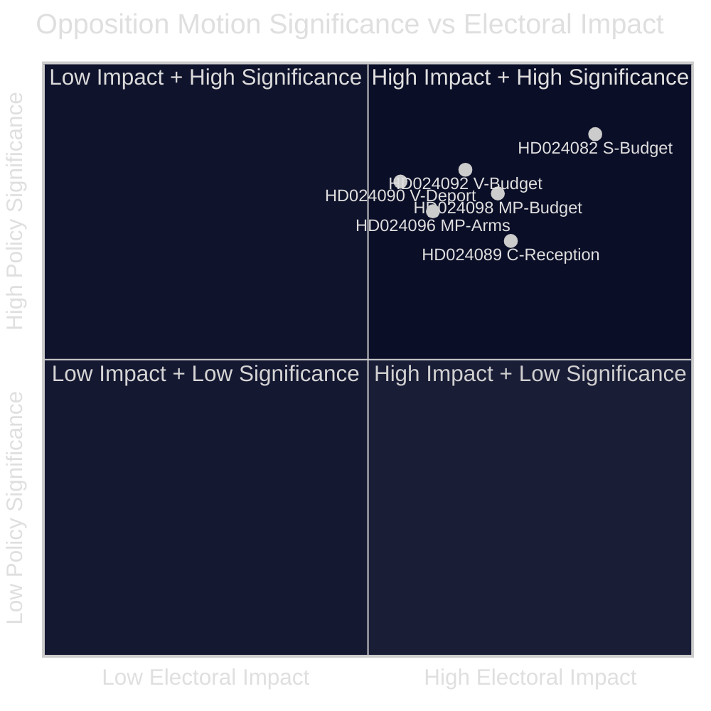

<!-- lang: fr -->
# Note de synthèse — Motions de l'opposition 2026-04-23

**Classification** : DOMAINE PUBLIC — Documents parlementaires  
**Auteur** : James Pether Sörling  
**Date** : 2026-04-23  
**Confiance** : ÉLEVÉE [B2]

---

## 🎯 BLUF

L'opposition parlementaire suédoise a déposé 14 motions dans la semaine du 13 au 17 avril 2026 contestant le budget supplémentaire extraordinaire du gouvernement (prop. 2025/26:236), la réforme de la loi sur l'expulsion (prop. 2025/26:235), le nouveau cadre d'exportation d'armements (prop. 2025/26:228) et la nouvelle loi sur l'accueil des demandeurs d'asile (prop. 2025/26:229). Le clivage le plus vif porte sur la réduction temporaire de la taxe sur les carburants aux niveaux minimaux de l'UE : S, V et MP y sont tous opposés mais pour des raisons divergentes, signalant que l'opposition centre-gauche ne peut se coaliser derrière une contre-proposition unique avant les élections d'automne 2026.

---

## 🧭 Décisions soutenues par cette note

1. **Cadrage médiatique et éditorial** : Déterminer si le conflit énergie/budget doit être présenté comme une histoire de « crédibilité fiscale » ou de « politique climatique » — les preuves ci-dessous soutiennent les deux cadrages simultanément.
2. **Renseignement électoral** : Évaluer si la fragmentation de l'opposition sur les questions fiscales et migratoires réduit la probabilité d'un changement de gouvernement centre-gauche à l'automne 2026.
3. **Suivi des politiques** : Suivre quelle commission (FiU pour le budget, SfU pour la migration) traitera les motions en premier et quand les votes sont prévus.

---

## ⚡ Lecture en 60 secondes

- **Conflit budgétaire** : S veut un soutien à l'électricité mieux ciblé et une utilisation flexible des revenus de congestion du réseau (HD024082 de Mikael Damberg). V exige le rejet de l'intégralité de la réduction de la taxe sur les carburants — cite une analyse RUT montrant que les réformes gouvernementales profitent à la moitié supérieure de la distribution des revenus 5 fois plus qu'à la moitié inférieure (HD024092, Nooshi Dadgostar). MP s'oppose également à la réduction du carburant ; cite Konjunkturinstitutet, Naturvårdsverket, 2030-sekretariatet et Trafikverket comme opposants à la proposition (HD024098, Janine Alm Ericson).
- **Loi sur l'expulsion (prop. 2025/26:235)** : V demande le rejet total de règles d'expulsion plus strictes (HD024090, Tony Haddou) ; C accepte sous conditions exigeant des infractions répétées systématiques (HD024095, Niels Paarup-Petersen) ; MP rejet partiel (HD024097, Annika Hirvonen).
- **Exportations d'armements (prop. 2025/26:228)** : MP exige une interdiction des exportations d'armements vers des dictatures et des nations en guerre, et s'oppose aux nouvelles dispositions sur le secret (HD024096, Jacob Risberg). V s'oppose à l'ensemble de la proposition.
- **Accueil des demandeurs d'asile (prop. 2025/26:229)** : C accepte le cadre général mais s'oppose aux restrictions de zone et souhaite que les municipalités conservent les pouvoirs d'aide d'urgence (HD024089) ; S s'oppose à la privatisation des logements d'asile (HD024080) ; MP rejette entièrement (HD024087).
- **Fragmentation de l'opposition** : S, V et MP s'opposent au supplément budgétaire mais ne peuvent s'unir sur une alternative commune. Sur la migration, le bloc centre-gauche est encore plus fragmenté, C soutenant partiellement le gouvernement.

---

## 🔭 Principal déclencheur prospectif

**Vote de la commission FiU sur Extra ändringsbudget (prop. 2025/26:236)** — attendu dans 3–4 semaines. Si SD vote avec le gouvernement comme prévu, la réduction de la taxe sur les carburants sera adoptée. Surveiller les éventuelles demandes d'amendement de SD comme indicateur décisif de la stabilité de la coalition.

---

## 📊 Classement par signification (pondération DIW)

*Confiance : ÉLEVÉE globale [B2] ; les scores individuels des documents reflètent les données du manifeste + le texte complet lorsque disponible.*

<!-- source-sha: 1e83ac6587956e9b1ca9cfd53aac08783e617cbd -->
