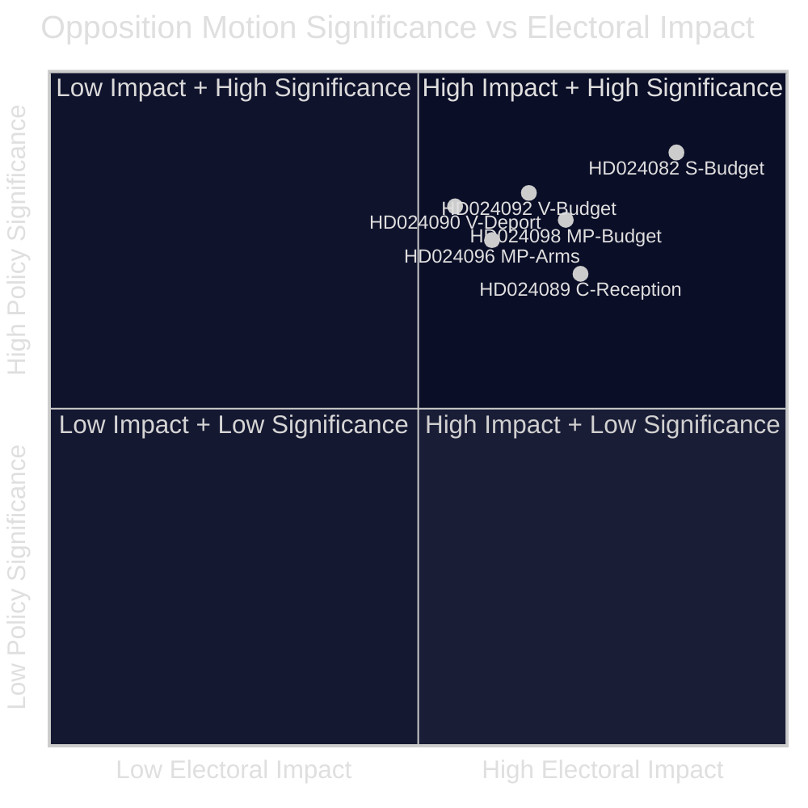

<!-- dir: rtl -->
<!-- lang: he -->
# סיכום מנהלים — הצעות האופוזיציה 2026-04-23

**סיווג**: תחום ציבורי — רשומות פרלמנטריות  
**מחבר**: James Pether Sörling  
**תאריך**: 2026-04-23  
**אמינות**: גבוהה [B2]

---

## 🎯 תקציר מנהלים

האופוזיציה הפרלמנטרית השוודית הגישה 14 הצעות בשבוע 13–17 באפריל 2026 שמאתגרות את תקציב הנוסף המיוחד של הממשלה (prop. 2025/26:236), רפורמת חוק הגירוש (prop. 2025/26:235), המסגרת החדשה לייצוא נשק (prop. 2025/26:228) וחוק קליטת מבקשי מקלט החדש (prop. 2025/26:229). הפיצול החד ביותר נוגע לקיצוץ המס הזמני על דלק לרמות המינימום של האיחוד האירופי: S, V ו-MP כולן מתנגדות אך מסיבות שונות, מה שמעיד שהאופוזיציה המרכז-שמאל לא יכולה להתאחד מאחורי הצעת נגד יחידה לפני בחירות סתיו 2026.

---

## 🧭 החלטות שמסמך זה תומך בהן

1. **מסגרת תקשורתית ועיתונאית**: קביעה האם המחלוקת על אנרגיה/תקציב צריכה להוביל כסיפור "אמינות פיסקלית" או "מדיניות אקלים" — הראיות להלן תומכות בשתי המסגרות בו-זמנית.
2. **מודיעין בחירות**: הערכה האם פיצול האופוזיציה בנושאים פיסקליים ומיגרציה מפחית את הסבירות לשינוי ממשלת מרכז-שמאל בסתיו 2026.
3. **מעקב מדיניות**: מעקב אחר איזו ועדה (FiU לתקציב, SfU להגירה) תעבד הצעות ראשונה ומתי מתוכננות הצבעות.

---

## ⚡ קריאה של 60 שניות

- **עימות תקציבי**: S רוצה תמיכה חשמלית ממוקדת יותר ושימוש גמיש בהכנסות עומס רשת (HD024082 של Mikael Damberg). V דורשת דחיית כל קיצוץ מס הדלק — מצטטת ניתוח RUT המראה שרפורמות הממשלה מועילות למחצית העליונה של התפלגות ההכנסות פי 5 יותר מהמחצית התחתונה (HD024092, Nooshi Dadgostar). MP גם כן מתנגדת לקיצוץ הדלק; מצטטת את Konjunkturinstitutet, Naturvårdsverket, 2030-sekretariatet ו-Trafikverket כמתנגדים להצעה (HD024098, Janine Alm Ericson).
- **חוק גירוש (prop. 2025/26:235)**: V דורשת דחייה מלאה של כללי גירוש מחמירים יותר (HD024090, Tony Haddou); C מקבלת בתנאים הדורשים עבירות חוזרות שיטתיות (HD024095, Niels Paarup-Petersen); MP דחייה חלקית (HD024097, Annika Hirvonen).
- **ייצוא נשק (prop. 2025/26:228)**: MP דורשת איסור על ייצוא נשק לדיקטטורות ומדינות לוחמות, ומתנגדת להוראות סודיות חדשות (HD024096, Jacob Risberg). V מתנגדת להצעה כולה.
- **קליטת מבקשי מקלט (prop. 2025/26:229)**: C מקבלת את המסגרת הרחבה אך מתנגדת להגבלות אזוריות ורוצה שעיריות תשמורנה על סמכויות סיוע חירום (HD024089); S מתנגדת לפרטיזציה של דיור מקלט (HD024080); MP דוחה לחלוטין (HD024087).
- **פיצול האופוזיציה**: S, V ו-MP מתנגדות לתוספת התקציב אך לא יכולות להתאחד על חלופה משותפת. בנושא הגירה, הגוש מרכז-שמאל מפוצל עוד יותר, כאשר C תומכת בממשלה באופן חלקי.

---

## 🔭 הטריגר הפרוספקטיבי המרכזי

**הצבעת ועדת FiU על Extra ändringsbudget (prop. 2025/26:236)** — צפויה תוך 3–4 שבועות. אם SD יצביע עם הממשלה כצפוי, קיצוץ מס הדלק יעבור. לצפות בכל דרישות תיקון של SD כאינדיקטור מרכזי לייצוב הקואליציה.

---

## 📊 דירוג משמעות (משוקלל DIW)

*אמינות: גבוהה כוללת [B2]; ציוני מסמכים בודדים משקפים נתוני מניפסט + טקסט מלא כאשר זמין.*

<!-- source-sha: 1e83ac6587956e9b1ca9cfd53aac08783e617cbd -->
