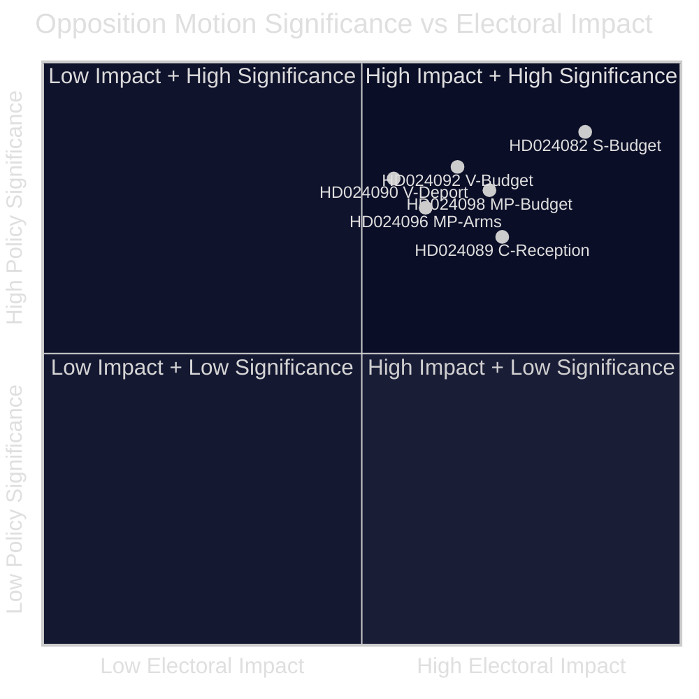

<!-- lang: ja -->
# エグゼクティブブリーフ — 野党動議 2026-04-23

**分類**: 公開情報 — 議会記録  
**著者**: James Pether Sörling  
**日付**: 2026-04-23  
**信頼度**: 高 [B2]

---

## 🎯 BLUF

スウェーデン議会野党は2026年4月13〜17日の週に14件の動議を提出し、政府の追加補正予算（prop. 2025/26:236）、退去強制法改正（prop. 2025/26:235）、新たな武器輸出枠組み（prop. 2025/26:228）、新たな難民受け入れ法（prop. 2025/26:229）に異議を唱えた。最も鋭い対立は、燃料税をEU最低水準に引き下げる政府の一時的措置をめぐるものだ：S、V、MPはすべて反対しているが、理由が異なるため、中道左派野党が2026年秋の選挙を前に共通の対案でまとまれないことを示唆している。

---

## 🧭 このブリーフが支援する意思決定

1. **メディア・編集の枠組み**: エネルギー/予算論争を「財政信頼性」か「気候政策」の物語として扱うべきかを決定する — 以下の証拠は両方の枠組みを同時に支持する。
2. **選挙インテリジェンス**: 財政・移民問題における野党の分裂が、2026年秋の中道左派政権交代の確率を下げるかどうかを評価する。
3. **政策モニタリング**: どの委員会（予算はFiU、移民はSfU）が動議を先に処理し、採決がいつ予定されているかを追跡する。

---

## ⚡ 60秒で読む

- **予算対立**: Sはより的を絞った電力支援と系統混雑収入の柔軟な活用を求める（HD024082、Mikael Damberg）。VはRUT分析を引用しながら燃料税引き下げ全体の否決を要求する — 政府の改革が所得分布の上位半分に下位半分の5倍の恩恵をもたらすと示す（HD024092、Nooshi Dadgostar）。MPも燃料税引き下げに反対し、Konjunkturinstitutet、Naturvårdsverket、2030-sekretariatet、Trafikverketが反対していると引用する（HD024098、Janine Alm Ericson）。
- **退去強制法（prop. 2025/26:235）**: Vはより厳しい退去強制規則の完全否決を要求（HD024090、Tony Haddou）；Cは系統的繰り返し違反を要件とする条件付きで受け入れ（HD024095、Niels Paarup-Petersen）；MP一部否決（HD024097、Annika Hirvonen）。
- **武器輸出（prop. 2025/26:228）**: MPは独裁国家や交戦国への武器輸出禁止を要求し、新たな秘密保護条項にも反対（HD024096、Jacob Risberg）。Vは提案全体に反対。
- **難民受け入れ（prop. 2025/26:229）**: Cは広い枠組みを受け入れるが地域制限に反対し、自治体が緊急援助権限を維持することを希望（HD024089）；Sは難民住宅の民営化に反対（HD024080）；MPは完全拒否（HD024087）。
- **野党の分裂**: S、V、MPは予算補正に反対しているが、共通の代替案でまとまれない。移民問題では、中道左派ブロックはさらに分裂しており、Cが部分的に政府を支持している。

---

## 🔭 主要な先行指標

**FiU委員会によるExtra ändringsbudget（prop. 2025/26:236）への採決** — 3〜4週間以内に予定。予想通りSDが政府と同様の投票をすれば、燃料税引き下げは可決される。SDの修正要求を連立安定の重要指標として注視すること。

---

## 📊 重要度ランキング（DIW加重）

*信頼度：全体的に高 [B2]；個別の文書スコアは、入手可能な場合、マニフェストデータ＋全文を反映。*

<!-- source-sha: 1e83ac6587956e9b1ca9cfd53aac08783e617cbd -->
