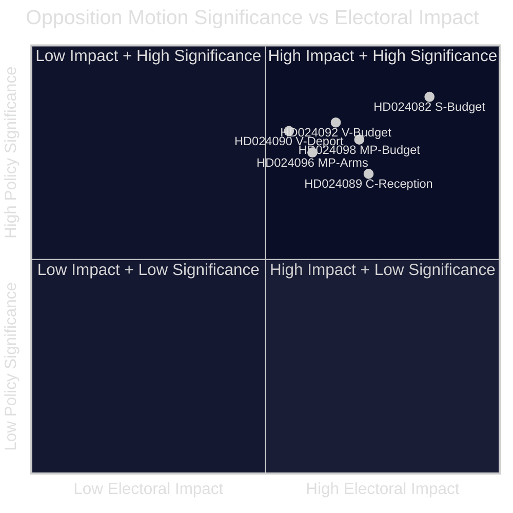

<!-- lang: ko -->
# 집행 브리핑 — 야당 동의안 2026-04-23

**분류**: 공개 영역 — 의회 기록  
**저자**: James Pether Sörling  
**날짜**: 2026-04-23  
**신뢰도**: 높음 [B2]

---

## 🎯 BLUF

스웨덴 의회 야당은 2026년 4월 13~17일 주에 14건의 동의안을 제출하여 정부의 추가 보충 예산(prop. 2025/26:236), 추방법 개정(prop. 2025/26:235), 새로운 무기 수출 틀(prop. 2025/26:228), 새로운 망명 신청자 수용법(prop. 2025/26:229)에 이의를 제기했다. 가장 날카로운 균열은 연료세를 EU 최저 수준으로 일시 인하하는 정부 조치를 둘러싼 것이다: S, V, MP 모두 반대하지만 이유가 다르며, 이는 중도좌파 야당이 2026년 가을 선거를 앞두고 단일 반대안 뒤에 결집할 수 없음을 시사한다.

---

## 🧭 이 브리핑이 지원하는 결정

1. **미디어 및 편집 프레이밍**: 에너지/예산 분쟁이 "재정 신뢰성"이나 "기후 정책" 이야기로 다루어져야 하는지 결정 — 아래 증거는 두 가지 프레임을 동시에 지지한다.
2. **선거 정보**: 재정 및 이민 문제에서 야당의 분열이 2026년 가을 중도좌파 정권 교체 가능성을 낮추는지 평가한다.
3. **정책 모니터링**: 어느 위원회(예산은 FiU, 이민은 SfU)가 동의안을 먼저 처리하고 투표가 언제 예정되어 있는지 추적한다.

---

## ⚡ 60초 읽기

- **예산 충돌**: S는 더 잘 목표화된 전기 지원과 네트워크 혼잡 수익의 유연한 사용을 원한다(HD024082, Mikael Damberg). V는 연료세 인하 전체를 거부하도록 요구 — RUT 분석을 인용하여 정부 개혁이 소득 분포의 상위 절반에게 하위 절반보다 5배 더 혜택을 준다고 주장(HD024092, Nooshi Dadgostar). MP도 연료 인하에 반대하며; Konjunkturinstitutet, Naturvårdsverket, 2030-sekretariatet, Trafikverket을 제안 반대자로 인용(HD024098, Janine Alm Ericson).
- **추방법(prop. 2025/26:235)**: V는 더 엄격한 추방 규정의 완전 거부를 요구(HD024090, Tony Haddou); C는 체계적 반복 위반을 요구하는 조건부로 수용(HD024095, Niels Paarup-Petersen); MP 부분 거부(HD024097, Annika Hirvonen).
- **무기 수출(prop. 2025/26:228)**: MP는 독재 국가와 교전국에 대한 무기 수출 금지를 요구하고 새로운 기밀 조항에 반대(HD024096, Jacob Risberg). V는 제안 전체에 반대.
- **망명 신청자 수용(prop. 2025/26:229)**: C는 광범위한 틀을 수용하지만 지역 제한에 반대하고 지자체가 긴급 복지 권한을 유지하기를 원한다(HD024089); S는 망명 주거의 민영화에 반대(HD024080); MP는 완전 거부(HD024087).
- **야당 분열**: S, V, MP는 예산 보충에 반대하지만 공동 대안 뒤에 결집할 수 없다. 이민 문제에서 중도좌파 블록은 더욱 분열되어 있으며, C가 정부를 부분적으로 지지하고 있다.

---

## 🔭 주요 선행 트리거

**FiU 위원회의 Extra ändringsbudget(prop. 2025/26:236) 투표** — 3~4주 이내에 예정. SD가 예상대로 정부와 함께 투표하면 연료세 인하가 통과된다. SD의 수정안 요구를 연립 안정성의 핵심 지표로 주시할 것.

---

## 📊 중요도 순위 (DIW 가중치)

*신뢰도: 전반적으로 높음 [B2]; 개별 문서 점수는 매니페스트 데이터 + 전문(가능한 경우)을 반영.*

<!-- source-sha: 1e83ac6587956e9b1ca9cfd53aac08783e617cbd -->
