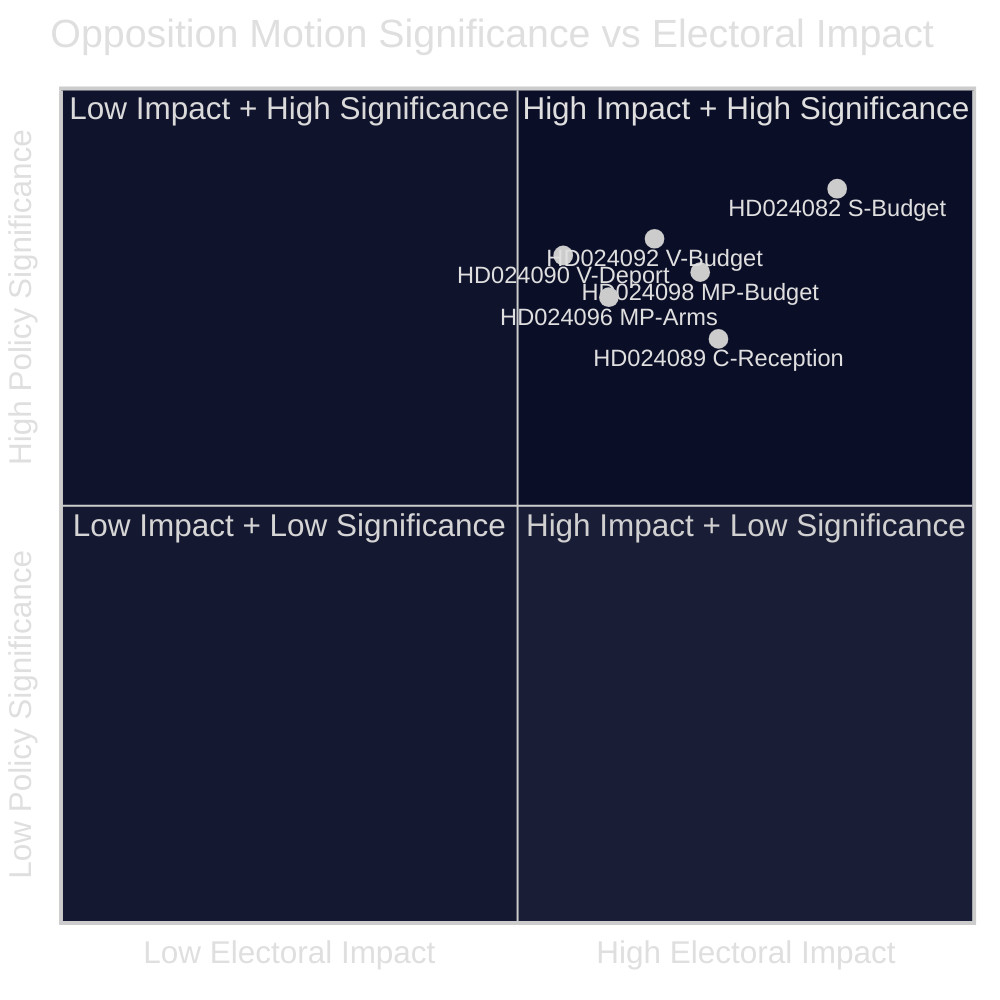

<!-- lang: nl -->
# Uitvoerende briefing — Oppositiemoties 2026-04-23

**Classificatie**: OPENBAAR DOMEIN — Parlementaire documenten  
**Auteur**: James Pether Sörling  
**Datum**: 2026-04-23  
**Betrouwbaarheid**: HOOG [B2]

---

## 🎯 BLUF

De Zweedse parlementaire oppositie diende in de week van 13–17 april 2026 14 moties in ter betwisting van de extra aanvullende begroting van de regering (prop. 2025/26:236), de hervorming van de deportatiewet (prop. 2025/26:235), het nieuwe raamwerk voor wapenexport (prop. 2025/26:228) en de nieuwe wet opvang asielzoekers (prop. 2025/26:229). De scherpste kloof betreft de tijdelijke brandstofbelastingverlaging naar EU-minimumniveaus: S, V en MP zijn er allemaal tegen maar om uiteenlopende redenen, wat aangeeft dat de centrum-links oppositie zich niet achter één tegenpropositie kan verenigen voor de herfstverkiezingen 2026.

---

## 🧭 Beslissingen die deze briefing ondersteunt

1. **Media- en redactioneel kader**: Bepalen of de energie-/budgetdispute moet leiden als een verhaal over 'fiscale geloofwaardigheid' of 'klimaatbeleid' — de onderstaande bewijzen ondersteunen beide kaders tegelijk.
2. **Verkiezingsinformatie**: Beoordelen of de fragmentatie van de oppositie over fiscale en migratieproblemen de kans op een centrum-links regeringswisseling in de herfst van 2026 verkleint.
3. **Beleidsmonitoring**: Bijhouden welke commissie (FiU voor begroting, SfU voor migratie) de moties als eerste verwerkt en wanneer stemmingen zijn gepland.

---

## ⚡ 60-seconden lezing

- **Begrotingsconflict**: S wil beter gerichte elektriciteitssteun en flexibel gebruik van netcongestieopbrengsten (HD024082 van Mikael Damberg). V eist dat de volledige brandstofbelastingverlaging wordt afgewezen — citeert RUT-analyse die aantoont dat regeringshervormingen de bovenste helft van de inkomensverdeling 5× meer bevoordelen dan de onderste helft (HD024092, Nooshi Dadgostar). MP is eveneens tegen de brandstofverlaging; citeert Konjunkturinstitutet, Naturvårdsverket, 2030-sekretariatet en Trafikverket als tegenstanders van het voorstel (HD024098, Janine Alm Ericson).
- **Deportatiewet (prop. 2025/26:235)**: V eist volledige afwijzing van strengere deportatieregels (HD024090, Tony Haddou); C accepteert onder voorwaarden die systematische herhaalde overtredingen vereisen (HD024095, Niels Paarup-Petersen); MP gedeeltelijke afwijzing (HD024097, Annika Hirvonen).
- **Wapenexport (prop. 2025/26:228)**: MP eist een verbod op wapenexport naar dictaturen en oorlogvoerende landen, en verzet zich tegen nieuwe geheimhoudingsbepalingen (HD024096, Jacob Risberg). V verzet zich tegen de volledige propositie.
- **Asielopvang (prop. 2025/26:229)**: C accepteert het brede kader maar verzet zich tegen gebiedsbeperkingen en wil dat gemeenten noodhulpbevoegdheden behouden (HD024089); S verzet zich tegen privatisering van asielhuisvesting (HD024080); MP wijst volledig af (HD024087).
- **Oppositiefragmentatie**: S, V en MP verzetten zich tegen het begrotingssupplement maar kunnen zich niet verenigen achter een gemeenschappelijk alternatief. Over migratie is het centrum-links blok nog verder gefragmenteerd, waarbij C de regering gedeeltelijk steunt.

---

## 🔭 Belangrijkste vooruitkijkende trigger

**FiU-commissiestemming over Extra ändringsbudget (prop. 2025/26:236)** — verwacht binnen 3–4 weken. Als SD zoals verwacht met de regering stemt, zal de brandstofbelastingverlaging doorgaan. Let op eventuele SD-wijzigingseisen als cruciale indicator voor coalitiesstabiliteit.

---

## 📊 Significantierangschikking (DIW-gewogen)

*Betrouwbaarheid: HOOG algemeen [B2]; individuele documentscores weerspiegelen manifestgegevens + volledige tekst waar beschikbaar.*

<!-- source-sha: 1e83ac6587956e9b1ca9cfd53aac08783e617cbd -->
