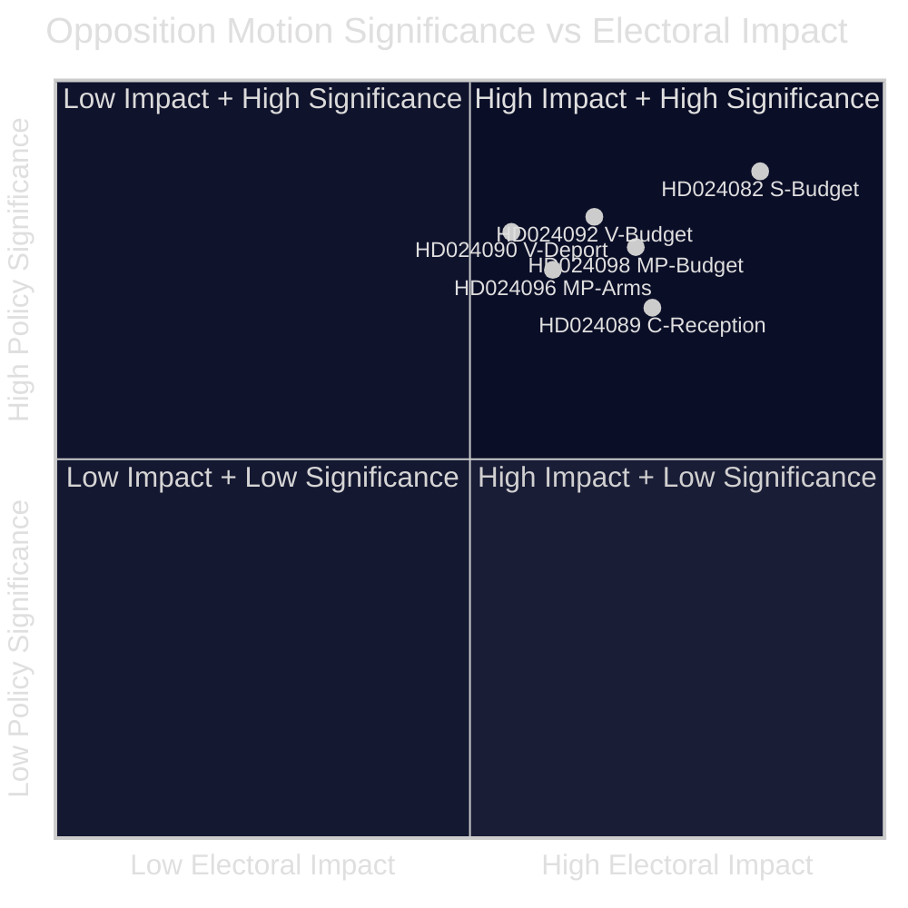

<!-- lang: no -->
# Beslutningsnotat — Opposisjonsforslag 2026-04-23

**Klassifisering**: OFFENTLIG DOMENE — Parlamentariske optegnelser  
**Forfatter**: James Pether Sörling  
**Dato**: 2026-04-23  
**Tillit**: HØY [B2]

---

## 🎯 BLUF

Den svenske parlamentariske opposisjonen leverte inn 14 forslag i uken 13.–17. april 2026 som utfordrer regjeringens ekstra tilleggsbudsjett (prop. 2025/26:236), reform av deportasjonsloven (prop. 2025/26:235), det nye rammeverket for våpeneksport (prop. 2025/26:228) og den nye loven om asylmottak (prop. 2025/26:229). Den skarpeste kløften gjelder regjeringens midlertidige drivstoffavgiftsnedskjæring til EUs minimumsnivåer: S, V og MP er alle imot, men av divergerende årsaker, noe som signaliserer at sentrum-venstre-opposisjonen ikke kan samle seg bak et felles motforslag foran høstvalget 2026.

---

## 🧭 Beslutninger dette notatet støtter

1. **Medie- og redaksjonell innramming**: Avgjør om energi-/budgetstriden bør lede som en «finansiell troverdighet»- eller «klimapolitikk»-nyhet — bevisene nedenfor støtter begge innramminger simultant.
2. **Valgintelligens**: Vurder om opposisjonens fragmentering på finansielle og migrasjonsspørsmål reduserer sannsynligheten for et sentrum-venstrestyrt regjeringsskifte høsten 2026.
3. **Politikkmonitorering**: Spor hvilken komité (FiU for budsjett, SfU for migrasjon) som behandler forslagene først og når avstemninger er planlagt.

---

## ⚡ 60-sekunders lesning

- **Budsjettsammenstøt**: S ønsker bedre målrettet strømstøtte og fleksibel bruk av nettflaskehals-inntekter (HD024082 av Mikael Damberg). V krever at hele drivstoffavgiftskuttet avvises — siterer RUT-analyse som viser at regjeringens reformer gagner den øverste halvdelen av inntektsfordelingen 5× mer enn den nederste halvdelen (HD024092, Nooshi Dadgostar). MP er likeledes mot drivstoffkuttet; siterer Konjunkturinstitutet, Naturvårdsverket, 2030-sekretariatet og Trafikverket som motstandere av forslaget (HD024098, Janine Alm Ericson).
- **Deportasjonslov (prop. 2025/26:235)**: V krever full avvisning av strengere deportasjonsregler (HD024090, Tony Haddou); C aksepterer med vilkår som krever systematiske gjentatte lovbrudd (HD024095, Niels Paarup-Petersen); MP delvis avvisning (HD024097, Annika Hirvonen).
- **Våpeneksport (prop. 2025/26:228)**: MP krever forbud mot våpeneksport til diktaturer og krigførende nasjoner, og motsetter seg nye taushetsbestemmelser (HD024096, Jacob Risberg). V motsetter seg hele proposisjonen.
- **Asylmottak (prop. 2025/26:229)**: C aksepterer det brede rammeverket, men motsetter seg områdebegrensninger og ønsker at kommunene beholder nødhjelpsmyndigheter (HD024089); S motsetter seg privatisering av asylboliger (HD024080); MP avviser fullstendig (HD024087).
- **Opposisjonsfragmentering**: S, V og MP motsetter seg budsjett-supplementet, men kan ikke samle seg om et felles alternativ. Om migrasjon er sentrum-venstre-blokken enda mer fragmentert, med C som delvis støtter regjeringen.

---

## 🔭 Topp fremadskuende trigger

**FiU-komitéavstemning om Extra ändringsbudget (prop. 2025/26:236)** — forventet innen 3–4 uker. Hvis SD stemmer med regjeringen som forventet, vil drivstoffavgiftskuttet passere. Se etter eventuelle SD-endringsforslag som en avgjørende indikator på koalisjonsstabilitet.

---

## 📊 Signifikansrangering (DIW-vektet)

*Tillit: HØY overordnet [B2]; individuelle dokumentscorer gjenspeiler manifestdata + full tekst der tilgjengelig.*

<!-- source-sha: 1e83ac6587956e9b1ca9cfd53aac08783e617cbd -->
