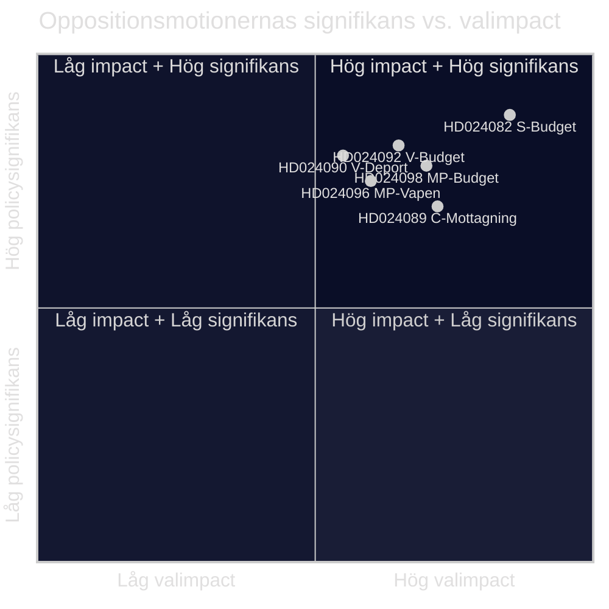

# Exekutiv sammanfattning — Oppositionsmotioner 2026-04-23

**Klassificering**: OFFENTLIGT DOMÄN — Parlamentariska handlingar
**Författare**: James Pether Sörling
**Datum**: 2026-04-23
**Förtroende**: HÖG [B2]

---

## 🎯 BLUF

Sveriges parlamentariska opposition lämnade in 14 motioner veckan 13–17 april 2026 som utmanar regeringens extra tilläggsbudget (prop. 2025/26:236), deportationslagreformen (prop. 2025/26:235), det nya ramverket för vapenexport (prop. 2025/26:228) och den nya asylmottagningslagen (prop. 2025/26:229). Den skarpaste klyftan gäller regeringens tillfälliga bränsleskattsänkning till EU-miniminivåer: S, V och MP motsätter sig alla men av olika skäl, vilket signalerar att centrum-vänsteroppositionens inte kan enas bakom ett gemensamt motförslag inför höstvalet 2026.

---

## 🧭 Beslut som detta underlag stödjer

1. **Medie- och redaktionell inramning**: Avgör om energi/budgetstriden bör leda som en berättelse om "finansiell trovärdighet" eller "klimatpolitik" — underlagen nedan stödjer båda inramningarna simultant.
2. **Valunderrättelse**: Bedöm huruvida oppositionens fragmentering i fiskala och migrationsfrågor minskar sannolikheten för ett vänsterlutande regeringsskifte hösten 2026.
3. **Policyövervakning**: Spåra vilket utskott (FiU för budget, SfU för migration) som kommer att behandla motionerna först och när omröstningar planeras.

---

## ⚡ 60-sekunders läsning

- **Budgetkonflikt**: S vill ha bättre riktad elstöd och flexibel användning av nätbegränsningsintäkter (HD024082 av Mikael Damberg). V kräver att hela bränsleskattsänkningen avslås — citerar RUT-analys som visar att regeringens reformer gynnar den övre hälften av inkomstfördelningen 5× mer än den nedre (HD024092, Nooshi Dadgostar). MP motsätter sig likaledes bränslesnedkärftet; citerar Konjunkturinstitutet, Naturvårdsverket, 2030-sekretariatet och Trafikverket som oppositionella till förslaget (HD024098, Janine Alm Ericson).
- **Deportationslagen (prop. 2025/26:235)**: V kräver fullständigt avslag av de striktare deportationsreglerna (HD024090, Tony Haddou); C accepterar med villkor som kräver systematiska upprepade brott (HD024095, Niels Paarup-Petersen); MP delvist avslag (HD024097, Annika Hirvonen).
- **Vapenexport (prop. 2025/26:228)**: MP kräver förbud mot vapenexport till diktaturer och krigsförande nationer, och motsätter sig nya sekretessbestämmelser (HD024096, Jacob Risberg). V är emot hela propositionen.
- **Asylmottagning (prop. 2025/26:229)**: C accepterar brett ramverk men motsätter sig områdesbegränsningar och vill att kommunerna behåller akuta socialbidragsbefogenheter (HD024089); S motsätter sig privatisering av asylboenden (HD024080); MP avslår helt (HD024087).
- **Oppositionens fragmentering**: S, V och MP motsätter sig det extra ändringsbudgeten men kan inte enas om ett gemensamt alternativ. I migrationsfrågor är centrum-vänsterblocket ännu mer splittrat med C som delvis stödjer regeringen.

---

## 🔭 Bästa framåtsignalen

**FiU-utskottets omröstning om extra ändringsbudget (prop. 2025/26:236)** — förväntas inom 3–4 veckor. Om SD röstar med regeringen som väntat kommer bränsleskattsänkningen att gå igenom. Bevaka eventuella SD-ändringsförslag som en vägledande indikator på koalitionsstabilitet.

---

## 📊 Signifikansrankning (DIW-viktad)

*Förtroende: HÖG totalt [B2]; enskilda dokumentpoäng återspeglar manifestdata + fulltext där tillgängligt.*

<!-- source-sha: 1e83ac6587956e9b1ca9cfd53aac08783e617cbd -->
