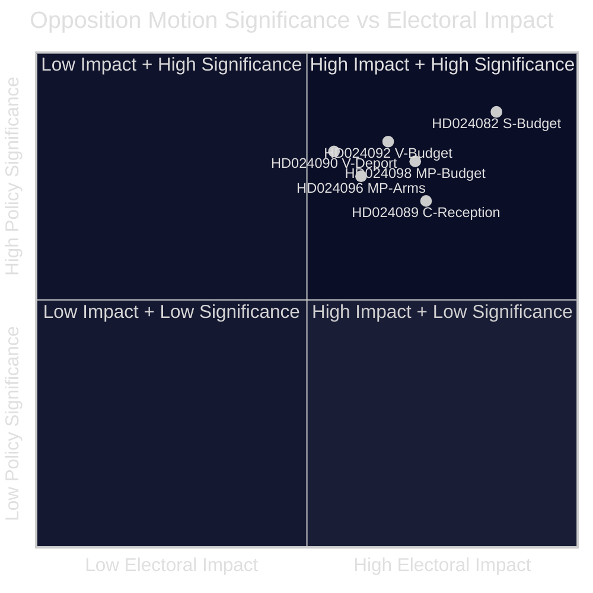

<!-- lang: zh -->
# 执行摘要 — 反对党议案 2026-04-23

**分类**: 公开领域 — 议会记录  
**作者**: James Pether Sörling  
**日期**: 2026-04-23  
**置信度**: 高 [B2]

---

## 🎯 摘要

瑞典议会反对派于2026年4月13日至17日提交了14项议案，质疑政府的额外补充预算（prop. 2025/26:236）、驱逐出境法修订（prop. 2025/26:235）、新武器出口框架（prop. 2025/26:228）和新庇护申请人接待法（prop. 2025/26:229）。最尖锐的分歧在于政府将燃油税暂时降至欧盟最低水平的措施：S、V和MP均反对，但原因各异，表明中左翼反对派无法在2026年秋季大选前围绕单一反驳提案凝聚共识。

---

## 🧭 本文件支持的决策

1. **媒体和编辑框架**：确定能源/预算争议应以"财政公信力"还是"气候政策"故事为主线——下文证据同时支持两种框架。
2. **选举情报**：评估反对派在财政和移民问题上的分裂是否降低了2026年秋季中左翼政府更迭的概率。
3. **政策监测**：追踪哪个委员会（预算为FiU，移民为SfU）将首先处理议案以及何时安排投票。

---

## ⚡ 60秒速读

- **预算冲突**：S希望更精准的电力支持和灵活利用电网拥堵收益（HD024082，Mikael Damberg）。V要求完全否决燃油税削减——引用RUT分析显示政府改革使收入分布上半部分受益是下半部分的5倍（HD024092，Nooshi Dadgostar）。MP同样反对燃油税削减；引用Konjunkturinstitutet、Naturvårdsverket、2030-sekretariatet和Trafikverket作为该提案的反对者（HD024098，Janine Alm Ericson）。
- **驱逐法（prop. 2025/26:235）**：V要求完全否决更严格的驱逐规则（HD024090，Tony Haddou）；C在要求系统性重复违规的条件下接受（HD024095，Niels Paarup-Petersen）；MP部分否决（HD024097，Annika Hirvonen）。
- **武器出口（prop. 2025/26:228）**：MP要求禁止向独裁政权和交战国出口武器，并反对新的保密条款（HD024096，Jacob Risberg）。V反对整项提案。
- **庇护申请人接待（prop. 2025/26:229）**：C接受广泛框架，但反对地区限制并希望市政当局保留紧急福利权力（HD024089）；S反对庇护住房私有化（HD024080）；MP完全拒绝（HD024087）。
- **反对派分裂**：S、V和MP反对预算补充，但无法就共同替代方案达成一致。在移民问题上，中左翼阵营更加分裂，C部分支持政府。

---

## 🔭 主要前瞻性触发点

**FiU委员会对Extra ändringsbudget（prop. 2025/26:236）的投票** — 预计在3至4周内进行。如果SD如预期那样与政府一起投票，燃油税削减将获通过。关注SD提出的任何修正案要求，作为衡量联盟稳定性的关键指标。

---

## 📊 重要性排名（DIW加权）

*置信度：总体高 [B2]；各文件分数反映清单数据 + 可用时的全文。*

<!-- source-sha: 1e83ac6587956e9b1ca9cfd53aac08783e617cbd -->
