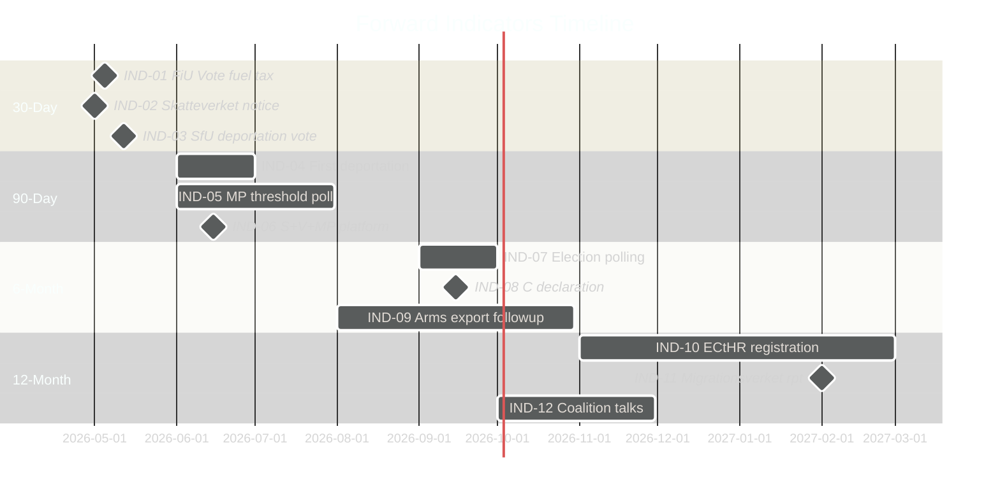

# Forward Indicators — Opposition Motions 2026-04-23

**Author**: James Pether Sörling | **Date**: 2026-04-23 | **Confidence**: MEDIUM [B3–C3]

---

## Indicator Framework

This file tracks 12 dated indicators across 4 horizons (30-day, 90-day, 6-month, 12-month) that would confirm or refute the key judgments in `intelligence-assessment.md`.

---

## Horizon 1: 30-Day Indicators (May 2026)

### IND-01: FiU Committee Vote on prop. 2025/26:236 (fuel tax)
- **Expected date**: ~May 5, 2026 (FiU scheduled)
- **Indicator**: Does FiU adopt S's design amendment (HD024082)? Yes = KJ-1 partially refuted (opposition succeeded). No = KJ-1 confirmed.
- **Trigger threshold**: Any S, V, or MP amendment adopted by FiU majority
- **Confidence**: HIGH [A2] that vote will occur; MEDIUM [B2] that government amendments will prevail

### IND-02: Skatteverket Implementation Notice
- **Expected date**: ~May 1, 2026 (law comes into force)
- **Indicator**: Does official implementation guidance include or exclude cooperative housing (*bostadsrättsföreningar*)? Exclusion confirmed = HD024082 validated; political cost to government elevated.
- **Confidence**: HIGH [A1] that notice will be published

### IND-03: SfU Committee Vote on prop. 2025/26:235 (deportation law)
- **Expected date**: ~May 12, 2026
- **Indicator**: Does SfU include any C amendments? C amendment adopted = coalition complexity signal.
- **Confidence**: HIGH [A1] that vote will occur

---

## Horizon 2: 90-Day Indicators (June–July 2026)

### IND-04: First Deportation Under New Law
- **Expected date**: June–July 2026 (Migrationsverket implementation)
- **Indicator**: Is the first deportation case published? Does it produce a court challenge?
- **Confidence**: MEDIUM [B2] that early cases will be filed quickly

### IND-05: MP Poll Result (4% threshold)
- **Expected date**: Any major poll, June–July 2026
- **Indicator**: MP at/above 4% = electoral calculation shifts. MP below 4% = coalition arithmetic for S+V more difficult.
- **Confidence**: HIGH [A1] that polls will be published; threshold outcome is MEDIUM [C3]

### IND-06: S+V+MP Joint Election Platform Statement
- **Expected date**: June 2026 (traditional alliance-building period)
- **Indicator**: A joint platform on energy would refute H1 (fragmentation is strategic differentiation) and confirm H1-alt (genuine coordination).
- **Confidence**: MEDIUM [B3] that some form of coordination statement emerges; quality uncertain

---

## Horizon 3: 6-Month Indicators (September–October 2026)

### IND-07: 2026 Election Polling Trend
- **Expected date**: Ongoing, key snapshot September 2026
- **Indicator**: If government coalition (M+SD+KD+L) polling above 175 seats → KJ-1 (fragmentation = government advantage) confirmed.
- **Confidence**: HIGH [A1] that polls will be published

### IND-08: C's Final Alliance Declaration
- **Expected date**: C autumn congress, September 2026 (est.)
- **Indicator**: C declares coalition preference. C → left = major political realignment. C → right = status quo confirmed.
- **Confidence**: MEDIUM [B2] that C will clarify before election campaign

### IND-09: Arms Export Policy Development
- **Expected date**: Summer/autumn 2026 (Riksdag follows up HD024096)
- **Indicator**: Any governmental communication on arms export secrecy provisions (opposed by MP in HD024096). Government concession = small HD024096 victory.
- **Confidence**: LOW [C3]

---

## Horizon 4: 12-Month Indicators (Spring 2027)

### IND-10: ECtHR Case Registration
- **Expected date**: Autumn 2026–Spring 2027 (cases filed after law implementation)
- **Indicator**: ECtHR registers case against Sweden under ECHR Art. 8 related to prop. 2025/26:235. Registration = medium-term legal risk elevated (KJ-2 confirmed on legal dimension).
- **Confidence**: MEDIUM [B2]

### IND-11: Migrationsverket Capacity Report
- **Expected date**: Q1 2027 (annual report)
- **Indicator**: Migrationsverket reports implementation difficulties with new Mottagandelagen. Friction confirmed = C's HD024089 concerns validated.
- **Confidence**: MEDIUM [B3]

### IND-12: Post-Election Coalition Negotiations
- **Expected date**: September–November 2026 (post-election)
- **Indicator**: Who negotiates with whom? If S+C talks emerge seriously, KJ-3 (C as pivotal actor) fully confirmed. If Tidö 2.0 forms without modification, KJ-1 (fragmentation cost opposition the election) confirmed.
- **Confidence**: HIGH [A1] that negotiations will occur

---

## Indicator Summary Matrix

