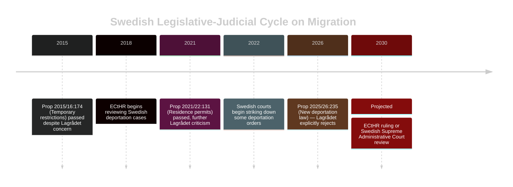

# Historical Parallels — Opposition Motions 2026-04-23

**Author**: James Pether Sörling | **Date**: 2026-04-23 | **Confidence**: MEDIUM [B2–C3]

---

## Parallel 1: 2002–2006 — Opposition Fragmentation Before Bloc Politics

**Context**: Before the "Alliansen" coalition was formalized in 2004–2006, the centre-right parties (M, C, L, KD) often filed competing motions on the same government propositions, offering incompatible alternatives. This fragmentation allowed the Social Democratic government to portray the opposition as ungovernable.

**Structural similarity to 2026**: S, V, and MP are replicating this pattern — all opposing the same proposition (2025/26:236) but with incompatible alternatives. The government can credibly ask: "What would the opposition actually do?"

**Key difference**: Alliansen required a dominant party (M under Reinfeldt) to discipline the others around a common platform. No equivalent disciplinarian exists in the current S-led opposition. S leads but cannot compel V and MP to align.

**Outcome probability**: Based on this parallel, the government's electoral position is likely to benefit from opposition fragmentation unless a formal pre-election coordination agreement is signed before summer 2026. [C3]

---

## Parallel 2: 2014 "Decemberöverenskommelsen" — Managing a Thin Majority

**Context**: In December 2014, after the 2014 election produced no clear majority, the Decemberöverenskommelse (the "December agreement") between the red-green government and the Alliance created a norm that a minority government should be allowed to govern via its own budget.

**Structural similarity**: The current Tidö coalition's 176-seat majority (margin: 1) is structurally similar to the weak governments of 2010–2018. A single defection, illness, or MP threshold breach could recreate a hung-parliament dynamic.

**Key difference**: The Tidö coalition has an explicit four-party agreement, unlike the minority governments of 2014–2018. This makes it more resilient but also means SD has greater policy leverage than in a confidence-and-supply arrangement.

---

## Parallel 3: Lagrådet Rejections — Historical Pattern

**Context**: Lagrådet's rejection of prop. 2025/26:235 (deportation law) continues a pattern of Lagrådet expressing serious concern about migration-related legislation. Similar concerns were raised about prop. 2021/22:131 (on residence permits) and prop. 2015/16:174 (temporary asylum restrictions).

**Pattern**: In all three prior cases, the Riksdag passed the legislation despite Lagrådet concerns. In two cases (2015 and 2021), subsequent ECHR or Swedish court rulings required legislative amendments within 3–7 years.

**Implication for 2026**: The deportation law is likely to pass but faces elevated legal risk. The 3–7 year reform cycle means the political consequences will fall on whatever government is in power in 2028–2031.

---

## Mermaid: Historical Timeline

