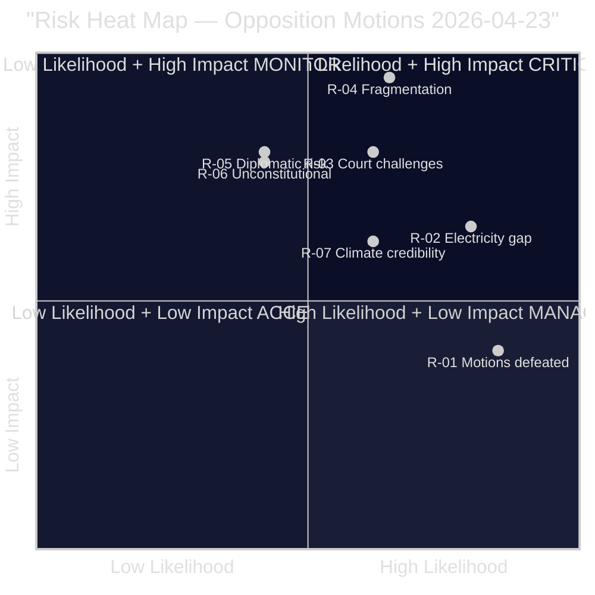

# Risk Assessment — Opposition Motions 2026-04-23

**Author**: James Pether Sörling | **Date**: 2026-04-23 | **Confidence**: MEDIUM-HIGH [B2]

---

## 5-Dimension Risk Register

| Risk ID | Description | Likelihood (1–5) | Impact (1–5) | L×I | Trend | Evidence |
|---------|-------------|-----------------|-------------|-----|-------|----------|
| R-01 | All opposition motions voted down, zero policy change | 4 | 2 | **8** | Stable | SD-government bloc solid; structural 2025/26 pattern [B1] |
| R-02 | Fuel tax cut passes but electricity support design remains inequitable | 4 | 3 | **12** | Rising | S motion HD024082 identifies 800k excluded households [B1] |
| R-03 | Stricter deportation law (prop. 2025/26:235) creates mass court challenges | 3 | 4 | **12** | Rising | Lagrådet rejection + extensive remiss criticism [A1] |
| R-04 | Opposition fragmentation deepens ahead of 2026 elections | 3 | 5 | **15** | Rising | No joint motions across budget cluster; C partial government support [B1] |
| R-05 | Arms export modernisation creates diplomatic risk with EU partners | 2 | 4 | **8** | Stable | MP HD024096 + remiss citations on third-country diversion [B2] |
| R-06 | Mottagandelag area restrictions ruled unconstitutional | 2 | 4 | **8** | Uncertain | C HD024089 raises kommunal självstyre concerns [C3] |
| R-07 | Climate credibility damage from fuel tax cut undermines Swedish COP commitments | 3 | 3 | **9** | Rising | MP HD024098 + agency consensus [A2] |

---

## Priority Risks (L×I ≥ 10)

### R-04 — Opposition Fragmentation [HIGH RISK, L×I = 15]

The most severe risk for democratic accountability: when S, V, and MP cannot agree on a budget alternative, the government faces no unified opposition. Evidence: three separate motions (HD024082, HD024092, HD024098) against the same government proposition, each with a different analytical framework and policy demand. This is structurally worse than the 2022–23 budget period when S and V coordinated more frequently.

**Cascading chain**: Fragmentation → no alternative budget → government wins FiU vote → fuel tax implemented → climate agencies increase criticism → media shifts to "government vs experts" framing → opposition fails to capture narrative.

### R-02 + R-03 — Social Policy Double Jeopardy [HIGH RISK, L×I = 12 each]

Two simultaneous social policy risks create a compound exposure: (1) electricity support design flaw disproportionately affects cooperative housing (S: HD024082); (2) deportation law challenged as unconstitutional by Lagrådet with likely court litigation (V: HD024090). Either alone is manageable; together they strain public trust in government competence.

**Posterior probability**: Given Lagrådet's explicit rejection and the 2022 reform being less than 4 years old, probability of at least one court challenge to the deportation rules within 12 months of implementation (Sep 2026) is estimated at ~55% [C3 — analyst judgement].

---

## Mermaid: Risk Heat Map

*Confidence: MEDIUM [B2–C3]. Risk scores based on parliamentary patterns + primary documents.*

