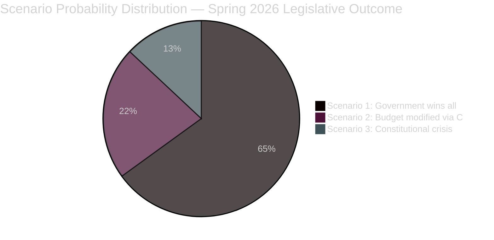

# Scenario Analysis — Opposition Motions 2026-04-23

**Author**: James Pether Sörling | **Date**: 2026-04-23 | **Confidence**: MEDIUM [B2–C3]

---

## Scenarios for Spring 2026 Parliamentary Outcome

### Scenario 1: Government Wins All Four Propositions (Most Likely)
**Probability**: 65% [C2]  
**Narrative**: SD and the four-party government coalition pass prop. 2025/26:235, 236, 228, and 229 intact. Opposition motions (HD024082–098, HD024090–097, HD024096, HD024089–091) are voted down in committee and plenary. The fuel tax cut takes effect 1 May 2026. Deportation rules tighten 1 September 2026.  
**Why likely**: SD has been reliable since the Tidö agreement; no by-election pressure; C partially supporting migration proposals.  
**Leading indicator**: Monitor FiU committee vote date (est. late April/early May 2026). If S/V/MP cannot coordinate to delay, Scenario 1 is confirmed.  
**Impact on opposition**: Deepens fragmentation narrative; V/MP locked into protest stance; S under pressure to differentiate from V.

### Scenario 2: Budget Propositions Modified — C Demands Concessions (Plausible)
**Probability**: 22% [C3]  
**Narrative**: C leverages its SfU position to demand changes to the Mottagandelag area-restriction provisions (HD024089) in exchange for abstention on the fuel tax supplementary. Government makes minor concessions. S, V, MP motions still voted down. Electricity support design is tweaked but 800k cooperative households remain partially excluded.  
**Why plausible**: C has a track record of extracting symbolic wins on migration (see 2023 Tidö addendum). Niels Paarup-Petersen's motion (HD024089) is specifically calibrated to be acceptable as a negotiating position.  
**Leading indicator**: Any informal contact between C leadership and government whips in the two weeks before FiU vote.  
**Impact**: Partial vindication for C; S/V/MP still lose but narrative shifts to "C saves municipal welfare."

### Scenario 3: Lagrådet Rejection Creates Constitutional Crisis on Deportation Law (Low probability, High impact)
**Probability**: 13% [D3]  
**Narrative**: After prop. 2025/26:235 passes, an immediate constitutional challenge is mounted by legal NGOs citing Lagrådet's opinion. The Supreme Court (Högsta domstolen) issues an interim stay on the deportation expansion for those who arrived before age 15. Government embarrassed; V (HD024090, Tony Haddou) vindicated. This delays implementation beyond the September 2026 target and becomes a major election issue.  
**Why low probability**: Courts rarely issue interim stays on legislation; Lagrådet opinions are advisory, not binding. But the specific removal of childhood-arrival protections is a ECHR Art. 8 (family life) flashpoint.  
**Leading indicator**: Filing of a formal constitutional complaint within 30 days of the law passing (est. August 2026); any ECHR provisional measures request.  
**Impact**: Severely damages government credibility on rule of law; boosts V/MP in polls; S gains from not opposing in the same extreme terms.

---

## Scenario Probability Summary

*Probabilities sum to 100%. All scenarios based on parliamentary pattern analysis and motion text; no insider information used. Confidence [C2–D3] reflects the limited predictive base for Swedish coalition dynamics 6+ weeks out.*

---

## Leading Indicators per Scenario

| Indicator | Triggers | Timeline |
|-----------|----------|----------|
| FiU committee vote date announced | Scenario 1 or 2 pathway | Late April 2026 |
| C leadership statement on HD024089 outcome | Scenario 2 possible | May 2026 |
| Legal NGO constitutional filing on prop. 2025/26:235 | Scenario 3 activated | August 2026 |
| Government press release modifying electricity support | Scenario 2 outcome | May 2026 |
| SD amendment demand on energy proposition | New Scenario possible | April–May 2026 |

