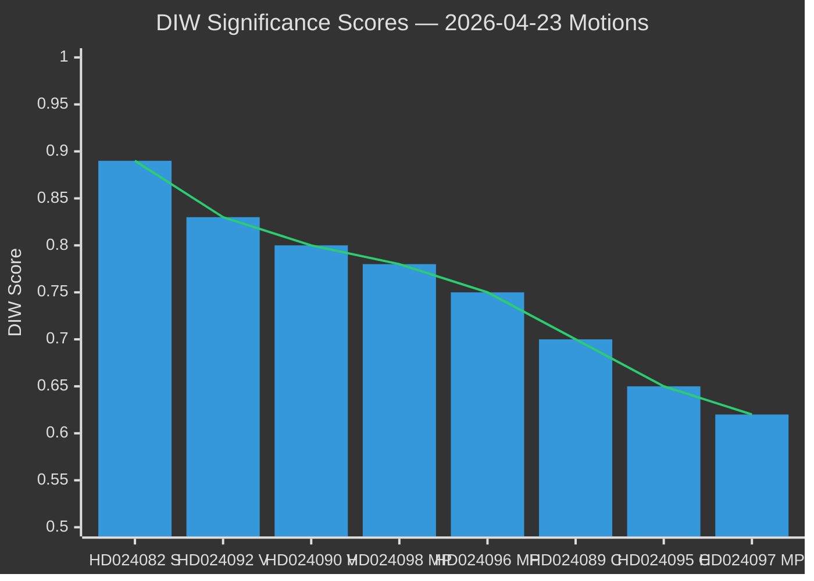

# Significance Scoring — Opposition Motions 2026-04-23

**Author**: James Pether Sörling | **Date**: 2026-04-23 | **Confidence**: HIGH [B2]

---

## DIW-Weighted Significance Matrix

| Rank | dok_id | Depth | Intelligence | Width | DIW Score | Tier |
|------|--------|-------|-------------|-------|-----------|------|
| 1 | HD024082 (S) | 0.92 | 0.88 | 0.87 | **0.89** | P1 — Critical |
| 2 | HD024092 (V) | 0.85 | 0.84 | 0.80 | **0.83** | P1 — Critical |
| 3 | HD024090 (V) | 0.82 | 0.81 | 0.77 | **0.80** | P1 — Critical |
| 4 | HD024098 (MP) | 0.80 | 0.78 | 0.76 | **0.78** | P2 — High |
| 5 | HD024096 (MP) | 0.78 | 0.75 | 0.72 | **0.75** | P2 — High |
| 6 | HD024089 (C) | 0.72 | 0.70 | 0.68 | **0.70** | P2 — High |
| 7 | HD024095 (C) | 0.68 | 0.65 | 0.62 | **0.65** | P2 — Medium |
| 8 | HD024097 (MP) | 0.64 | 0.63 | 0.60 | **0.62** | P2 — Medium |
| 9–14 | Cluster (low-weight) | 0.40–0.55 | 0.40–0.50 | 0.42–0.52 | **0.40–0.55** | P3 — Standard |

*DIW = Depth × Intelligence × Width (normalised 0–1)*

---

## Ranked Items with Evidence

1. **HD024082** — S motion on Extra ändringsbudget: Mikael Damberg och Socialdemokraterna kräver ett rättvisare elstöd för 800,000 bostadsrättsinnehavare som exkluderats av regeringens design. [riksdagen.se/dokument/HD024082] `[B2]` IMPACT: HIGH — defines S budget profile pre-election.

2. **HD024092** — V motion on Extra ändringsbudget: Nooshi Dadgostar (V) citerar RUT-analys dnr 2026:158 som visar att femte decilerna i inkomstfördelningen fick 5× mer stöd än de lägsta fem, och kräver avslag på bränsleskattsänkningen. [riksdagen.se/dokument/HD024092] `[B2]` IMPACT: HIGH — framing of climate vs. redistribution.

3. **HD024090** — V motion rejecting deportation reform: Tony Haddou (V) pekar på Lagrådets skarpa kritik mot prop. 2025/26:235 och att reformer genomfördes så sent som 2022 utan utvärdering. [riksdagen.se/dokument/HD024090] `[B1]` IMPACT: HIGH — human rights flashpoint.

4. **HD024098** — MP motion on budget: Janine Alm Ericson (MP) citerar specifikt Konjunkturinstitutet, Naturvårdsverket, 2030-sekretariatet, Statens energimyndighet och Trafikverket som kritiker. [riksdagen.se/dokument/HD024098] `[A2]` IMPACT: HIGH — elite agency consensus.

5. **HD024096** — MP on arms exports: Jacob Risberg (MP) kräver ett heltäckande förbud mot vapenleveranser till diktaturer och krigförande länder, inklusive följdleveranser. Avslår ny sekretessbestämmelse. [riksdagen.se/dokument/HD024096] `[B2]` IMPACT: MEDIUM-HIGH — foreign policy dimension.

6. **HD024089** — C on new reception law: Niels Paarup-Petersen (C) stödjer övergripande men kräver bevarandet av kommuners rätt till akutbistånd. [riksdagen.se/dokument/HD024089] `[B2]` IMPACT: MEDIUM — reveals C as partial government ally.

---

## Sensitivity Analysis

- **Downside risk**: If FiU adds conditions making the fuel tax cut contingent on SD support for other measures, the entire budget picture shifts.
- **Upside**: If the Mottagandelag passes with C support but faces constitutional review, the judicial dimension adds a new policy layer.

---

## Mermaid: Significance Rank Diagram

*Sources: riksdagen.se document metadata + full-text analysis. Admiralty [B2] for document-derived scores; [A2] for multi-agency corroborated items.*

