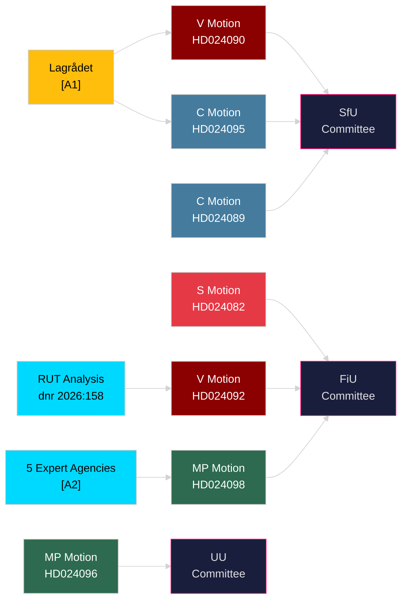

# Stakeholder Perspectives — Opposition Motions 2026-04-23

**Author**: James Pether Sörling | **Date**: 2026-04-23 | **Confidence**: HIGH [B1–B2]

---

## 6-Lens Stakeholder Matrix

### Lens 1: Parliamentary Parties

| Party | Position | Key Actor | Primary Motion | Strategic Interest |
|-------|----------|-----------|----------------|-------------------|
| S — Socialdemokraterna | Oppose fuel cut design; demand targeted electricity support | Mikael Damberg | HD024082 | Fiscal competence credibility; 2026 election positioning |
| V — Vänsterpartiet | Oppose fuel cut entirely; reject deportation law | Nooshi Dadgostar, Tony Haddou | HD024092, HD024090 | Distributional justice; human rights base mobilisation |
| MP — Miljöpartiet | Oppose fuel cut on climate; oppose arms export liberalisation | Janine Alm Ericson, Jacob Risberg, Annika Hirvonen | HD024098, HD024096, HD024097 | Climate mandate; green voter retention |
| C — Centerpartiet | Conditionally accept deportation and reception frameworks | Niels Paarup-Petersen | HD024089, HD024095 | Swing-voter appeal; rural municipal interests |
| SD — Sverigedemokraterna | Expected to support government across all four propositions | (no motions filed in this cluster) | — | Coalition stability; border control narrative |
| M, L, KD | Expected to support government | — | — | Government parties |

### Lens 2: Civil Society & Expert Bodies

| Actor | Position | Basis | Admiralty |
|-------|----------|-------|-----------|
| Lagrådet | Explicitly advised against prop. 2025/26:235 (deportation) | Official legal opinion | [A1] |
| Konjunkturinstitutet | Opposed fuel tax cut in remiss | Climate/economic analysis | [A2] |
| Naturvårdsverket | Opposed fuel tax cut | Environmental mandate | [A2] |
| 2030-sekretariatet | Opposed fuel tax cut | Climate transition mandate | [A2] |
| Statens energimyndighet | Opposed fuel tax cut | Energy security analysis | [A2] |
| Trafikverket | Opposed fuel tax cut | Transport sector mandate | [A2] |
| Remiss bodies on HD024090 | Extensive criticism of deportation reform | Rule-of-law analysis | [A2] |

### Lens 3: Voters & Affected Populations

| Group | Affected by | Stakes |
|-------|-------------|--------|
| ~800,000 bostadsrättsinnehavare with shared electricity | S motion HD024082 — excluded from electricity support | SEK hundreds per household per month |
| Migrants who arrived in Sweden before age 15 | Prop. 2025/26:235 removes their protection | Potential deportation risk |
| Low-income households | V motion HD024092 — fuel price relief is proportional to car use and income | 5:1 benefit asymmetry per RUT analysis |
| Environment-concerned voters (~25–30% of electorate) | MP motion HD024098 — climate signal from fuel tax cut | Long-term fossil fuel dependency |
| Asylum seekers and municipalities | Reception law prop. 2025/26:229 | Municipal welfare, area restrictions |

### Lens 4: Media & Narrative Agents

| Frame | Promoted by | Risk for opposition |
|-------|-------------|---------------------|
| "Relief for hard-pressed households" | Government + friendly media | Makes opposition seem out of touch |
| "Government favours the wealthy" | V (RUT data) | Resonant but S hasn't adopted it |
| "Climate backslide" | MP + green media | True but niche; low penetration in election swing voters |
| "Rule of law erosion" | V + legal NGOs | Strong for base mobilisation; limited mainstream appeal |

### Lens 5: International Actors

| Actor | Concern | Basis |
|-------|---------|-------|
| EU Commission | Potential state aid issues with selective electricity support | General EU energy rules [C3] |
| Arms recipient states | Stricter Swedish export controls (MP demands) would restrict flows | HD024096 — explicit demand for export bans [B2] |
| UNHCR / EU migration agencies | Stricter deportation thresholds and new reception framework | HD024090, HD024089 [B2] |

### Lens 6: Institutional Actors

| Actor | Role | Interest |
|-------|------|---------|
| FiU (Finansutskottet) | Processes HD024082, HD024092, HD024098 | Budget supplementary vote timing |
| SfU (Socialförsäkringsutskottet) | Processes HD024089–090, 095, 097, 076, 080 | Migration reform timeline |
| UU (Utrikesutskottet) | Processes HD024096, HD024091 | Arms export framework |
| AU (Arbetsmarknadsutskottet) | Processes HD024079, 077, 086 | Labour/housing reception motions |

---

## Influence Network

